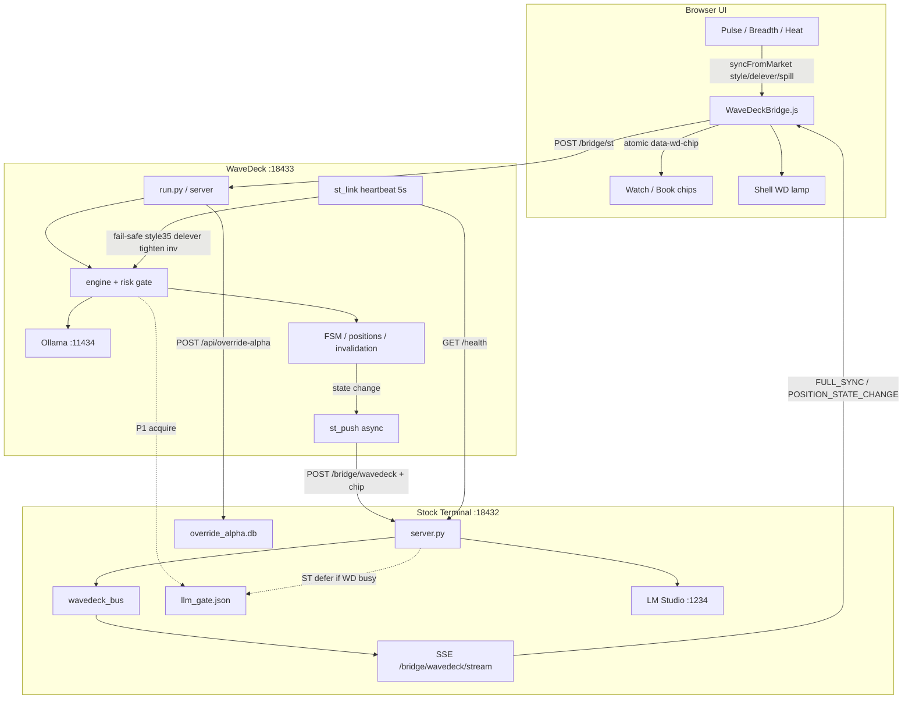
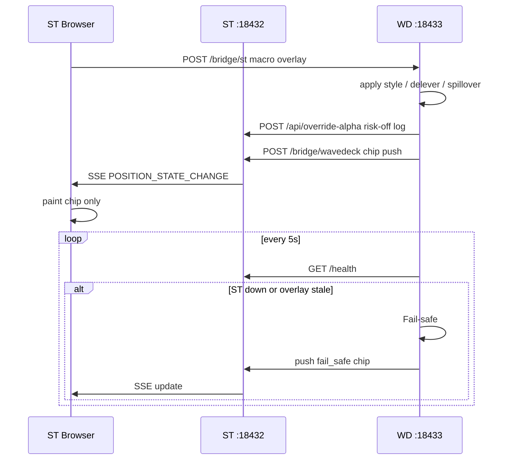

# Stock Terminal v5.0

Bloomberg 風格台／美股研究終端機 — **本機跑、零雲端、純 Python stdlib（不用 pip）**。

完整功能表與資料來源見 **[docs/README.md](docs/README.md)**。  
**tip UX 圖示導覽（轉盤／總覽）**見 **[docs/TIP_UX.md](docs/TIP_UX.md)**。


## 5.0 重點（tip UX）

- **無側欄**：導航改為 **分析轉盤**（最多三層，依投資分析分類）
- **開啟＝總覽 `#pulse` + 自動彈出轉盤**；中心為 Stock Terminal 5.0 logo
- **總覽儀表板**：一屏市場脈搏（廣度、法人趨勢、全球影響、台美快訊）
- **歷史庫 merge 同步**：頂列「同步資料」只補新日
- **真實資料計分**：缺源進「尚未納入」，不捏造 Fear&Greed

### 轉盤快捷

| 鍵／手勢 | 作用 |
|----------|------|
| 中鍵 / `\` / `[` / `Ctrl+B` | 開／關轉盤 |
| 滾輪 / 方向鍵 | 循環選取 |
| Enter | 確認／下鑽 |
| Esc | 返回上層或關閉轉盤 |
| `Alt+Shift+1…0` | 直達常用路由 |
| `?` | 完整快捷表 |

結構示意：[`assets/tip-ring-schematic.svg`](assets/tip-ring-schematic.svg)

---

## 本機執行（建議）

需求：Python 3.10+（純標準庫）、現代瀏覽器。Server **只聽** `127.0.0.1:18432`。

### Windows

```powershell
cd C:\Users\Sam\AI_Stock
.\START_TIP.cmd
```

或：

```powershell
.\scripts\go.bat
```

| 指令 | 用途 |
|------|------|
| `.\START_TIP.cmd` | tip 專用：殺殘留 python + 驗證 tip 檔 + 啟動 |
| `.\scripts\go.bat` | rebuild + 重啟 server + 開瀏覽器 |
| `.\scripts\go.bat pull` | `git pull` 後同上 |
| `.\scripts\go.bat rebuild` | 只重建＋重啟（不開瀏覽器） |

### Linux / macOS

```bash
cd /path/to/AI_Stock
chmod +x scripts/go.sh
./scripts/go.sh
```

瀏覽器（開頁後建議 **Ctrl+F5**）：

```
http://127.0.0.1:18432/stock_terminal_v2.html#pulse
```

> 融資週期／TDCC／`pulse_history.db`／`market.db` 等大 DB **不隨 git／分享包**；首次使用會背景回補或按「同步資料」。

---

## 打包可分享版

```bash
python3 scripts/build_dist.py
# Windows: python scripts\build_dist.py
# 或雙擊 scripts\build_dist.bat
```

產出根目錄 **`Stock_Terminal_v5.0.zip`**（已剝除 API Key、警報、觀察股、本機大 DB）。

收件者解壓後：

1. 閱讀 `docs/TIP_UX.md`（含圖示範例）
2. Windows：`START_TIP.cmd` 或 `scripts\go.bat`
3. Linux／macOS：`./scripts/go.sh`

## 連動子專案：WaveDeck（浪潮執行台）

微觀下單／AI 判斷／風控艦橋，與本終端分工：

| | Stock Terminal (`:18432`) | WaveDeck (`:18433`) |
|--|--|--|
| 角色 | 宏觀觀測指揮塔 | 微觀執行艦橋 |
| 連動 | Pulse／廣度／供應鏈外溢 → `WaveDeckBridge.syncFromMarket` | `POST /bridge/st`；啟發式／閘門吃外溢；heartbeat Fail-safe |
| 回寫 | SSE `/bridge/wavedeck/stream` 原子 chip、Override Alpha | 狀態變更 REST push → ST SSE 扇出＋LLM P1 |

- 專案目錄：[`wavedeck/`](wavedeck/)
- 啟動：`.\START_WAVEDECK.cmd` 或 `cd wavedeck && python3 run.py`
- 架構：[`wavedeck/docs/ARCHITECTURE.md`](wavedeck/docs/ARCHITECTURE.md)
- 側欄「執行」開啟艦橋；頂列 **WD** 燈可點擊開啟；Pulse「→ WD」「AI 摘要」

### ST ↔ WD 串接邏輯 Map



閉環時序：



關鍵路徑：

1. **ST → WD**：`POST http://127.0.0.1:18433/bridge/st`（事件驅動）
2. **WD → ST**：`POST http://127.0.0.1:18432/bridge/wavedeck`（輕量 `chip`）
3. **ST → UI**：`GET http://127.0.0.1:18432/bridge/wavedeck/stream`（SSE）
4. **韌性**：WD 每 5s ping ST；斷線 → 風格 35／降載／收緊失效／禁新單
5. **算力**：`data/llm_gate.json` WD=P1；ST Pulse 可 defer

## 分享版注意

發行 zip **不含**：Claude API Key、Telegram／Email 警報、觀察股後端清單、畫線雲端記憶、本機大庫、內部 `docs/revision.md`。請自行在 UI 設定。

## 授權

MIT
