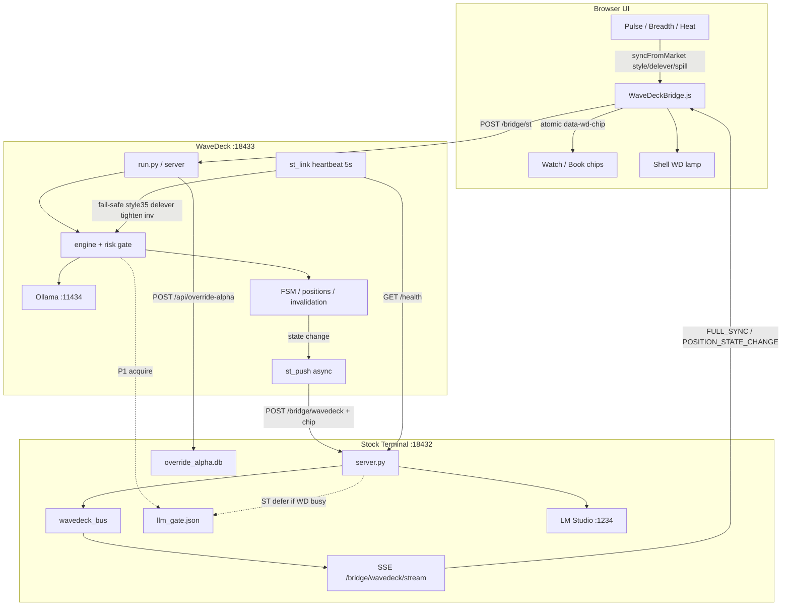
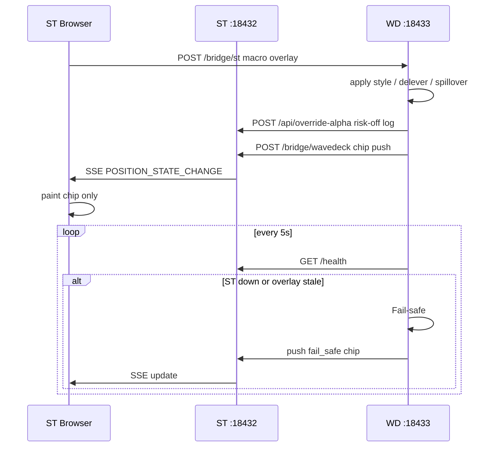

# Stock Terminal v4.1

Bloomberg 風格台／美股研究終端機 — **本機跑、零雲端、純 Python stdlib（不用 pip）**。

完整說明、功能表與打包規範見 **[docs/README.md](docs/README.md)**。

## 30 秒啟動

1. 解壓（或 clone）到任意資料夾  
2. Windows：雙擊 `scripts\go.bat` → 瀏覽器開 `http://127.0.0.1:18432`（server **只聽 loopback**）  
3. 輸入代號（例 `2330`）按 **GO**

> 融資週期／TDCC 集中度等大 DB **不隨 git／分享包**；首次開圖會背景回補。

## 連動子專案：WaveDeck（浪潮執行台）

微觀下單／AI 判斷／風控艦橋，與本終端分工：

| | Stock Terminal (`:18432`) | WaveDeck (`:18433`) |
|--|--|--|
| 角色 | 宏觀觀測指揮塔 | 微觀執行艦橋 |
| 連動 | Pulse／廣度／供應鏈外溢 → `WaveDeckBridge.syncFromMarket` | `POST /bridge/st`；啟發式／閘門吃外溢；heartbeat Fail-safe |
| 回寫 | SSE `/bridge/wavedeck/stream` 原子 chip、Override Alpha | 狀態變更 REST push → ST SSE 扇出＋LLM P1 |

- 專案目錄：[`wavedeck/`](wavedeck/)
- 啟動：`.\START_WAVEDECK.cmd` 或 `cd wavedeck && python3 run.py`
- 架構：[`wavedeck/docs/ARCHITECTURE.md`](wavedeck/docs/ARCHITECTURE.md)
- 側欄「執行」開啟艦橋；頂列 **WD** 燈可點擊開啟；Pulse「→ WD」「AI 摘要」

### ST ↔ WD 串接邏輯 Map

閉環時序：

關鍵路徑：

1. **ST → WD**：`POST http://127.0.0.1:18433/bridge/st`（事件驅動）
2. **WD → ST**：`POST http://127.0.0.1:18432/bridge/wavedeck`（輕量 `chip`）
3. **ST → UI**：`GET http://127.0.0.1:18432/bridge/wavedeck/stream`（SSE）
4. **韌性**：WD 每 5s ping ST；斷線 → 風格 35／降載／收緊失效／禁新單
5. **算力**：`data/llm_gate.json` WD=P1；ST Pulse 可 defer

## 分享版注意

發行 zip（`scripts/build_dist.py`）**不含**：

- Claude API Key（`data/ai_key.txt`）
- Telegram／Email 警報設定
- 觀察股後端清單（`watch_rules.json` / `watch_state.json`）
- 畫線雲端記憶、個人籌碼快照

請自行在 UI 設定 Key 與通知；觀察股只存在你本機瀏覽器。

## 授權

MIT
