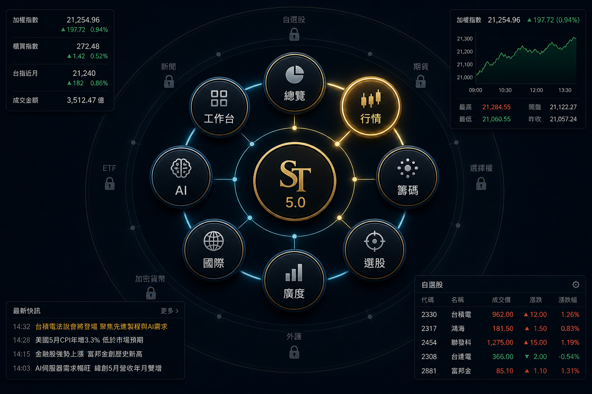
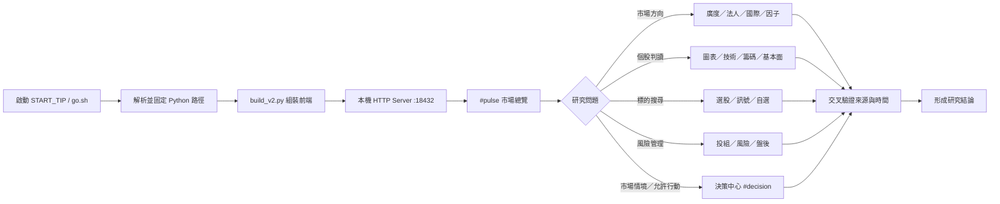
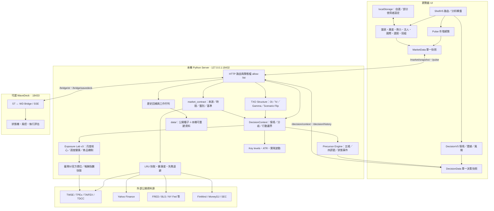
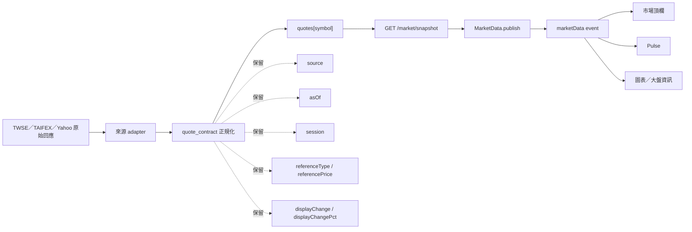
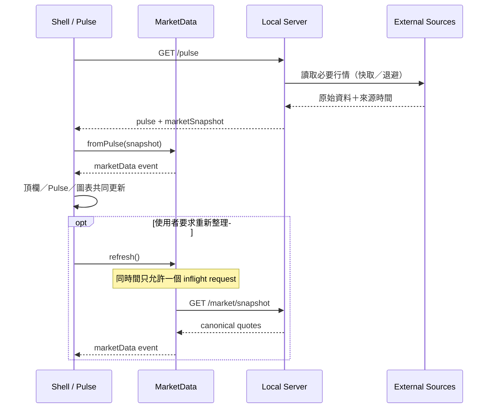
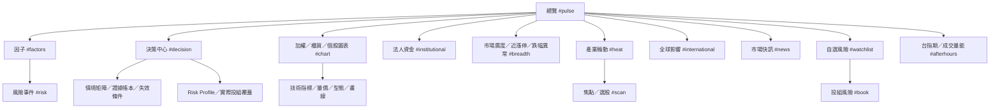
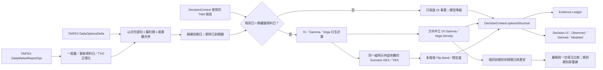
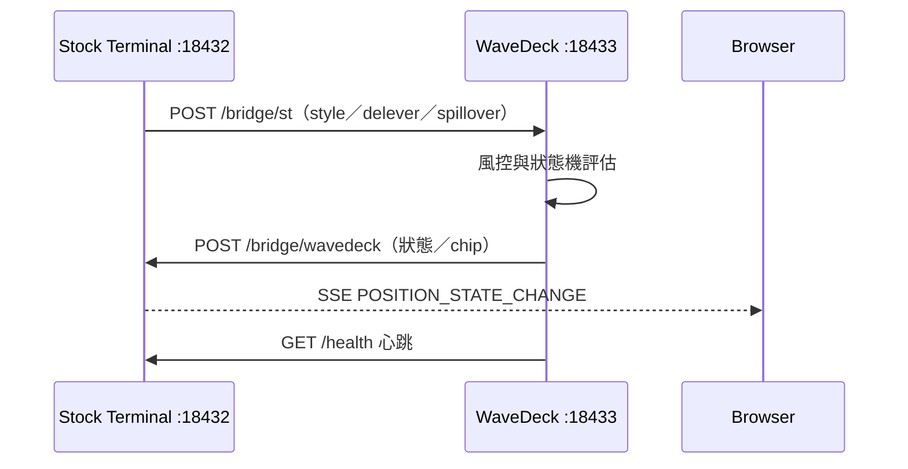
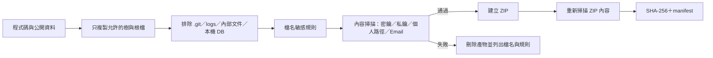

# Stock Terminal v5.0

本機優先的台股／美股市場研究終端。Stock Terminal 把即時行情、市場廣度、法人籌碼、產業輪動、國際市場、選股、投組風險與 AI 輔助集中在單一瀏覽器介面；核心伺服器使用 Python 標準函式庫，不需要先架設資料庫服務。

> 重要：本專案是研究與資訊工具，不構成投資建議。外部資料可能延遲、修正或暫時中斷；交易決策前請回到交易所或資料供應商核對。



## 特色

- **一屏市場總覽**：加權、櫃買、台指期、成交量能、廣度、漲跌停、法人與國際市場。
- **統一市場資料契約**：每筆行情都帶來源、時間、盤別、比較基準與顯示漲跌幅。
- **單一寫入流程**：頂欄、Pulse 與圖表共用 `MarketData` 快照，避免不同元件各自刷新後互相覆蓋。
- **可稽核決策契約**：`DecisionContext v2` 用確定性規則收斂情境、分歧、允許行動、確認條件與失效條件；每項證據保留來源、時間、盤別與比較基準。
- **新手／專業雙層總覽**：預設用市場結構狀態、情緒表、白話行動、廣度／法人／量能三訊號、台股／美股／期貨三市場雷達與 R1/S1 安全邊界快速理解；可展開進階觀察或切回完整 5+5 專業儀表板。
- **有條件的風險範圍**：只有完整 Risk Profile 才計算持倉範圍，並公開公式與風險上限；若使用者帶入持倉但投組覆蓋失敗，則停止輸出範圍並明示原因。
- **Exposure Lab v3（預設展開）**：月度凍結核心、週度健康監控與每日槓桿商品機制是三個不同權限層；先用曝險壓力四燈快速判讀，再按需查看臺灣50同基準波動、台積電 EPS 證據層、正二效率差與商品追蹤品質。週度融資／短波動只能要求複查或增加限制，不能改寫核心研究上限；個別持倉假說不會進入分享版預設模型。
- **盤別動量研究（Shadow）**：以一致調整後日線拆解「隔夜定價」與「日間承接」，分開觀察臺灣／美國記憶體固定籃子、20／60 日結構、同市場基準歸因與族群同步率；只進研究面板與證據帳本，不改寫 Regime、Action Envelope 或槓桿限制。公式、資料 Gate 與權限圖見 [Overnight × Intraday 研究契約](docs/OVERNIGHT_INTRADAY_RESEARCH.md)。
- **跨市場前兆雷達（Shadow）**：以國際科技、2330／0050 去重錨點、台美記憶體固定籃子、廣度／流動性與資金／衍生品五個獨立證據域，追蹤下跌前兆、強攻蓄勢、AI 雙箭頭與記憶體共振；狀態轉換寫入 SQLite 並可選擇推送，AI 只解釋、不觸發。另以不可回寫的 1／3／5 日前瞻帳本驗證主訊號，單一 horizon 未滿 20 筆時不顯示命中率。契約、公式、狀態機與驗證方法見 [跨市場前兆雷達](docs/MARKET_PRECURSOR_SIGNALS.md)。
- **共識注意力 Radar**：既有右下浮動按鈕先呈現最多三項跨功能重點，再深連結並高亮 Decision 的原始證據區；它只投影既有 DecisionContext、不另行抓資料，Observation 不計徽章，過期資料凍結提醒。排序、已讀 generation、手機直／橫版與權威邊界見 [Consensus Attention Radar](docs/CONSENSUS_ATTENTION_RADAR.md)。
- **台指選擇權結構（預設收合）**：精確到期別整合 TAIFEX 一般盤日終 OI、結算價與官方 Delta；分層呈現 OI 事實、IV／Gamma Density 衍生值，以及明確標成 Shadow 的 Signed GEX／Flip 情境，不把公開 OI 冒充造市商真實持倉。
- **台美顏色語意分離**：台股／台指期紅漲綠跌；美股綠漲紅跌。
- **本機優先**：介面與伺服器只在本機運作，預設僅監聽 `127.0.0.1:18432`。
- **可追溯資料品質**：健康檢查、來源狀態、快取與路由診斷都可由本機端點或紀錄查核。
- **可選 WaveDeck**：以獨立執行台接收 Stock Terminal 的宏觀風險訊號，維持研究與執行職責分離。
- **安全分享包**：打包器只帶必要程式與公開種子資料，並掃描檔名、內容、個人路徑與常見密鑰格式。

## 30 秒開始

需求：Windows 10/11、Linux 或 macOS；Python 3.10 以上；現代瀏覽器。核心功能不需要 `pip install`。

### Windows

```powershell
cd C:\Stock_Terminal
.\START_TIP.cmd
```

### Linux / macOS

```bash
cd /path/to/Stock_Terminal
chmod +x scripts/go.sh
./scripts/go.sh
```

啟動後開啟：<http://127.0.0.1:18432/#pulse>

如果瀏覽器仍顯示舊版介面，先按 `Ctrl+F5`。健康狀態可查：<http://127.0.0.1:18432/health>

## 使用流程



分析轉盤操作與快捷鍵見 [tip UX 導覽](docs/TIP_UX.md)。

## 系統架構



### 主要責任邊界

| 層級 | 主要檔案 | 責任 |
|---|---|---|
| UI 殼層 | `src/ui/shell_v5.js` | 路由、轉盤、頁面生命週期、快捷鍵 |
| 市場快照 | `src/core/market_data_v5.js` | 單一狀態、單一事件、合併並抑制重複刷新 |
| 決策快照 | `src/core/decision_data_v5.js` | 單一 `DecisionContext` 狀態、合併 inflight 請求與事件發布 |
| 市場總覽 | `src/ui/pulse_v5.js` | 消費統一快照、呈現總覽與面板深連結 |
| 決策中心 | `src/ui/decision_v5.js` | 情境矩陣、關鍵價位、台指選擇權結構、分歧、Risk Profile、Exposure Lab、投組穿透與證據帳本 |
| 顏色語意 | `src/core/colors_v3.js` | 台股與美股漲跌色契約 |
| 視覺元件 | `src/ui/viz_v5.js` | 趨勢線、量表、峰谷標記等共用元件 |
| HTTP 入口 | `server/server.py` | 本機 API、快取、工作佇列、靜態檔限制 |
| 市場契約 | `server/market_contract.py` | 標準化價格、漲跌、來源、時間、盤別與比較基準 |
| 市場路由 | `server/market_routes.py` | 組裝 `/market/snapshot` 的一致行情集合 |
| 決策引擎 | `server/decision_context.py` | 確定性情境分類、信心度、分歧、行動邊界、歷史與重播 |
| 市場前兆引擎 | `server/early_warning.py` | 五個去重證據域、四個具名 Shadow 訊號、遲滯狀態機、SQLite 事件帳本與只讀 API |
| 中長期曝險研究 | `server/exposure_lab.py` | 月度凍結核心、台積電 EPS 證據分層、同基準長短波動、正二效率差、研究上限、商品機制與 ETF 底層穿透 |
| 研究基準資料 | `server/benchmark_research.py` | 非阻塞讀取／背景更新證交所臺灣50價位與報酬指數；只提供單一 canonical contract，不另建 UI 刷新路徑 |
| 決策路由 | `server/decision_routes.py` | `/decision/context`、歷史與關鍵價位 API；輸入驗證 |
| 期權結構 | `server/options_exposure.py`、`server/options_routes.py` | 精確到期鏈、IV／Greeks、方向中立 OI Gamma／Vega Density、情境 GEX／VEX／Flip、同到期日歷史、快取與更新命令 |
| 盤別動量研究 | `server/overnight_intraday.py`、`server/overnight_intraday_routes.py` | 調整後 OHLC、ON／ID 恆等式、20／60 日結構、固定籃子 quorum、cache-only GET 與白名單更新 |
| 衍生分析 | `server/key_levels.py`、`server/sector_flow.py`、`server/news_impact.py` | 可重現價位、20／60 日波動與尾端分布、同口徑產業參與、新聞影響層級 |
| 前端建置 | `build_v2.py`、`build_order.py` | 依相依順序組裝 tip UX HTML |
| 執行台 | `wavedeck/` | 可選的微觀執行、狀態機與風控橋接 |

## 市場資料契約與刷新邏輯

同一主題的行情不應由多個元件各算一次。後端先建立規格化行情，前端再由 `MarketData` 發布一次，頂欄、總覽與圖表只消費同一份快照。



### 行情欄位

| 欄位 | 意義 |
|---|---|
| `symbol` | 統一識別碼，例如 `^TWII`、`^TWOII`、`__TXF__` |
| `market` | 市場別，例如 `TW`、`US` |
| `price` | 當前或該來源最後可用價格 |
| `source` | 實際採用的資料來源，不以畫面名稱推測 |
| `asOf` | 資料時間；用來判斷新鮮度與跨面板一致性 |
| `session` | `regular`、`day`、`night` 等盤別 |
| `referenceType` | 漲跌比較基準類型，預設 `previous_close` |
| `referencePrice` | 實際比較基準價格 |
| `displayChange` | 相對比較基準的點數變化 |
| `displayChangePct` | 畫面應顯示的漲跌幅；不得用不同日線序列覆寫 |

### 刷新時序



## 頁面與邏輯地圖



| 路由 | 用途 | 總覽入口 |
|---|---|---|
| `#pulse` | 一屏市場總覽 | 啟動預設 |
| `#decision` | 市場情境、允許行動、關鍵價位、分歧、投組限制與證據 | Command Strip／分析轉盤 |
| `#chart` | 指數與個股 K 線、技術研究 | TAIEX／OTC／加權盤勢 |
| `#factors` | 正面、風險與未納入因子 | 市場脈動「因子」 |
| `#institutional` | 外資、投信、自營與趨勢 | 法人資金 |
| `#breadth` | 漲跌家數、多空比、極端清單 | 市場廣度／近漲停／跌幅異常 |
| `#heat` | 台美產業相對強弱 | 產業輪動 |
| `#international` | 美股、日韓、美元、商品與風險代理 | 全球影響 |
| `#afterhours` | 台指期、盤後排行、量能與籌碼 | 台指期／成交量能 |
| `#news` | 台美重大訊息與快訊 | 市場快訊 |
| `#watchlist` | 自選股與狀態 | 自選風險 |
| `#scan` / `#signals` | 選股與策略訊號 | 分析轉盤 |
| `#book` / `#risk` | 投組與事件風險 | 分析轉盤 |
| `#settings` | 資料來源與同步狀態 | 分析轉盤 |

所有 `data-go` 入口都必須對應 `ShellV5` 中存在的路由，並支援滑鼠、Enter 與空白鍵操作。

## 台指選擇權結構研究

決策中心的「台指選擇權結構」預設收合；首次展開才向本機後端發出更新命令，避免每次 Pulse 刷新都下載數 MB 的期權鏈。更新完成後，後端重建唯一的 `DecisionContext`，前端仍由 `DecisionData` 單一寫入，不另存第二套數字。



三層資料不可互換：

| 層 | 可以陳述 | 不可以陳述 |
|---|---|---|
| Observed | 精確到期別的 OI、成交量、結算價、履約價與官方 Delta | 哪一側是造市商、造市商淨多空 |
| Derived | IV、Greeks、25Δ skew、`OI × Gamma × 50 × spot² × 1%` 與 `OI × Vega × 50 × 0.01` 方向中立密度 | 已觀測的市場淨 Gamma／Vega |
| Modeled | 每組明示係數下的 Signed GEX／VEX、全部有效根與跨情境 Flip Band | 唯一真實 Flip、期貨避險流、直接買賣或槓桿訊號 |

第一版固定單一精確到期日、不跨週三／週五／月契約混加；IV 對應 OI 未達 80%、現貨與鏈資料日不一致、資料過期或找不到覆蓋範圍內的根時，模型欄位會回傳 unavailable，而不是補固定波動率或延伸曲線硬湊價位。利率、put-call parity carry、時間基準、乘數、覆蓋率與錯誤碼都保留在契約與 Evidence Ledger。

第二版補上 `OI Vega 密度`（NTD／IV 變動 1 個波動率點）與沿用同一組版本化 Call／Put 係數的 `Modeled Signed VEX`。VEX 正負只描述指定持倉假設下的理論 IV 敏感度，不等於 Delta 避險量、期貨流向或指數方向。每次成功、同日終、非混合時點的刷新會原子寫入精簡歷史；以 `(tradeDate, expiry)` 去重，只和嚴格較早且完全相同的 expiry 比較。換週／換月契約會顯示「新到期別，重新累積」，不拿上一個到期別湊變化率。

## 顏色契約

| 市場／商品 | 上漲 | 下跌 |
|---|---|---|
| 台股、櫃買、台指期 | 紅 | 綠 |
| 美股與美股指數 | 綠 | 紅 |

元件不可自行以 CSS 猜測市場；必須由市場識別與 `colors_v3.js` 決定。

## 主要 API

| 端點 | 用途 |
|---|---|
| `GET /health` | 版本、tip UX、Python、來源健康度、工作佇列、WaveDeck 狀態 |
| `GET /pulse` | 市場總覽聚合資料與 canonical market snapshot |
| `GET /market/snapshot` | 加權、櫃買、台指期統一行情契約 |
| `GET /breadth` | 官方廣度、漲跌停與相關趨勢 |
| `GET /focus?mkt=TW|US` | 台美焦點與產業資料 |
| `GET /flash` | 台美公司重大訊息 |
| `GET /pulse/history` | 指數、法人、廣度與 Pulse 歷史 |
| `GET /decision/context?market=TW` | 最新完整 `DecisionContext v2` 與證據帳本 |
| `GET /signals/active` | 四個前兆訊號的目前狀態與仍有效事件（唯讀） |
| `GET /signals/history?limit=80` | 已去重的前兆狀態轉換歷史（唯讀） |
| `GET /signals/performance?limit=80&signal=...` | 啟用後才累積的 1／3／5 日前瞻結果；小樣本不公開比例（唯讀） |
| `POST /decision/context` | 帶 Risk Profile／實際持倉的本機決策重算 |
| `GET /decision/history?limit=20` | 本機決策情境歷史與狀態轉換 |
| `GET /key-levels?symbol=%5ETWII` | Classic Pivot、確認轉折、ATR 與實現波動 |
| `GET /options/txo/structure` | 讀取最近一次 TXO 結構快取；不暗中觸發外部網路 |
| `POST /options/txo/refresh` | 下載 TAIFEX 官方鏈、驗證到期別並發布回唯一 `DecisionContext` |
| `GET /research/overnight-intraday?market=all` | 只讀盤別動量研究快取；不在 GET 隱藏外部下載 |
| `POST /research/overnight-intraday/refresh` | 更新固定 `memory_v1` 白名單並驗證調整、時段與報酬恆等式 |
| `GET /options/txo/history?expiry=2026-08-19&limit=20` | 讀取精簡、同到期別的本機日終結構歷史；不觸發網路或寫入 |
| `GET /bridge/wavedeck/stream` | Stock Terminal 接收 WaveDeck 狀態的 SSE |

靜態檔案採 allow-list；伺服器不是通用檔案伺服器，也不應改成對外網卡監聽。

## 資料來源

| 主題 | 主要來源 | 備註 |
|---|---|---|
| 台股即時指數 | TWSE MIS | 加權與櫃買即時資訊 |
| 台股廣度／類股 | TWSE MI_INDEX | 上市股票與整體市場口徑需明確區分 |
| 台指期 | TAIFEX／市場即時來源 | 必須保留日盤／夜盤與前收基準 |
| 台指選擇權 | TAIFEX `DailyMarketReportOpt`／`DailyOptionsDelta` | 一般盤日終、精確到期別；Signed GEX 僅為明示情境模型 |
| K 線與全球商品 | Yahoo Finance | 使用備援 host 與失敗退避 |
| 法人資料 | TWSE／TPEx | 外資、投信、自營與合計 |
| 集保持股 | TDCC Open Data | 本機回補、可重建 |
| ETF 持股 | MoneyDJ 等公開頁面 | 分享包不帶個人歷史快照 |
| 台美重大訊息 | TWSE／TPEx／Yahoo／SEC | 標題與市場別分流 |
| 美國總經 | FRED／BLS／NY Fed | 失敗時可使用公開 seed 或替代來源 |

資料來源可能變更欄位、限制頻率或暫停服務。程式會盡量快取、退避並標示來源，但不保證完整性或即時性。

## 本機資料與隱私

### 會留在本機的資料

- `data/*.db`：行情、Pulse、融資、集保等可重建資料庫。
- `data/decision_history.db`：本機決策情境歷史；可刪除並由後續 Pulse 重建。
- `data/options_structure_cache.json`：可刪除的 TAIFEX 日終期權結構快取；Git 與分享包排除。
- `data/options_structure_history.json`：同到期日 Gamma／Vega／IV／OI 精簡快照；不含原始鏈，Git 與分享包排除。
- `data/chip_history/`、`data/etf_history/`：每日快照。
- `data/alert_config.json`：Telegram／Email／Webhook 設定。
- `data/ai_key.txt`：可選的後端 AI Key。
- `localStorage`：自選股、部分介面與 AI 設定。
- `logs/`：啟動、來源、廣度與 UI 路由診斷。

這些內容都不應透過 Git、聊天訊息或一般 ZIP 分享。瀏覽器 `localStorage` 不會被打包器讀取；換電腦或使用新的瀏覽器設定檔時需重新設定。

### 網路與安全邊界

- 預設只監聽 `127.0.0.1`，不要直接暴露到公網。
- POST 路由檢查同源；敏感設定檔不在靜態 allow-list。
- 分享包不含 `.git`、編輯器記憶、內部交接文件、日誌、API Key、通知設定與本機資料庫。
- 如果密鑰曾經提交到 Git，即使之後刪除，也要立刻到供應商端撤銷並重新產生。

## WaveDeck（可選）

WaveDeck 是獨立執行台，預設使用 `127.0.0.1:18433`。Stock Terminal 提供宏觀風險與產業外溢；WaveDeck 管理執行狀態、風控與回報。



Windows：

```powershell
.\START_WAVEDECK.cmd
```

其他平台：

```bash
cd wavedeck
python3 run.py
```

更完整的執行台設計見 [WaveDeck 架構](wavedeck/docs/ARCHITECTURE.md)。

## 開發與測試

### 前端建置

```powershell
py -3 build_v2.py
```

`build_v2.py` 會把唯讀輸入 `stock_terminal.html` 與 `src/` 模組組裝成 `stock_terminal_v2.html`。資產版號取自內容雜湊，因此相同輸入會得到相同輸出；建置不再回寫模板或修改 JavaScript 原始碼。不要只修改生成檔而忽略 `src/` 模組。

若只想驗證建置、不要覆寫正式產物：

```powershell
py -3 build_v2.py --out .\stock_terminal_v2.check.html
```

### 安全更新與資料邊界

- Windows 唯一正式入口是 `START_TIP.cmd → scripts/go.ps1`；`go.bat` 只是相容 shim。
- `go.ps1 -UpdateOnly` 遇到 dirty worktree 會停止，只接受 `fetch + ff-only`，不會 stash、force、reset 或 checkout 覆寫。
- 行情契約 v2 分開記錄 `generatedAt`、`marketAsOf`、`sessionDate`、`session` 與 `sourceStatus`；缺少來源時間時保持未知，不以本機時間冒充行情時間。
- 本機 JSON 狀態使用原子替換、備份與損毀隔離；AI 與通知密鑰使用 Windows DPAPI（無使用者 profile 時為 machine scope）保存。
- 完整架構修復與回復方法見 [架構修復報告](docs/ST_ARCHITECTURE_REMEDIATION_2026-08-16.md)。

### 測試

```powershell
py -3 -m unittest discover -s tests -v
py -3 scripts\replay_decisions.py --input tests\fixtures\decision_replay.json
node tests/shell_v5_selftest.js
node tests/parse_selftest.js
node tests/range_chg_selftest.js
```

Linux／macOS 將 `py -3` 改成 `python3`。

關鍵回歸範圍：

- 市場契約不以過期日線重算即時漲跌幅。
- `DecisionContext` 情境矩陣、分歧、Risk Profile 門檻、關鍵價位與歷史重播可重現。
- TXO 的 Black–Scholes、IV round-trip、曝險單位、精確到期、盤別去重、過期鏈與 Flip root fixtures 可重現。
- `/pulse.decisionSummary` 與 `/decision/context` 的情境來源一致；AI 不可覆寫確定性欄位。
- 所有總覽超連結都指向存在的 Shell 路由。
- 台美顏色契約一致。
- 靜態檔案維持 allow-list。
- 分享包不含敏感檔、個人快照或常見密鑰格式。
- Stock Terminal ↔ WaveDeck bridge 可完成 HTTP smoke test。

## 專案結構

```text
Stock_Terminal/
├─ assets/                 圖示與文件圖片
├─ data/                   公開種子＋本機資料（多數不進分享包）
├─ docs/                   操作、欄位與維護文件
├─ scripts/                啟動、診斷、排程與分享打包
├─ server/                 Python HTTP API、資料來源、DecisionContext 與計算
├─ src/
│  ├─ core/                市場／決策狀態、顏色、欄位與即時資料
│  ├─ ui/                  Shell、Pulse、Decision 與功能面板
│  ├─ chart/               圖表與技術分析
│  ├─ fundamental/         籌碼與基本面
│  ├─ screener/            選股、策略與回測
│  └─ portfolio/           投組風險
├─ tests/                  Python 與 JavaScript 回歸測試
├─ wavedeck/               可選執行台
├─ build_v2.py             前端組裝器
├─ START_TIP.cmd           Windows 安全啟動入口
└─ stock_terminal*.html    生成後的可執行前端
```

## 建立安全分享包

打包器只接受已納入 Git 索引的程式檔，並在重建前檢查策略指揮中心的必要檔案。若看到 `not in Git index`，請先檢查並加入預定分享的新檔；打包診斷紀錄位於本機 `logs/build_dist.jsonl`，不會進入分享包。

```powershell
py -3 scripts\build_dist.py
```

或：

```bash
python3 scripts/build_dist.py
```

輸出：

- `Stock_Terminal_v5.0.zip`：分享檔。
- `Stock_Terminal_v5.0.zip.sha256`：完整性校驗。
- `Stock_Terminal_v5.0.manifest.json`：版本、檔案數、大小與隱私檢查結果。

打包流程：



分享前建議再執行：

```powershell
py -3 -m unittest tests.test_dist_scrub -v
```

### 分享包刻意排除

| 類型 | 範例 |
|---|---|
| 金鑰與環境檔 | `.env*`、`*.key`、`*.pem`、`data/ai_key.txt` |
| 通知與使用者狀態 | `alert_config.json`、`watch_state.json`、`draw_store.json` |
| 歷史與本機 DB | `market.db`、`pulse_history.db`、`decision_history.db`、`tdcc_holders.db`、`margin_cycle.db` |
| 診斷與快取 | `logs/`、`__pycache__/`、`*.log` |
| 開發者資訊 | `.git/`、`.cursorrules`、內部 audit／handoff／revision 文件 |
| 個人快照 | `data/chip_history/*`、`data/etf_history/*` |

## 疑難排解

### 啟動後空白或仍是舊版

1. 確認 <http://127.0.0.1:18432/health> 回傳 `tipUx: true`。
2. 按 `Ctrl+F5` 清除舊 JS 快取。
3. 執行 `scripts/diagnose_tip.ps1`。
4. 查看 `logs/SERVER_BOOT.txt` 與伺服器視窗 traceback。

### Port 18432 被占用

`START_TIP.cmd` 只會停止占用 18432 的 listener，不會終止電腦上所有 Python 程序。若仍衝突，可用：

```powershell
Get-NetTCPConnection -LocalPort 18432 -State Listen
```

### 資料看起來沒有更新

- 先看 `/health` 的來源成功率、最後成功時間與 breaker 狀態。
- 比較畫面上的來源、`asOf`、盤別與比較基準。
- 廣度可查 `logs/breadth_trace.jsonl`；路由可查 `logs/ui_route_trace.jsonl`。
- 決策引擎狀態可查 `/health` 的 `decisionEngine`；規則輸入與結果摘要可查 `logs/decision_trace.jsonl`。
- 若決策頁尚未形成 Context，可直接按「更新市場資料」；瀏覽器端刷新鏈路保留最近 80 筆於 `localStorage.st_decision_ui_trace_v1`，後端證據仍寫入 `logs/decision_trace.jsonl`。
- 不要拿 Yahoo 排行榜的固定前 100 名，直接當作交易所全市場家數。

## 授權

MIT，詳見 [LICENSE](LICENSE)。第三方資料與服務仍受各自條款約束。
