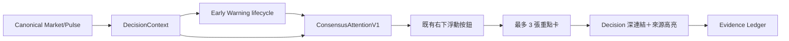

# Consensus Attention Radar v1

> 狀態：已落地（LOOP-015）
> 定位：跨功能「注意力投影」，不是第二套 Dashboard，也不是下單訊號
> 權威：`authority = attention_only`

## 為什麼存在

ST 的專業資訊分散在總覽、決策、前兆、曝險與 Evidence Ledger。使用者原本必須逐頁查看，才知道哪一項值得深入。Consensus Radar 將順序反轉：先用最多三張卡指出目前最值得看的共識，再深連結回唯一的來源面板。

## 收錄主題

| 主題 | 來源 | 顯示原則 |
|---|---|---|
| 市場結構 | Regime、廣度、資金與具名背離 | 永遠可觀察；warning 以上才進徽章 |
| 台股方向前兆 | 下跌前兆／強攻蓄勢 lifecycle | 只採用既有 deterministic warning engine |
| AI 錨點鏈 | TSMC／0050 residual／美國科技／廣度 | 2330 與 0050 不重複計票 |
| 記憶體週期 | 固定台美籃子與盤別動量 | 資料不足時保持 Observation |
| Owner 持倉曝險 | Exposure Lab 實際持倉穿透 | 只在 `portfolioKind=actual` 且資料可用時出現 |

選擇權結構暫不硬塞入 v1。公開 OI 的方向不確定、模型仍屬情境研究時，留在 Decision 專業面板比放進跨功能注意力層更誠實。

## 排序與提醒契約

- 最多五項候選、預設顯示前三項。
- `attentionScore` 只排序，不顯示為預測機率。
- `OBSERVATION` 只進次要觀察，不增加浮動按鈕徽章。
- `WATCH / ARMED / CONFIRMED / ACTIVE / CONFLICT` 且資料 fresh 才增加徽章。
- 資料 degraded／stale／逾期時保留卡片供追溯，但凍結提醒。
- 同一事件的 session、lifecycle、severity 或 direction 改變才產生新 generation。
- 已讀只記在本機 `st_consensus_ack_v1`；換日或狀態升級會重新提醒。
- 新聞不能當數值證據；AI 只能解釋，不能觸發或升級卡片。

## 互動與版面

- 桌面：右側 drawer。
- 手機直式：底部 sheet，保留瀏覽上下文。
- 手機橫式：右側 overlay，不改變原有 5+5 2-zone 工作站。
- 點卡片：自動標記已讀，前往 Decision 對應區段，展開並高亮原始項目。
- 「全部功能」：仍可從 Radar 開啟既有三層功能轉盤。

## 單一資料寫入權

Radar 不包含 `fetch()`、poll timer 或資料供應商邏輯，只訂閱 `DecisionData`。後端投影在 early-warning lifecycle 附著後，由 `publish_context()` 統一建立；Pulse compact summary 與完整 DecisionContext 共用同一份 `consensusAttention`。

## 驗證

- Python contract／Decision／warning／HTTP 整合測試。
- JavaScript 無獨立 fetch、3/5 budget、ACK、深連結與 portrait/landscape 契約測試。
- `shell_v5_selftest.js` 全通過。
- `build_order.py` 依賴排序通過。
- `build_v2.py` 已產生含 Radar 模組的 `stock_terminal_v2.html`。
