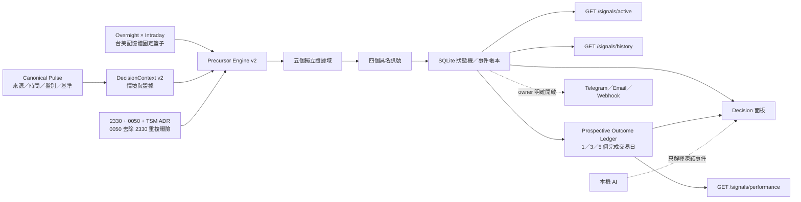
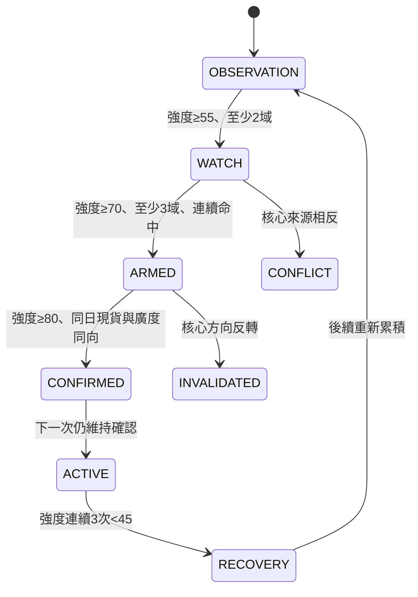

# 跨市場前兆雷達（Shadow v2）

跨市場前兆雷達把 Stock Terminal 既有的市場快照、DecisionContext、盤別動量研究與證據帳本收斂成可追蹤的「狀態轉換事件」。目的不是預測必然漲跌，而是在台股明顯轉弱或形成強攻結構之前，把多個相互獨立的來源是否開始同向，提早變成容易閱讀、可去重、可失效的提醒。

> 權限邊界：目前只具 `shadow_observation` 權限。訊號強度不是機率，不改寫 DecisionContext Regime、Action Envelope、Key Levels、曝險範圍或交易指令。雷達評估的是未來第 1～第 5 個台股交易日，不等同目前夜盤方向。

## 資料與控制流程



單一寫入者是後端 `early_warning.process_context()`。瀏覽器、通知 daemon 與 AI 都不能自行重算強度或升級狀態。

## 五個獨立證據域

| 證據域 | 主要來源 | 方向值 | 防止誤判的 Gate |
|---|---|---:|---|
| 國際科技 | SOX、NASDAQ、NVDA、AVGO | -1～+1 | 缺項按實際覆蓋降品質，不用新聞補數字 |
| 台積電／0050 錨點 | 2330、0050、TSM ADR、台指期 | -1～+1 | 0050 只有在具可用台積電權重時才計算 `0050-ex-2330`；否則不把兩者當兩票 |
| 記憶體週期 | 台股 2344／2408／2337／3006／8299；美股 MU／SNDK／WDC／STX | -1～+1 | 沿用固定籃子、75% quorum、調整後 OHLC 與 finalized bars；不足即 unavailable |
| 廣度／流動性 | 上市漲跌家數、3／5 日廣度斜率、產業參與 | -1～+1 | 必須是同一市場範圍與同盤資料 |
| 資金／衍生品 | 三大法人、量能、同契約 OI、台指期 | -1～+1 | OI 增減不單獨猜多空；方向仍需價格／現貨確認 |

### 0050 去重公式

當 2330、0050 與可用的台積電權重 `w` 同時存在時：

```text
R(0050-ex-2330) = (R0050 - w × R2330) / (1 - w)
```

這讓「台積電本身」與「0050 中其餘大型股」成為兩個可分辨的觀察面。若權重缺失或超出合理範圍，殘差欄位為 `null`，0050 不再重複計票。現行權重屬外部研究快照，因此 v1 只作當期 Shadow 判讀，不宣稱歷史點時可回測。

## 四個具名訊號

| Signal ID | 用途 | 必要語意 |
|---|---|---|
| `TW_DOWNSIDE_PRECURSOR` | 下行前兆證據 | 多來源先行轉弱；仍須同日現貨與廣度確認 |
| `TW_ATTACK_BUILDUP` | 上行前兆證據 | 多來源先行轉強；仍須同日現貨與廣度確認 |
| `AI_WAFER_DOUBLE_ARROW` | AI 雙箭頭晶圓連動 | 國際科技與 2330／0050 去重錨點必須同向；兩者衝突時直接標 `mixed` |
| `MEMORY_CYCLE_RESONANCE` | 記憶體週期共振 | 記憶體固定籃子須與台股錨點／廣度形成方向共振 |

主方向強度以可用證據域的加權支持減去反向壓力：

```text
support(direction) = Σ weight_i × quality_i × max(direction × family_i, 0)
opposition(direction) = Σ weight_i × quality_i × max(-direction × family_i, 0)
strength = 100 × max(0, support - 0.35 × opposition) / availableWeight
```

權重為國際科技 24%、台股錨點 26%、記憶體 18%、廣度／流動性 18%、資金／衍生品 14%。缺資料會同時降低可用權重與 `evidenceQuality`，不會把缺值當中性零分來美化品質。

## 狀態機、遲滯與去重



- 同一 `signalId + direction + observationKey` 只寫入一次；伺服器重算時間與重整頁面都不會推進狀態。
- 只有狀態轉換會產生 `SignalEvent`；輪詢不重複通知。
- 高階提醒至少需要三個獨立證據域。正負壓力同時偏高時標為 `CONFLICT`，不互相抵銷成「中性」。
- 夜盤新事件最多升至 `ARMED`；必須等下一個現貨盤，或在 13:30～15:00 的同日完成盤確認階段，同日現貨與上市廣度都有效，才能升至 `CONFIRMED`。
- 每個事件都保留支持理由、最強反證、確認條件、失效條件、證據 ID、政策版本、引擎版本與 TWSE 現貨盤邊界到期契約。同一觀測重算不得延長到期時間。
- 原始 `state` 保留生命週期稽核軌跡；超過 `expiresAt` 時另派生 `expired: true` 與 `effectiveState: EXPIRED`，並立即從 `activeEvents` 排除，不以唯讀查詢竄改歷史狀態。

## 時間、盤別與新鮮度契約

介面把「目前市場」與「多日前兆」分開呈現：

- `computedAt`：引擎本次重新計算的時間；不代表所有來源同時即時。
- `evaluationMode`：`cash_session_monitor`、`cash_close_review`、`overnight_monitor` 或 `finalized_review`。
- `baseline`：台股現貨的交易日、來源時間、盤別與完成狀態。
- `liveOverlay`：台指期目前可得盤別；夜盤漲跌會影響分數，但不會借用已收盤現貨完成新確認。
- `breadth`：上市股票廣度的交易日與來源時間。
- `target`：固定標示 `T+1～T+5`，即下一個至第五個台股交易日。
- `freshness`：上層通常為 `mixed`；「即時計算」不等同「所有輸入皆即時」。

TWSE MIS 的 `tlong` 或 `d + t` 會保留為 timezone-aware `asOf` 與 `tradeDate`。來源沒有時間時維持缺值，禁止使用 HTTP 抓取時間冒充市場時間。到期邊界在盤前對齊同日開盤、盤中對齊同日收盤、收盤後與夜盤對齊下一個平日開盤；目前尚無官方未來休市行事曆，因此契約明示 `weekday_fallback`，遇未知休市採提前失效而不延長。

## API 契約

### `GET /signals/active`

回傳每個訊號的目前狀態，以及仍屬 WATCH／ARMED／CONFIRMED／ACTIVE／CONFLICT 的事件。私人遠端唯讀帳號可以讀取，不能修改。

### `GET /signals/history?limit=80`

回傳有邊緣的狀態轉換，不回傳每次輪詢快照。上限 500 筆。

### `GET /signals/performance?limit=80&signal=TW_ATTACK_BUILDUP`

回傳從功能啟用後才開始累積的前瞻驗證帳本。預設只彙總兩個主方向訊號
`TW_DOWNSIDE_PRECURSOR` 與 `TW_ATTACK_BUILDUP`，避免把高度相關的 AI 雙箭頭與
記憶體共振元件混進同一個命中率；需要研究元件時，可用 `signal` 明確指定。

- 每個 `signal + direction + firstSeenAt` 狀態週期只建立一筆 trial，重整不重複計數。
- 入場基準是該週期第一次進入 WATCH 以上時，Canonical Pulse 中的 TWII 現值。
- 只用既有 Pulse 歷史的完成日收盤，依序凍結第 1／3／5 個交易日結果，不建立第二條行情來源。
- 已寫入的 outcome 不因資料供應商後續修訂而改寫；來源修訂只影響尚未結算的 horizon。
- 記錄方向報酬、方向是否正確、最大有利／不利變動，以及最早達到 2% 有利變動的交易日數。
- 每個 horizon 未滿 20 筆完成樣本前，命中率、false-alert rate 與平均報酬全部為 `null`。
- 回傳值一律保留 `shadowOnly: true`、`actionAuthority: none` 與 `predictiveProbability: false`。

主要欄位：

```json
{
  "eventId": "stable-hash",
  "signalId": "TW_ATTACK_BUILDUP",
  "direction": "upside",
  "fromState": "ARMED",
  "toState": "CONFIRMED",
  "strength": 84,
  "evidenceQuality": 0.82,
  "independentDomains": 4,
  "reasons": ["..."],
  "strongestCounterEvidence": ["..."],
  "confirmation": "...",
  "invalidation": "...",
  "observationKey": "source-observation-hash",
  "expiresAt": "2026-09-02T01:00:00+00:00",
  "expiry": {
    "market": "TWSE",
    "session": "regular",
    "boundary": "next_regular_open",
    "sessionDate": "2026-09-02",
    "timeZone": "Asia/Taipei",
    "calendarQuality": "weekday_fallback"
  },
  "shadowOnly": true,
  "actionAuthority": "none"
}
```

## 外部通知

所有狀態轉換都先寫入本機帳本並顯示於決策頁。若要再送 Telegram、Email 或 Webhook：

1. 開啟 ST 的「通知設定」。
2. 勾選「啟用後端警報 daemon」。
3. 設定至少一個通知通道。
4. 另外勾選「推送跨市場前兆雷達的狀態轉換」。

外部推送預設關閉。傳輸層只格式化已凍結的 `SignalEvent`，不重新取行情、不改分數。

## 前瞻驗證與升級條件

第一階段已開始用 append-only ledger 蒐集 1／3／5 日方向命中、2% 實質波動捕捉、
最大有利／不利變動與 lead sessions。介面中的比例只代表啟用後的歷史樣本；每個 horizon
未滿 20 筆時只顯示 `完成樣本／門檻`，不顯示比例，也不做回溯補樣。

仍須累積跨行情樣本後，才可討論從 Shadow 升級。後續至少補充：

- 各 horizon 的 precision／recall、Brier score 與 calibration（若未來產生機率模型）。
- 每個市場盤別、波動分層與事件日的 false-positive rate。
- 資料缺漏、來源延遲、公司行動與交易日錯位造成的降級次數。
- 與單純 TWII 動量、廣度或 SOX 基準相比，是否有穩定的 lead-time 增益。

在完成時間切割回測、walk-forward 與至少一段前瞻 shadow 樣本前，介面只能稱「訊號強度／證據品質」，不能稱「上漲機率／下跌機率」。
