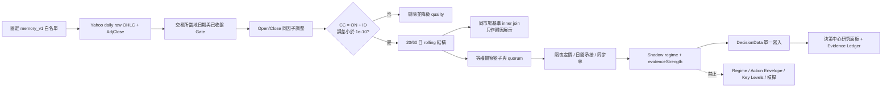

# Overnight × Intraday 盤別動量研究

狀態：`Shadow · 觀察`

模型：`st-overnight-intraday/v1`
用途：辨識隔夜價格重估與現金盤承接是否同向，觀察記憶體主題的盤別結構；不直接產生買賣、槓桿或持倉建議。

## Logic map



## 計算契約

對每個已完成交易日 `t`：

```text
factor_t       = AdjClose_t / RawClose_t
AdjustedOpen_t = RawOpen_t × factor_t

ON_t = ln(AdjustedOpen_t / AdjClose_t-1)
ID_t = ln(AdjClose_t / AdjustedOpen_t)
CC_t = ln(AdjClose_t / AdjClose_t-1)
```

每筆資料必須先通過：

```text
abs(CC_t - ON_t - ID_t) <= 1e-10
```

缺少 Open、Close、AdjClose、非正值、陣列長度錯位或未收盤日線都不補值。特別禁止用 `Open = Close` 製造假的零日內報酬。

主要顯示採 20／60 日 rolling log return；標準化強度使用當期以前的 median／MAD 基準，不使用無限累積曲線。缺口保留率只統計最近 60 個交易日內 `|ON| >= 0.5%` 的顯著缺口，樣本少於 3 筆時回傳空值。

## 固定觀察籃子

| 市場 | 成員 | 同市場展示基準 | Quorum |
|---|---|---|---|
| TW | 2344、2408、2337、3006、8299 | ^TWII | 4 / 5 |
| US | MU、SNDK、WDC、STX | ^SOX | 3 / 4 |

籃子與 ST 的 `memory-theme/2026-08-v1` 共用同一主題定義。這是固定觀察籃子，不宣稱代表完整產業，也不混入個人持股或特定 ETF。

同市場基準殘差以交易所當地交易日 inner join，不 forward-fill。v1 只拿來顯示歸因，不參與 regime 判定，避免未完成的 Beta／殘差模型改變主要訊號。

## Shadow regime

| ID | 中文語意 | 觀察重點 |
|---|---|---|
| `OVERNIGHT_CONFIRMED` | 隔夜重估獲日間承接 | 隔夜上修，現金盤沒有明顯回吐 |
| `GAP_FADE_DISTRIBUTION` | 隔夜重估、日內消化 | 開盤重估偏強，但日間承接轉弱 |
| `CASH_SESSION_ACCUMULATION` | 日間承接主導 | 主要動能發生在現金盤 |
| `BROAD_CORRECTION` | 隔夜與日內同步修正 | 兩個盤別都偏弱 |
| `MIXED_LOW_CONFIDENCE` | 定價結構分歧 | 尚無一致結構 |
| `INSUFFICIENT_DATA` | 資料不足 | Quorum、品質或時間 Gate 未通過 |

`evidenceStrength` 是覆蓋、方向分離度與同步程度的 bounded heuristic，不是成功機率，也不得稱作回測勝率。

## HTTP 與刷新權

- `GET /research/overnight-intraday?market=all|TW|US`：只讀伺服器快取，不隱藏外部下載。
- `POST /research/overnight-intraday/refresh`：只接受 `market` 與 `force`，只下載固定白名單；不接受任意 URL 或 symbols。
- 首次進入決策中心時，`DecisionData` 先讀快取；沒有快取才經明確 refresh route 建立研究資料。
- UI 不直接寫入第二份狀態。完整研究結果附在 `researchObservations.overnightIntraday`，compact Decision summary 刻意不包含此欄位。

## 權限邊界

下列欄位不得因本研究出現、消失或極端化而改變：

- `regime` 與 `regime.confidence`
- `actionEnvelope`、position range、mandatory controls
- `keyLevels` 與 volatility
- `scenario`、confirmation、invalidation
- orders、portfolio mutation、leverage

Evidence Ledger 中的 `shadow.overnight_intraday.tw/us` 是研究證據，不是 canonical regime evidence。

## 驗證

主要測試位於：

- `tests/test_overnight_intraday.py`：調整後 OHLC、拆股、缺值、partial bar、恆等式、inner join、gap、quorum 與 shadow contract。
- `tests/test_decision_http.py`：cache-only GET、白名單 refresh、未知欄位拒絕與 DecisionContext 權威投影不變。
- `tests/shell_v5_selftest.js`：DecisionData 單一寫入、研究面板語意與 compact summary 隔離。
- `tests/layout_visual_v5_selftest.js`：桌面／手機 reflow、字級與表格 contained overflow。
