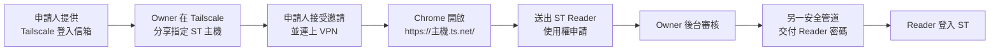
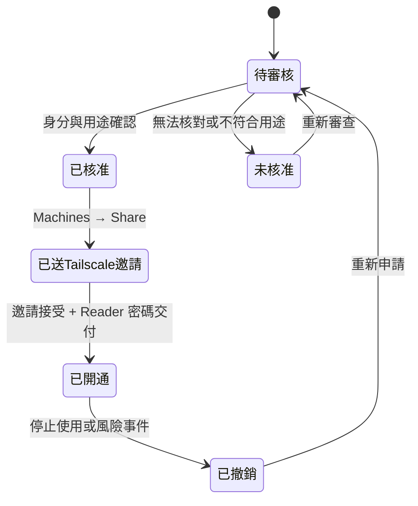

# Private Web ST 外部連線、申請與登入圖文指南

這份手冊適用於 iPhone + Chrome、Windows 10/11 + Chrome，以及 Stock Terminal Private Web 的 Reader 使用者與 Owner 管理者。

Private Web ST 不是公開網站。完整開通需要兩道獨立權限：

1. **Tailscale 私網權限**：Owner 只分享運行 ST 的指定主機；
2. **ST Reader 權限**：使用者送出申請，Owner 審核後另行交付 Reader 密碼。

> 申請不等於自動開通。ST 後台不會自動操作 Tailscale，也不保存 Tailscale API 金鑰、邀請連結或 ST 密碼。

## 一眼看懂完整流程



| 階段 | 使用者看見什麼 | Owner 要做什麼 |
| --- | --- | --- |
| 尚未分享主機 | 完全連不到 `.ts.net` | 在 Tailscale Machines 分享 ST 主機 |
| 已連 Tailscale、未開 ST | 可看登入、教學、申請頁 | 從 ST Owner 後台審核申請 |
| 已開通 | 可用 Reader 進入市場研究介面 | 標記已開通；需要時撤銷 |

## 申請人：先準備 Tailscale 帳號

Tailscale 使用 Google、Microsoft、Apple 或組織允許的 SSO 身分登入。請準備一個你能長期使用的登入信箱，並把同一個信箱提供給 Owner。

Owner 會從 Tailscale 的 **Machines** 頁分享一台固定 ST 主機。這種方式只讓你連到被分享的主機，不會讓你加入或看見 Owner 的整個 tailnet。

- [Tailscale：邀請使用者與分享裝置的差異](https://tailscale.com/docs/reference/inviting-vs-sharing)
- [Tailscale：分享裝置官方說明](https://tailscale.com/docs/features/sharing)

## iPhone + Chrome 第一次連線

### 1. 安裝 Tailscale

1. 從 App Store 安裝 Tailscale；iOS 需符合官方當前最低版本。
2. 開啟 App，點 `Get Started`。
3. 接受 iOS 建立 VPN 設定的提示。
4. 使用收到分享邀請的帳號登入。
5. 接受 ST 主機分享，確認 Tailscale 顯示 `Connected`。

[Tailscale iOS 官方安裝說明](https://tailscale.com/docs/install/ios)

```text
┌──────────────────────────┐
│ Tailscale                │
│ ● Connected              │
│                          │
│ Shared machine           │
│ ST host             ✓    │
└──────────────────────────┘
```

### 2. 用 Chrome 開啟 ST

在 iPhone Chrome 輸入 Owner 提供的完整 HTTPS 網址：

```text
https://<Owner 提供的 ST 主機名稱>.ts.net/
```

- 不要加入 `18432`、`18434` 或 `18435`；
- 不要改成 `http://`；
- 不要使用舊的 Basic-auth 書籤；
- 行動網路與 Wi-Fi 切換後若停止更新，先重新連一次 Tailscale。

### 3. 尚未開通時送出 Reader 申請

在登入頁選 **申請使用權**，填寫姓名／稱呼、聯絡信箱、Tailscale 登入信箱、預計使用裝置與必要的補充說明。

送出後記下 `ST-YYYYMMDD-XXXXXX` 申請編號。申請資料只保存在 ST 主機本機，供 Owner 審核與撤銷追蹤。

### 4. 收到核准後登入

1. 回到 ST 登入頁；
2. 身分選 `Reader（唯讀）`；
3. 輸入 Owner 透過另一個安全管道提供的 Reader 密碼；
4. 點 **安全登入**。

登入狀態不設應用層工作階段期限。Chrome 只保存簽章且 `HttpOnly` 的 Cookie；原始密碼不寫入 `localStorage`。下列情況才需重新登入：

- 清除該 `.ts.net` 網站的 Cookie／網站資料；
- 使用無痕模式並關閉分頁；
- Owner 輪替 Owner／Reader 存取密碼。

## Windows + Chrome 第一次連線

### 1. 安裝並登入 Tailscale

1. 從 Tailscale 官方頁下載 Windows 安裝程式；
2. 完成安裝後，在 Windows 系統匣找到 Tailscale 圖示；
3. 右鍵圖示，選 `Log in`；
4. 使用收到分享邀請的帳號登入；
5. 接受 ST 主機分享，確認狀態為已連線。

[Tailscale Windows 官方安裝說明](https://tailscale.com/docs/install/windows)

```text
Windows 系統匣
      │
      ▼
[ Tailscale ● Connected ]
      │
      ▼
Chrome → https://<ST 主機>.ts.net/
```

### 2. 申請與登入 ST

後續與 iPhone 相同：尚未開通先送出 Reader 申請；Owner 核准後選 Reader 並輸入 ST 密碼。請勿把 Owner 身分當成一般使用者選項。

## Owner：從後台管理申請

Owner 登入後開啟：

```text
https://<ST 主機>.ts.net/gateway/admin
```

後台提供：

- 待審核、處理中、已開通與撤銷數量；
- 申請人的聯絡信箱、Tailscale 帳號與裝置；
- `待審核 → 已核准 → 已送 Tailscale 邀請 → 已開通` 狀態追蹤；
- 未核准與已撤銷狀態；
- 直接前往 Tailscale Machines 的按鈕。

後台**不會**顯示或保存 Owner／Reader 密碼，也不會自動呼叫 Tailscale API。

### 建議審核順序



### 在 Tailscale 分享主機

1. 開啟 [Tailscale Machines](https://console.tailscale.com/admin/machines)；
2. 找到運行 ST 的主機；
3. 開啟該機器動作選單，選 `Share`；
4. 建議使用 Email 對指定對象發出單人邀請；
5. 等待對方接受，再於 ST 後台標記進度。

邀請連結應視同密碼。若使用手動連結，官方目前說明未使用的分享邀請會過期；實際期限與功能仍以 Tailscale 管理頁顯示為準。

### 交付 Reader 密碼

Reader 密碼保存在主機本機：

```powershell
$repo = 'C:\path\to\AI_Stock'
Set-Location $repo
$reader = (Get-Content data\private_web_read.token -Raw).Trim()
```

- 使用不同於 Tailscale 邀請的安全管道交付；
- 不要貼進 ST 後台備註；
- 不要放在 Git、README、公開分享包、Email 主旨或截圖；
- 永遠不要把 `private_web_owner.token` 交給受邀者。

## 撤銷與密碼輪替

只撤銷單一使用者時：在 Tailscale Machines 撤銷該主機分享，再於 ST Owner 後台把申請標記為 `已撤銷`。

Reader 密碼疑似外洩時，輪替兩組 ST 存取密碼並重啟 Private Web ST：

```powershell
$repo = 'C:\path\to\AI_Stock'
Set-Location $repo
py -3 scripts\setup_private_web.py --rotate
.\STOP_PRIVATE_WEB.cmd
.\START_PRIVATE_WEB_HOST.cmd
```

輪替會讓所有既有瀏覽器登入與 API Token 失效。

## 連線與黑畫面排除

| 狀況 | 檢查順序 |
| --- | --- |
| 完全打不開 `.ts.net` | 邀請是否接受 → Tailscale 帳號是否正確 → VPN 是否 Connected → 網址是否完整 HTTPS |
| Tailscale 已連線但仍無法進入 | 確認被分享的是正確 ST 主機；若使用自訂 policy，檢查雙方 access controls |
| 顯示 ST 密碼錯誤 | 身分應選 Reader；確認 Owner 是否剛輪替密碼 |
| 登入後又回登入頁 | 退出無痕模式；確認 Cookie 未被清除；檢查內容阻擋器 |
| 登入後黑畫面 | 關閉分頁後從完整網址重開；記錄發生時間、裝置與 Chrome 版本 |
| 換 Wi-Fi／行動網路後停止更新 | 重新連接 Tailscale，再重新整理 ST |

健康檢查網址：

```text
https://<ST 主機>.ts.net/gateway/health
```

正常時至少應看到：

```json
{"ok": true, "gateway": "private-web", "upstream": true}
```

管理者本機診斷：

```powershell
$repo = 'C:\path\to\AI_Stock'
Set-Location $repo
Invoke-RestMethod http://127.0.0.1:18434/gateway/health
tailscale serve status
Get-Content logs\private_web_audit.jsonl -Tail 50
Get-Content logs\private_web_client.jsonl -Tail 50
```

稽核紀錄不保存表單內容、Authorization Header、ST 密碼或申請人的姓名／信箱；只記申請編號、狀態、事件與技術性請求資訊。

## 安全邊界

- 不使用 Tailscale Funnel；Funnel 是公開網際網路入口。
- 不在路由器開放 ST 的 `18432`、`18434` 或 `18435`。
- 一般受邀者只使用 Reader；Owner 只供主機管理者。
- Reader 只能讀取核准的市場、報價、基本面、廣度、總經、Pulse 與 DecisionContext 等資料。
- 通知設定、密碼管理、遠端回補、WaveDeck、交易與券商操作不經由 Private Web ST 開放。
- 申請檔 `data/private_web_access_requests.json` 含個人資料，只留在正式主機，不進 Git 或一般分享包。
