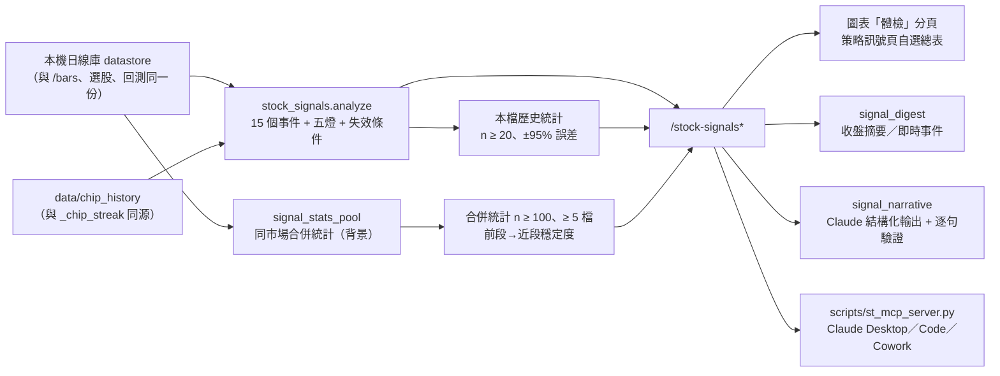

# 個股訊號與體檢（st-stock-signals/v1）

把已經齊全的資料收斂成三層：**訊號引擎 → 歷史驗證 → 白話翻譯**。新手看燈號、一句話和失效價位；老手看規則、統計與證據。

> 權限邊界：訊號是規則化的狀態轉換與歷史統計，不是買賣建議。AI 只能引用證據做解釋，不得新增或改判燈號、事件、價位與統計。價格未還原除權息。

## 資料流



## 指標口徑（全部走 `server/indicators.py`）

| 指標 | 口徑 |
|---|---|
| RSI14 | Wilder smoothing（與 TradingView 一致）；推播 daemon 已改用同一實作 |
| SMA | 簡單算術平均，逐點與 `indicators.sma` 相同 |
| EMA / MACD | alpha = 2/(n+1)，以前 n 根 SMA 為種子；MACD(12, 26, 9) |
| Bollinger | SMA20 ± 2 × 母體標準差 |
| ATR14 | Wilder RMA of True Range（首根 TR = high − low） |
| 前 N 日高低 | 不含當根，避免自己比自己 |

## 訊號目錄（事件＝狀態轉換，不是水位）

| 類別 | 訊號 | 方向 | 觸發（第 t 根） | 失效 |
|---|---|---|---|---|
| 趨勢 | 站上季線／跌破季線 | 偏多／偏空 | 收盤穿越 SMA60 | 收盤回到季線另一側 |
| 趨勢 | 20/60 黃金交叉／死亡交叉 | 偏多／偏空 | SMA20 穿越 SMA60 | 反向穿越 |
| 動能 | RSI 超賣回升 | 偏多 | RSI[t-1] < 30 ≤ RSI[t] | 收盤跌破近 10 日最低 |
| 動能 | RSI 過熱回落 | 偏空 | RSI[t-1] ≥ 70 > RSI[t] | 收盤創近 10 日新高 |
| 動能 | MACD 翻多／翻空 | 偏多／偏空 | 柱狀體變號 | 柱狀體再變號 |
| 量價 | 帶量突破／跌破 20 日高低 | 偏多／偏空 | 收盤越過前 20 日高（低）且量 ≥ 1.5 倍 20 日均量 | 收盤回到突破點另一側 |
| 波動 | 盤整後向上噴出／向下破底 | 偏多／偏空 | 前一日帶寬 ≤ 近 120 日第 20 百分位，收盤穿越上（下）軌 | 收盤回到中軌另一側 |
| 波動 | 波動急升 | 風險 | ATR14[t]/ATR14[t-10] 首次 ≥ 1.5 | 比值回落到 1.2 以下 |
| 籌碼 | 投信連 3 買／外資連 3 賣 | 偏多／偏空 | 第 3 日成形，且看得到第 4 日前的方向不同 | 轉為反向買賣超 |

生命週期：`new`（今日）→ `active`（觀察中）→ `confirmed`（3 根內沒失效）或 `invalidated`。同一訊號近 10 根只保留最近一次。盤中最後一根 K 標示「盤中暫定」，只存在記憶體，收盤後才寫回日線庫。

完整規則以 `GET /stock-signals/catalog` 為準。

## 五燈體檢

| 燈 | 偏多 | 偏空 | 留意 |
|---|---|---|---|
| 趨勢 | 收盤 > SMA60、SMA20 > SMA60、季線上彎 | 三者相反 | — |
| 動能 | RSI ≥ 50 且 MACD 柱 > 0 | RSI < 50 且 MACD 柱 < 0 | RSI ≥ 70 過熱／≤ 30 超賣 |
| 量能 | 量 ≥ 2 倍均量且收漲 | 量 ≥ 2 倍均量且收跌 | — |
| 籌碼 | 外資或投信連買 ≥ 3 日 | 連賣 ≥ 3 日 | 外資與投信方向相反 |
| 風險 | — | — | ATR% 高於近一年 80% 的日子，或距 60 日高點回落 ≥ 15% |

一句話摘要由固定模板產生（不經 LLM）；卡片另給「什麼情況代表判斷錯了」：上升趨勢看跌破季線、下降趨勢看站回季線、盤整看前 20 日高低點。

## 歷史統計

**本檔統計**：逐根判斷（只用當根以前資料），進場＝觸發日收盤（籌碼訊號為次一交易日收盤，因資料盤後才公布），只收已走完 5／20 日的樣本，同訊號觸發間隔 ≥ 5 根。n < 20 不公開比例。

**同市場合併統計**（`signal_stats_pool.py`）：對本機日線庫每一檔真實股票／ETF 套用同一套規則（排除 `^TWII`、`__MARGIN_RATIO__` 等合成序列）。基準＝同批標的所有交易日。合併樣本 < 100 或貢獻標的 < 5 不公開比例；另列前後兩段的上漲比例作為穩定度參考。於背景任務執行並快取，時間取決於本機資料規模。

每一列保留比例誤差與原始基準差距：

- `descriptive`：歷史差距，尚未驗證優勢。比例誤差不等於兩組差距的區間。
- `ci95Pts` 採 Wilson 比例區間的最大半寬，仍假設獨立樣本；不據此給出顯著性結論。

限制會一起回傳：存活者偏差、未還原除權息、事件與同日股票相依、多重比較。新增情境研究另提供季度等權差距區間，仍屬探索結果。

## 推播

`alert_config.json` 的 `stock_signal_push`：

| 模式 | 行為 |
|---|---|
| `off`（預設） | 不推播 |
| `digest` | 收盤後（台股 14:30、美股 16:45 當地時間）每市場一則自選股體檢摘要 |
| `realtime` | 今日新事件每個 (代號, 訊號, 日期) 只推一次，外加收盤摘要 |

`stock_signal_ai_digest=true` 且已設定 AI Key 時，收盤摘要先以 Message Batches 送出 Claude 白話版（非即時、費用約一半），最多等 90 分鐘；逾時或失敗照常送規則版。標的＝前端同步的自選股 ∪ WATCH 觀察清單。推播開啟時，每週在背景重算一次合併統計。

## AI 白話解讀（`signal_narrative.py`）

1. 證據包＝體檢結果的 `evidence` 子集（燈號、摘要、失效條件、事件、本檔與合併統計、關鍵指標）。
2. 系統提示含訊號名詞表，逐字固定並設 `cache_control`，同一版本可命中提示快取。
3. 以 `output_config.format`（JSON schema）要求 `sentences[{text, evidenceIds}]`，`effort=medium`，不傳 `temperature`（新模型會拒收）。舊模型不支援結構化輸出（HTTP 400）時，退回提示詞 JSON 並用同一套驗證。
4. 後端逐句驗證：證據編號必須存在、句中每個數字必須出現在所引證據、不得有買賣／目標價／保證等字眼。刪掉的句子與原因會一起回傳；剩不到 2 句就改用規則模板。
5. 拒答、截斷、HTTP 錯誤或未設 Key 一律回規則模板，介面永遠有可讀內容。同一張卡 30 分鐘內不重複呼叫。

預設模型沿用 `ai_api.resolve_model`（每日查 `/v1/models` 取最新 Sonnet；查不到時後備為 `claude-sonnet-5`）。

## 與 Claude 整合（MCP）

`scripts/st_mcp_server.py` 是純標準函式庫的 stdio MCP 伺服器，只讀本機 ST API：

| 工具 | 內容 |
|---|---|
| `st_stock_health` | 單檔體檢（燈號、摘要、失效條件、事件、本檔與合併統計） |
| `st_stock_evidence` | 單檔可引用證據表（寫筆記／論點時逐句引用） |
| `st_watchlist_health` | 最多 40 檔的精簡燈號與今日新訊號 |
| `st_signal_scoreboard` | 15 個訊號的同市場成績單 |
| `st_signal_catalog` | 訊號定義 |
| `st_market_decision` | DecisionContext 精簡版（情境、姿態、允許／限制行動、確認與失效） |
| `st_key_levels` | 關鍵價位、ATR 與實現波動 |

設定：

```powershell
# Claude Code
claude mcp add stock-terminal -- python C:\path\to\AI_Stock\scripts\st_mcp_server.py
```

```json
// Claude Desktop：claude_desktop_config.json
{"mcpServers": {"stock-terminal": {"command": "python",
  "args": ["C:\\path\\to\\AI_Stock\\scripts\\st_mcp_server.py"]}}}
```

ST 需先啟動（`START_TIP.cmd`）；非預設埠用 `ST_MCP_BASE_URL=http://127.0.0.1:<port>`。

搭配 [Claude for Financial Services](https://github.com/anthropics/financial-services) 的 equity-research 技能時，把 ST 當成台股資料來源（該套件的連接器以美系付費資料為主，沒有證交所、櫃買或期交所）：

| 技能 | 建議用法 |
|---|---|
| `/morning-note` | 先呼叫 `st_market_decision` 與 `st_watchlist_health`，再寫晨會重點 |
| `/thesis` | 以 `st_stock_evidence` 為證據，把失效條件寫進投資論點 |
| `/catalysts` | 搭配 ST 事件行事曆（法說、除權息、月營收） |
| `/screen` | 以 `st_signal_scoreboard` 先確認哪些訊號在本市場有資訊，再用選股 |

## API

| 端點 | 說明 |
|---|---|
| `GET /stock-signals?sym=2330&market=TW[&cacheOnly=1]` | 完整體檢（含 evidence）；`cacheOnly=1` 不連外 |
| `GET /stock-signals/batch?syms=2330,AAPL:US` | 精簡版，最多 40 檔 |
| `GET /stock-signals/catalog` | 訊號目錄 |
| `GET /stock-signals/pooled?market=TW` | 同市場成績單（快取） |
| `POST /stock-signals/pooled/refresh` | 背景重算合併統計 |
| `POST /stock-signals/explain` | `{sym, market}` → AI 白話（或規則模板） |
| `POST /stock-signals/watchlist` | 同步自選股（推播標的） |
| `GET/POST /stock-signals/push-config` | `{mode, aiDigest}` |
| `GET /stock-signals/digest/preview?market=TW` | 預覽收盤摘要文字（不連外） |

本機狀態檔（已列入 `.gitignore`，分享包不帶）：`data/stock_signal_watchlist.json`、`data/stock_signal_push_state.json`、`data/stock_signal_pooled_stats.json`。

## 後續研究與前瞻追蹤

現有 15 個事件的歷史比例屬描述統計，比例誤差不再用來判定相對基準優勢。成績單新增同股票、同大盤情境的已成熟歷史對照，以及季度等權差距區間。完整方法、資料門檻、固定時間分段與限制見 [個股訊號研究規格](個股訊號研究規格.md)。

`scripts/個股訊號成績單.py` 會凍結程式與行情快照、產生完整成績單，並登錄獨立的個股研究協定。沒有通過者保留空候選；不回填前瞻事件，不建立排程或啟用推播。既有 `POST /stock-signals/pooled/refresh` 也共用此研究計算，HTTP 查詢本身仍只讀快取。

籌碼依紀錄的 `sourceDate` 對齊，同日重複快照去重。當日尚未收盤與未來日線不納入成熟研究；已知缺漏交易日不以較晚價格代替。

「圖表 → 體檢 → 專業」提供獨立事件證據、狀態日期、成熟樣本分布與原始證據表。第二輪另加入固定 RSI 情境研究與既有資料來源修復，結果及限制見 [第二輪驗收](個股訊號下一輪驗收.md)。

## 測試清單

`tests/test_signal_indicator_parity.py`、`tests/test_stock_signals.py`、`tests/test_signal_stats_pool.py`、`tests/test_signal_narrative.py`、`tests/test_st_mcp_server.py`，以及 `tests/stock_health_v5_selftest.js`、`tests/watch_rsi_bounce_selftest.js`、`tests/js_syntax_selftest.js`（每支打包進 HTML 的前端腳本都必須能解析）。
