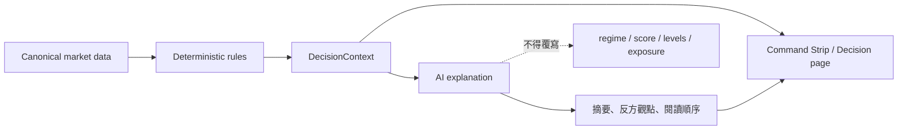
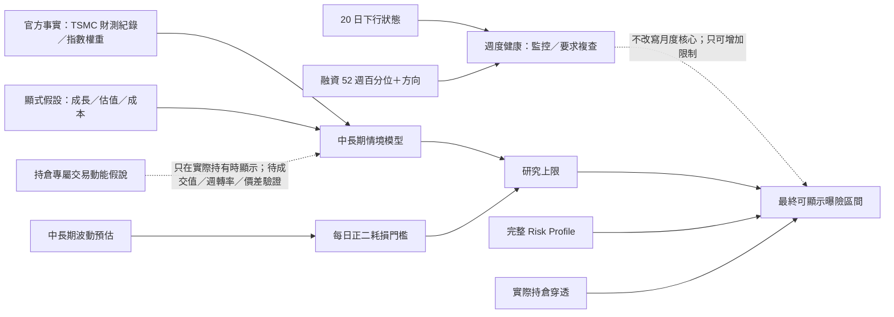
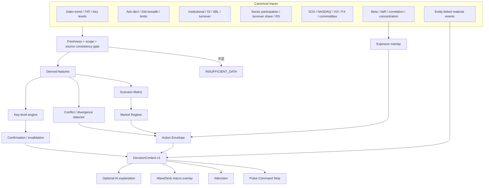
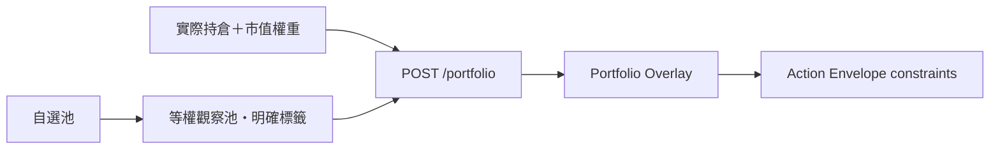
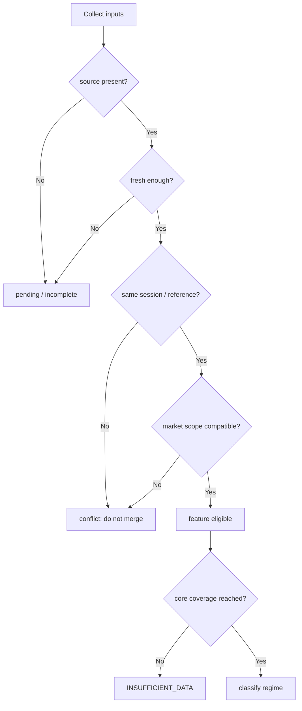

# Stock Terminal Strategic Command Center Plan

> 狀態：Implemented in current worktree
>
> 目標版本：v5.x
>
> 核心命題：把 ST 從「高密度資訊終端」提升為「可稽核的決策指揮中心」，但不製造無來源的交易建議或偽精準倉位。

## 1. Executive Summary

外部評語指出的方向正確：Stock Terminal 已具備足夠的資料密度與專業視覺，下一個價值增量不在新增更多卡片，而在把資料收斂成：

1. **現在是什麼市場狀態？**
2. **哪些風險行動是允許、限制或禁止的？**
3. **什麼條件會推翻目前判斷？**
4. **這個結論用了哪些來源、時間與比較基準？**

本計畫提出一個新的 `DecisionContext` 決策契約，由規則化、可測試的後端引擎產生；AI 只將既有結論轉成容易閱讀的文字，不負責創造分數、價位、倉位或方向。

### 實作狀態

| 工作流 | 狀態 | 主要落點 |
|---|---|---|
| 情境矩陣與 Command Strip | 已完成 | `server/decision_context.py`、`src/ui/pulse_v5.js` |
| 關鍵價位、ATR、波動與分歧 | 已完成 | `server/key_levels.py`、`DecisionContext.divergences[]` |
| 同口徑產業結構 | 已完成 | `server/sector_flow.py`；無成交額時明示為 participation proxy |
| Risk Profile 與投組覆蓋 | 已完成 | `POST /decision/context`、`src/ui/decision_v5.js` |
| 新聞影響層級 | 已完成 | `server/news_impact.py`；AI 僅提供可選文字解釋 |
| 歷史、證據與離線重播 | 已完成 | `data/decision_history.db`、`logs/decision_trace.jsonl`、`scripts/replay_decisions.py` |
| 獨立決策頁與單一寫入 | 已完成 | `#decision`、`src/core/decision_data_v5.js` |
| 新手語意層與漸進揭露 | 已完成 | 預設市場天氣／情緒表／三訊號／台股美股期貨雷達；進階觀察收合；完整 `5col-2zone` 保留於專業模式 |
| 中長期 Exposure Lab | 已完成 | `server/exposure_lab.py`；預設展開於 `#decision`，只輸出研究上限，不直接產生買賣 |
| 正二／持倉穿透 | 已完成 | 依實際產品的每日槓桿倍數穿透；計算有效總曝險、台積電與科技經濟曝險，不給重疊分散加分 |
| 雙波動層與融資煞車 | 已完成 | 20 日下行狀態只降風險；60 日／長期錨定波動供中長期耗損；52 週融資百分位與 4 週方向只作煞車 |
| POS 報酬語意 | 已完成 | `src/core/pro_v2.js`、`position_v2.js`、`wl_live_v3.js`；分開顯示「今日」與「持有」，沿用台股紅漲綠跌 |

下文保留完整設計與驗收基準，作為後續修改時的架構契約，而不是一次性提案。

### 核心策略

- 新手模式預設呈現白話市場天氣、行動邊界與三個訊號；專業模式維持一屏 `5col-2zone`，不增加第三列。
- 在頂部加入精簡的 **Command Strip**，取代部分重複敘述。
- 詳細推理、情境矩陣、證據與失效條件放到獨立 `#decision` 頁。
- 先重用既有 Pulse、OI、投組風險、國際外溢與新聞引擎，再補缺少的關卡與產業資金流。
- 所有決策輸出必須帶 `source / asOf / session / reference / confidence / evidence`。
- 沒有資料就輸出 `INSUFFICIENT_DATA`，不能用 AI 或預設值補洞。

## 2. 對外部建議的判斷

| 建議 | 判斷 | ST 現況 | 計畫處理 |
|---|---|---|---|
| Scenario Matrix／策略傾向 | **採納** | Pulse 已有體質、風險、因子與 tone，但尚未形成正式 regime | 建立 deterministic `DecisionContext` 與情境矩陣 |
| 建議持倉 60%–70% | **調整後採納** | ST 不知道使用者最大風險、現金需求與槓桿限制 | 預設只給風險姿態；只有設定 Risk Profile 才計算範圍，並顯示公式 |
| R1/R2、S1/S2、多空分界 | **採納** | 圖表已有技術與畫線，總覽沒有一致的關卡契約 | 新增可重現的 key-level engine，先做前高低收、Classic Pivot 與 ATR |
| 產業權重與成交占比 | **採納** | 現有產業輪動多為漲跌幅與代理股；Pulse 已誠實標示缺成交額時使用集中度代理 | 新增 `marketSharePct / shareDelta5d / RS20 / coverage`，上市與上櫃不可靜默混合 |
| 自選池 Beta／相關性 | **整合既有能力** | `/portfolio` 已有 Beta、相關性、VaR、波動與產業曝險 | 不重寫引擎；將持倉摘要接入決策層。自選池只能標示「等權觀察池」，不能冒充實際投組 |
| Header 降密度、Macro Regime 升階 | **採納** | WaveDeck 與更新資訊偏擁擠 | Header 只留 regime、confidence、freshness；WD 細節收進 popover |
| 廣度背離警告 | **優先採納** | Pulse 已有 advRatio、20 日歷史與部分 divergence 判斷 | 正式化 `divergences[]`，放大 20 日趨勢並提供規則與失效條件 |
| AI 新聞影響標籤 | **調整後採納** | `/flash` 已有來源、公司、代號、市場、URL、8-K 類別 | 先做 deterministic entity/scope/impact tier，再讓 AI 解釋；AI 不自行判定財務金額 |
| 美股盤前／盤後連動 | **部分已有，補契約** | 已有 after-market 與 AI 科技外溢 | 統一 regular/pre/post session 與台股映射時間，禁止混用不同基準 |
| 台指 OI | **已有，改為顯性呈現** | `pulse_extras.py` 已做近月同契約 OI，換月無法對齊時回 pending | 接入情境矩陣與證據鏈，不另寫第二套 |
| 散戶小台多空比 | **延後** | 尚缺完整、穩定且口徑清楚的主資料契約 | 確認官方來源、日期與契約對齊後才納入 |
| 波動率區間預測 | **拆分處理** | 投組已有 realized volatility / VaR，VIX 只是美股風險代理 | 先做 realized range；implied volatility 必須有選擇權來源，不能拿 VIX 冒充台指 IV |

## 3. Product Principles

### 3.1 Decision support，不是假投顧

介面應輸出「風險姿態與允許行動」，而不是在缺少使用者條件時直接輸出買賣與百分比。

建議用語：

- `允許增加風險，但不追價`
- `維持曝險，等待廣度確認`
- `限制新增槓桿`
- `優先檢查對沖與集中曝險`
- `資料衝突，不建立新方向`

避免用語：

- `現在買進`
- `一定續漲`
- `建議持倉 70%`（尚未設定 Risk Profile 時）
- `AI 判定高勝率`（沒有樣本與校準時）

### 3.2 Deterministic first，AI second



AI 可以：

- 摘要證據。
- 說明因果鏈與反方觀點。
- 將新聞連到已知供應鏈節點。
- 把失效條件轉成自然語言。

AI 不可以：

- 改變 deterministic regime。
- 創造沒有來源的價格關卡。
- 在沒有 Risk Profile 時生成倉位百分比。
- 把缺資料描述成中性或正面。

### 3.3 Evidence before confidence

每個結論都要能點開查看：

- 使用的輸入欄位。
- 來源與資料時間。
- 盤別與比較基準。
- 觸發規則。
- 支持證據與衝突證據。
- 失效條件。

## 4. Target User Experience

### 4.1 Pulse Command Strip

總覽不增加新列，而是在 Header 下方建立一條三區塊 Command Strip：

```text
┌──────────────────────┬──────────────────────────┬──────────────────────────┐
│ 市場狀態             │ 可採取範圍               │ 失效／確認條件           │
│ NARROW_RALLY         │ 維持曝險・限制新增槓桿   │ 廣度 > 50% / SOX 止跌   │
│ 信心 72・資料 91%    │ 不追價・檢查集中度       │ 跌破 S1 則轉防禦        │
└──────────────────────┴──────────────────────────┴──────────────────────────┘
```

設計規則：

- 最多三行，不能破壞 `5col-2zone` 一屏限制。
- 點擊任何區塊進入 `#decision`。
- `confidence` 與 `dataCompleteness` 分開顯示。
- 若來源過期，整條降階並顯示 `STALE`，不能維持高信心色彩。
- 使用既有台美顏色契約；regime 色不是漲跌色，使用中性狀態色。

### 4.2 Decision Page

新增 `#decision`，包含：

1. **Regime Summary**：狀態、信心、資料完整度、更新時間。
2. **Scenario Matrix**：趨勢 × 廣度 × 資金 × 波動。
3. **Action Envelope**：允許、限制、禁止、觀察。
4. **Key Levels**：方法、週期、來源、關卡與失效。
5. **Divergences**：指數／廣度、現貨／期貨、台股／美科技、價格／量能。
6. **Portfolio Overlay**：若有持倉才顯示 Beta、VaR、集中與產業曝險。
7. **Evidence Ledger**：正面、風險、衝突、缺資料。
8. **AI Explanation**：選配；只能解釋上面已產生的結論。
9. **Exposure Lab**：預設展開、仍可手動收合；顯示月度中長期核心、正二效率差、研究上限、週度健康監控、商品機制與實際持倉穿透。

### 4.4 Exposure Lab 邏輯邊界



- 台積電歷史財測達成紀錄只提高情境信心，不把未來營收、匯率與估值假設改寫成必然。
- 0050 標示為大型權值／科技高度集中工具，不標示為純 AI ETF。
- 多檔同方向每日正二若底層高度重疊，同時持有是主動集中，不是有效分散。
- 週度落後波動擇時在外部同平均曝險樣本外比較未勝出，因此短波動與融資層只監控／要求複查，不再機械縮放研究上限或最終範圍。
- 個別產品的拆股低價買氣假說只在實際持有時出現，初始狀態固定為 `UNVERIFIED`；須以前後 20 日成交值、成交量、週轉率、價差與折溢價確認。

### 4.3 Header Hierarchy

Header 第一層只顯示：

- `Macro Regime`
- `confidence`
- `asOf / freshness`
- WaveDeck 連線燈

WaveDeck 詳細狀態、來源健康度、更新耗時放到 hover／popover；避免和決策摘要爭奪第一視線。

## 5. Decision Logic Map



## 6. Regime Model

### 6.1 初始狀態集合

| Regime | 條件概念 | 預設風險姿態 |
|---|---|---|
| `BROAD_RISK_ON` | 指數、廣度、量能與資金同向 | 可增加風險，但仍受關卡與曝險限制 |
| `NARROW_RALLY` | 指數偏強但廣度／產業參與不足 | 維持強勢部位、限制追價與集中 |
| `RECOVERY_ATTEMPT` | 趨勢改善、廣度先回升、資金尚未確認 | 小幅試探、等待確認，不提升槓桿 |
| `CONFLICT` | 現貨、期貨、法人、國際或量價互相矛盾 | 不建立新方向，列出確認條件 |
| `DEFENSIVE_RISK_OFF` | 指數、廣度、資金與風險同步惡化 | 降低新增風險、檢查對沖與流動性 |
| `CAPITULATION` | 大幅下跌、廣度極端、波動與跌停擴張 | 禁止把超跌自動視為買點；等待結構修復 |
| `INSUFFICIENT_DATA` | 核心來源缺失、過期或 scope 衝突 | 不輸出方向與百分比 |

### 6.2 Feature groups

每組先正規化為 `[-1, +1]`，同時保留原始值：

| 群組 | 主要輸入 | 備註 |
|---|---|---|
| Trend | TAIEX／OTC 即時漲跌、20 日趨勢、TXF basis | 即時漲跌必須使用 canonical `displayChangePct` |
| Breadth | advRatio、net A/D、多空比 20 日 Z、漲跌停 | TWSE 股票與整體市場 scope 分離 |
| Flow | 三大法人、成交量能、TX OI、SBL | OI 必須同契約比較；換月進 pending |
| Sector | 上漲類股比、成交占比、RS20、集中度 | 無成交額時不可把漲幅代理標成資金流 |
| Global | SOX、NASDAQ、VIX、USD/TWD、商品角色 | 保留交易時區與盤前／盤後 session |
| Risk | healthScore、riskScore、維持率、realized vol | 不把 VIX 當台指 IV |
| Portfolio | Beta、VaR、平均相關、單一產業集中 | 只有實際持倉權重才可稱投組曝險 |

### 6.3 Classification approach

首版採規則矩陣，不使用黑箱模型：

```text
if core_data_missing_or_stale:
    INSUFFICIENT_DATA
elif trend < -0.55 and breadth < -0.55 and risk > 0.60:
    DEFENSIVE_RISK_OFF
elif extreme_selloff and limit_down_expanding:
    CAPITULATION
elif trend > 0.45 and breadth > 0.35 and flow > 0.20:
    BROAD_RISK_ON
elif trend > 0.35 and breadth < -0.15:
    NARROW_RALLY
elif trend_crosses_up and breadth_leads and flow <= 0.20:
    RECOVERY_ATTEMPT
else:
    CONFLICT
```

實際門檻必須：

- 放在具名常數／設定中。
- 有 fixture 與邊界單測。
- 能在 Evidence Ledger 顯示命中的規則。
- 經歷史 replay 校準後才能調整。

## 7. Action Envelope

### 7.1 預設輸出

`Action Envelope` 不是下單訊號，而是風險治理範圍：

```json
{
  "posture": "LIMIT_NEW_RISK",
  "allowed": ["HOLD", "ROTATE_TO_LOWER_BETA", "REVIEW_HEDGE"],
  "restricted": ["ADD_LEVERAGE", "CHASE_GAP_UP"],
  "prohibited": [],
  "rationale": ["index_breadth_divergence", "negative_ai_spillover"],
  "confirmation": ["advRatio >= 0.50 for 2 observations"],
  "invalidation": ["TAIEX closes below S1"],
  "positionRange": null
}
```

### 7.2 Risk Profile 啟用後的倉位範圍

只有使用者明確設定下列參數，才可輸出百分比：

- `baseGrossExposure`
- `maxGrossExposure`
- `maxLeverage`
- `maxSingleNameWeight`
- `maxSectorWeight`
- `maxPortfolioBeta`
- `maxDailyVaR`
- `investmentHorizon`

透明公式：

```text
targetGross
  = baseGrossExposure
  × regimeMultiplier
  × volatilityMultiplier
  × dataConfidenceMultiplier

lowerBound = targetGross × 0.90
upperBound = min(targetGross × 1.10, maxGrossExposure)
```

所有 multiplier 必須顯示，不得由 LLM 產生。若投組 VaR／Beta 已超過限制，`upperBound` 必須先被風險限制截斷。

## 8. Key-Level Engine

### 8.1 首版方法

| 方法 | 公式／資料 | 用途 |
|---|---|---|
| Previous session | 前一有效交易日 H/L/C | 最可驗證的隔日攻防 |
| Classic Pivot | `P=(H+L+C)/3`；`R1=2P-L`；`S1=2P-H`；`R2=P+(H-L)`；`S2=P-(H-L)` | 日內參考 |
| ATR Band | 前收 `± k×ATR14` | 波動調整後的合理區間 |
| Swing level | 經確認的 N 日 pivot high／low | 波段結構；需明確 window 與確認條件 |

### 8.2 Contract

```json
{
  "symbol": "^TWII",
  "session": "regular",
  "asOf": "2026-08-11T05:30:00Z",
  "source": "local-daily-series",
  "referenceDate": "2026-08-10",
  "method": "classic_pivot_v1",
  "timeframe": "1d",
  "levels": {
    "r2": 0,
    "r1": 0,
    "pivot": 0,
    "s1": 0,
    "s2": 0
  },
  "quality": {
    "complete": true,
    "stale": false
  }
}
```

### 8.3 Guardrails

- TXF 日盤與夜盤分開標示，不能拿日盤前收直接冒充夜盤比較基準。
- OHLC 缺一項就不算 Classic Pivot。
- Swing level 不可只因接近目前價格就改名為支撐或壓力。
- 每個關卡都顯示 method、timeframe、reference date。

## 9. Breadth Divergence

### 9.1 Divergence types

| ID | 條件概念 | 顯示 |
|---|---|---|
| `INDEX_UP_BREADTH_DOWN` | 指數上漲，但 advRatio 低於中性且惡化 | 上漲結構狹窄 |
| `INDEX_DOWN_BREADTH_UP` | 指數下跌，但 advRatio／net A/D 改善 | 賣壓可能收斂 |
| `PRICE_UP_VOLUME_DOWN` | 指數走高但成交額趨勢收縮 | 上攻確認不足 |
| `SPOT_FUTURES_CONFLICT` | 現貨與 TXF 方向／basis 顯著衝突 | 期現貨背離 |
| `TW_US_TECH_DIVERGENCE` | 台半導與 SOX／NASDAQ 方向衝突 | 隔日外溢警戒 |
| `FLOW_PRICE_CONFLICT` | 價格上漲但法人／OI 結構偏弱 | 資金確認不足 |

### 9.2 Output

```json
{
  "id": "INDEX_UP_BREADTH_DOWN",
  "severity": "warning",
  "confidence": 0.82,
  "observed": {
    "indexChangePct": 0.8,
    "advRatio": 0.39,
    "advRatioZ20": -1.1
  },
  "evidenceIds": ["twii.live", "breadth.stock_scope"],
  "confirmation": "advRatio returns above 0.50",
  "invalidation": "index closes below pivot while breadth remains weak"
}
```

## 10. Sector Flow & Rotation

### 10.1 Required fields

```json
{
  "sector": "電子零組件",
  "marketScope": "TWSE",
  "changePct": 1.88,
  "turnoverYi": 0,
  "marketSharePct": 0,
  "shareDelta5dPctPoint": 0,
  "rs20VsBenchmarkPct": 0,
  "breadthPct": null,
  "sampleCoveragePct": null,
  "source": "...",
  "asOf": "..."
}
```

### 10.2 Derived metrics

- **市場成交占比**：`sector turnover / same-scope market turnover`。
- **資金聚焦度**：前 N 產業成交占比加總與 HHI。
- **RS20**：產業 20 日報酬減 benchmark 20 日報酬。
- **Breadth within sector**：需要成分股 coverage；不足時回 `null`。
- **Share acceleration**：當日成交占比較 5 日均值的百分點變化。

### 10.3 Scope rules

- TWSE、TPEx、US sector baskets 分開計算。
- 合併市場時必須顯示 numerator／denominator coverage。
- 代理股 basket 必須標示 `proxyBasket`，不能標示為官方產業成交額。
- 沒有成交額就保留現有「漲跌參與／集中度代理」，但名稱必須明確。

## 11. Portfolio & Watchlist Overlay

現有 `/portfolio` 已提供：

- 個股與投組 Beta。
- 年化波動。
- 1 日 95% VaR。
- 平均相關性與相關矩陣。
- 產業曝險。
- 供應鏈曝險。

因此本計畫只新增整合層：



規則：

- 實際持倉才可顯示「投組 Beta／曝險」。
- 自選股只能顯示「等權觀察池 Beta」，不能描述成使用者資產風險。
- 無足夠歷史樣本的標的列入 `skipped`，不得按剩餘標的重新包裝成完整投組而不提示。
- Portfolio Overlay 只限制 Action Envelope，不改變市場 Regime。

## 12. News Impact Layer

### 12.1 Deterministic tagging first

`/flash` 已有 `time / title / cat / code / name / mkt / url / source / clause`。新增：

```json
{
  "entities": ["NVDA"],
  "impactTier": "high",
  "scope": ["US_MEGA_CAP", "TW_AI_SUPPLY_CHAIN"],
  "eventType": "CAPEX_OR_SUPPLY_AGREEMENT",
  "direction": "unknown",
  "evidence": ["title_entity_match", "8k_clause"],
  "publishedAt": "...",
  "source": "SEC",
  "url": "..."
}
```

### 12.2 AI explanation

AI 可以根據已標記的 entities 與 ST 供應鏈表解釋：

- 可能影響的台股供應鏈節點。
- 需要核對的營收／產能／客戶集中資料。
- 直接影響、間接影響與未知部分。
- 反方風險與時間尺度。

AI 不得只看新聞標題就輸出營收挹注金額或確定方向。`direction` 預設 `unknown`，除非存在可規則化的明確事件。

## 13. Volatility & Tail Risk

### 13.1 首先實作 realized range

- `ATR14`。
- 20／60 日 realized volatility。
- 1 日 68%／95% 常態近似區間，明確標示模型限制。
- gap distribution 與過去 N 日極端分位。
- Portfolio VaR 約束。

### 13.2 延後 implied volatility

台指選擇權 IV 需要可靠的履約價、到期日、bid/ask、無風險利率與除息假設。取得正式來源前：

- 不把 VIX 當台指 IV。
- 不把歷史波動稱為市場預期波動。
- 不輸出選擇權策略建議。

## 14. DecisionContext Contract

```json
{
  "ok": true,
  "contractVersion": 1,
  "market": "TW",
  "asOf": "2026-08-11T05:30:00Z",
  "regime": {
    "id": "NARROW_RALLY",
    "label": "指數偏強・結構狹窄",
    "score": 0.41,
    "confidence": 0.72,
    "ruleId": "regime.narrow_rally.v1"
  },
  "actionEnvelope": {
    "posture": "LIMIT_NEW_RISK",
    "allowed": ["HOLD", "ROTATE_TO_LOWER_BETA"],
    "restricted": ["ADD_LEVERAGE", "CHASE_GAP_UP"],
    "prohibited": [],
    "positionRange": null
  },
  "keyLevels": {},
  "divergences": [],
  "breadthTrend": {"rows": [], "current": null, "changeVs3": null},
  "sectorFlow": {},
  "portfolioOverlay": null,
  "newsImpact": [],
  "confirmation": [],
  "invalidation": [],
  "evidence": [],
  "dataQuality": {
    "completeness": 0.91,
    "freshness": 0.95,
    "scopeConsistency": true,
    "conflicts": [],
    "staleFields": []
  },
  "model": "st-decision-context/v1"
}
```

### Evidence item

```json
{
  "id": "breadth.stock_scope",
  "metric": "advRatio",
  "value": 0.39,
  "comparison": "below_neutral",
  "source": "TWSE MI_INDEX",
  "marketScope": "TWSE_STOCKS",
  "session": "regular",
  "asOf": "2026-08-11",
  "reference": "same-session stock up/down counts",
  "quality": "official"
}
```

## 15. Data Quality Gate

決策計算前先檢查：



最低要求：

- Trend 與 Breadth 必須可用。
- `asOf` 差距不能超過各自允許窗口。
- 指數、TXF 與國際資料必須保留 session。
- 廣度與成交占比必須保留 market scope。
- 任何 fallback 都要進 Evidence Ledger。

## 16. Backend Architecture

### 16.1 新增模組

| 檔案 | 責任 |
|---|---|
| `server/decision_context.py` | feature normalization、regime、action envelope、evidence ledger |
| `server/decision_routes.py` | `GET /decision/context`、Risk Profile 輸入驗證 |
| `server/key_levels.py` | Pivot、ATR、Swing levels 與 contract |
| `server/sector_flow.py` | 成交占比、RS、集中度與 coverage |
| `server/news_impact.py` | deterministic entity／scope／impact tagging |

### 16.2 重用模組

| 現有檔案 | 重用內容 |
|---|---|
| `server/market_contract.py` | source、asOf、session、reference contract |
| `server/market_routes.py` | canonical TAIEX／OTC／TXF snapshot |
| `server/pulse_intel.py` | health、risk、因子帳本、AI spillover |
| `server/pulse_extras.py` | 同契約 TX OI、SBL、NHNL |
| `server/trend_quant.py` | 趨勢、streak、Z-score |
| `server/portfolio.py` | Beta、VaR、correlation、sector exposure |
| `server/market_flash.py` | 台美重大訊息與來源 URL |

### 16.3 HTTP routes

```text
GET  /decision/context?market=TW
POST /decision/context          # 帶持倉／Risk Profile 的本機計算
GET  /decision/history?n=40
GET  /key-levels?symbol=^TWII&session=regular
```

`/pulse` 可附帶 compact `decisionSummary`，但完整證據只由 `/decision/context` 提供，避免 Pulse payload 無限膨脹。

## 17. Frontend Architecture

### 17.1 新增模組

| 檔案 | 責任 |
|---|---|
| `src/core/decision_data_v5.js` | 單一 DecisionContext store、inflight 合併、事件發布 |
| `src/ui/decision_v5.js` | `#decision` 頁、Scenario Matrix、Evidence Ledger |

### 17.2 修改模組

| 檔案 | 修改 |
|---|---|
| `src/ui/pulse_v5.js` | Command Strip、key-level compact view、decision deep-link |
| `src/ui/shell_v5.js` | 加入 `decision` route 與轉盤入口 |
| `src/ui/news_v5.js` | impact tier、scope、entity、AI explanation action |
| `src/ui/heat_v5.js` | turnover share、RS20、coverage 與 proxy 標示 |
| `src/ui/book_v5.js` | Portfolio Overlay 摘要與風險限制 |
| `build_v2.py` / `build_order.py` | 模組載入順序與相依測試 |

### 17.3 Single-writer rule

- `MarketData` 繼續是行情唯一寫入者。
- `DecisionData` 只儲存後端 DecisionContext，不重新計算行情。
- Pulse、Decision page、WaveDeck 只訂閱 context，不各自做 regime。
- AI narrative 不可 publish 回 DecisionData 覆蓋 deterministic 欄位。

## 18. Source Consistency Matrix

| 主題 | 權威輸入 | 可接受 fallback | 禁止 |
|---|---|---|---|
| TAIEX／OTC 即時漲跌 | `/market/snapshot` canonical quote | 明確標示過期的最後值 | 用日線尾端重新算即時漲跌 |
| TXF 漲跌 | 同 session、previous close contract | 明確標示 day/night fallback | 混用日盤與夜盤基準 |
| 廣度 | TWSE MI_INDEX 股票欄 | 最近官方日，標 stale | Yahoo top-100 排行當全市場家數 |
| 法人 | 同交易日官方分項 | 前一有效日，標日期 | 不同日期分項直接加總 |
| TX OI | 同契約、同 session | 換月時 pending | 跨契約直接比較 OI |
| 產業成交占比 | 同 market scope 成交額 | proxy basket，明確標示 | 用類股漲幅冒充資金流 |
| Portfolio Beta | `/portfolio` 本機日線、實際權重 | 自選等權，標 observation pool | 無權重稱「整體資產曝險」 |
| Volatility | realized vol／ATR | 樣本不足 pending | VIX 冒充台指 implied vol |
| News impact | source URL＋entity mapping | AI explanation 標 low confidence | 無來源的財務挹注數字 |

## 19. Delivery Sequence

### Slice A — Decision foundation

- `DecisionContext v1` contract。
- Data Quality Gate。
- Regime matrix 與 Evidence Ledger。
- `/decision/context`。
- `#decision` 空殼與 Command Strip。
- 來源／時間／scope 一致性測試。

**完成定義**：任何 regime 都能追溯到 inputs；缺核心資料必定回 `INSUFFICIENT_DATA`。

### Slice B — Key levels & divergences

- Pivot／ATR levels。
- 六種 divergence。
- Breadth 20 日趨勢放大與警告燈。
- confirmation／invalidation。

**完成定義**：所有關卡具 method、timeframe、reference date；背離可用 fixture 重現。

### Slice C — Sector flow

- 市場成交占比、5 日占比變化、RS20、HHI。
- TWSE／TPEx／US scope 分離。
- Heat 與 Pulse compact integration。

**完成定義**：沒有成交額時 UI 不出現「資金流」字樣。

### Slice D — Portfolio constraints

- 重用 `/portfolio`。
- Risk Profile schema。
- Beta／VaR／集中度限制 Action Envelope。
- 自選等權與實際持倉明確區分。

**完成定義**：沒有 Risk Profile 時 `positionRange` 永遠為 `null`。

### Slice E — News impact & AI explanation

- deterministic tagging。
- entity → supply-chain mapping。
- AI explanation、反方觀點與 evidence citations。
- 快訊影響篩選。

**完成定義**：關閉 AI 後，所有 deterministic 功能仍完整可用。

### Slice F — Calibration & replay

- Decision history。
- 歷史 replay。
- regime transition 與錯誤案例分析。
- 門檻調整報告。

**完成定義**：每次門檻變更有 fixture、比較結果與版本號。

## 20. Test Plan

### 20.1 Unit tests

- 每個 regime 的最小 fixture。
- 邊界值與缺資料。
- 同契約 OI 與換月 pending。
- Pivot／ATR 公式。
- divergence 正反案例。
- Risk Profile multiplier 與 cap。
- 自選等權／持倉市值權重區分。
- news entity 與 scope tagging。

### 20.2 Contract tests

- `DecisionContext` required fields。
- 所有 evidence 具有 source／asOf／reference。
- `positionRange` 的授權條件。
- stale input 不得產生 high confidence。
- AI response 不得覆寫 deterministic fields。

### 20.3 Integration tests

- `/pulse.decisionSummary` 與 `/decision/context` regime 一致。
- Pulse、Decision page、WaveDeck 接收同一 context version。
- TAIEX／TXF／breadth 的 source、time、session 與現有面板一致。
- `/portfolio` 的 Beta／VaR 能限制 envelope，但不改 regime。

### 20.4 UI tests

- Command Strip 一屏不溢出。
- `#decision` route 存在且可由滑鼠／鍵盤進入。
- stale／conflict／insufficient 三種降階狀態。
- 台美顏色契約不被 regime 色覆蓋。
- 1366×768、1920×1080 與高 DPI。

### 20.5 Replay tests

至少準備以下情境：

- 指數上漲、廣度走弱的 narrow rally。
- 大跌後廣度先回升的 recovery attempt。
- 美科技大跌、台半導仍強的 spillover divergence。
- OI 換月週。
- 來源過期或單一來源失敗。
- 投組 Beta／VaR 超限但市場仍 risk-on。

## 21. Observability

新增 bounded `logs/decision_trace.jsonl`：

```json
{
  "ts": "...",
  "correlationId": "...",
  "inputVersion": "...",
  "inputHash": "...",
  "regime": "NARROW_RALLY",
  "confidence": 0.72,
  "rulesHit": ["regime.narrow_rally.v1"],
  "conflicts": ["INDEX_UP_BREADTH_DOWN"],
  "staleFields": [],
  "elapsedMs": 12
}
```

規則：

- 不記錄 API Key、持倉成本、Email、Telegram 或完整新聞內文。
- Risk Profile 只記錄版本與限制命中，不記錄使用者身份。
- Trace 大小有上限並可輪替。
- `/health` 顯示 decision engine version、last success、last error、age。

## 22. Acceptance Criteria

### Product

- 使用者 3 秒內能回答：市場狀態、允許行動、主要風險、失效條件。
- Pulse 不增加垂直捲動，維持一屏。
- 每個決策摘要一鍵進入完整 evidence。
- 沒有 Risk Profile 時不出現倉位百分比。

### Data

- 同一主題在 Pulse、頂欄、圖表與 Decision page 的值、來源、時間、盤別一致。
- 任何 fallback 都可見。
- scope 不一致時不做合併。
- 缺資料不補零、不補中性、不讓 AI 猜。

### Engineering

- 決策規則為純函數，可用 fixture 測試。
- 前端沒有第二套 regime 計算。
- 新後端路由不繼續膨脹 `server.py`。
- 完整 Python／JavaScript／integration tests 通過。
- 分享包掃描與 README 同步更新。

## 23. Non-goals

本計畫首版不做：

- 自動實盤下單。
- 無使用者風險設定的精準持倉百分比。
- 以 LLM 直接決定 market regime。
- 沒有 options chain 的台指 implied volatility。
- 未確認官方口徑的散戶小台多空比。
- 新增第三列 Pulse 面板。
- 用更多新聞數量取代 impact filtering。

## 24. Recommended First Implementation

第一個可交付版本應同時完成以下最小閉環：

1. `DecisionContext v1`。
2. `BROAD_RISK_ON / NARROW_RALLY / CONFLICT / DEFENSIVE_RISK_OFF / INSUFFICIENT_DATA` 五個狀態。
3. `INDEX_UP_BREADTH_DOWN / SPOT_FUTURES_CONFLICT / TW_US_TECH_DIVERGENCE` 三個背離。
4. TAIEX Classic Pivot 與 ATR Band。
5. Pulse Command Strip。
6. `#decision` Evidence Ledger。
7. bounded trace 與完整測試。

這個閉環能直接完成「資料 → 觀點 → 可採取範圍 → 失效條件」，且不依賴尚未驗證的新資料源。產業資金流、Risk Profile 與 AI 新聞解釋可在相同契約上繼續擴充，不需要重做 UI 或資料流。

## 25. Final Position

ST 不缺更多指標；缺的是一個對現有指標負責的決策層。

最有價值的升級不是把 Dashboard 變得更滿，而是讓每個結論同時具備：

- **方向**：目前 regime。
- **界線**：哪些行動可做、哪些應限制。
- **條件**：什麼會確認或推翻判斷。
- **證據**：來源、時間、scope、公式。
- **誠實度**：缺資料就不下結論。

做到這五點，ST 才會真正從資訊終端升級為戰略 Copilot。
