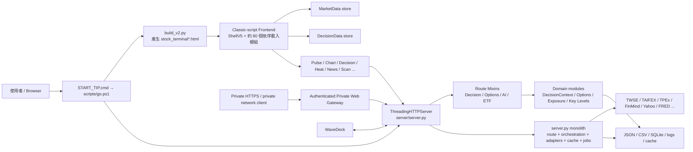
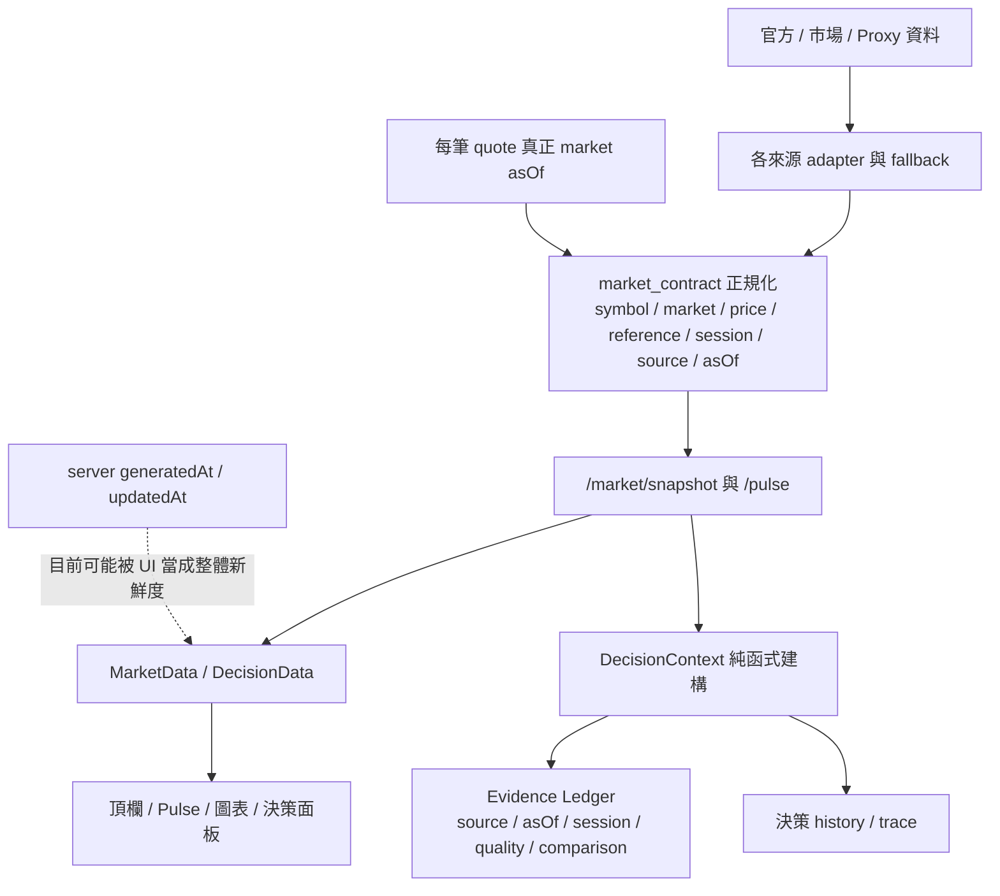
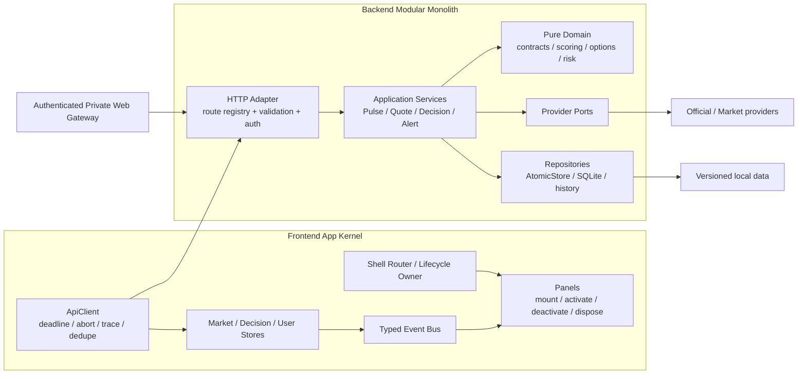
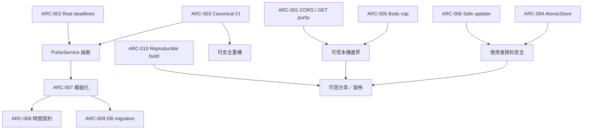

# Stock Terminal v5.0 — 完整架構與 Code Review

> 審查日期：2026-08-16  
> 方法：Loop Engineering（LOOP-003，Plan → Execute → Observe → Refine）  
> 審查目標：架構、程式邏輯、安全、資料契約、可測試性、可維運性與發佈流程  
> 本輪變更邊界：**只做審查、驗證與建議，不修改產品行為。**  
> 審查基準：目前工作目錄中的未提交版本；既有變更視為使用者資產，不覆寫、不清理。

---

## 1. 結論先行

Stock Terminal 已不是原型，而是一套功能範圍很廣、具備實際資料工程能力的本機金融工作站。它在資料來源備援、台／美市場顏色契約、DecisionContext 證據鏈、選擇權 observed／derived／modeled 分層、私有 Web 閘道與分享包剝除方面，明顯高於一般個人專案。

目前的主要限制不是「功能不夠」，而是**功能成長速度已超過架構承載力**：後端仍以單一大型 Handler 承擔路由、聚合、快取、外部 I/O 與持久化；前端仍靠大量全域函式、覆寫與載入順序維繫。這使一個局部變更容易跨面板回歸，也讓逾時、生命週期、錯誤觀測與測試順序變得難以保證。

### 審查裁定

| 等級 | 數量 | 裁定 |
|---|---:|---|
| P0 — 立即中止使用／可能直接毀損 | 0 | 未發現已證實的 P0 |
| P1 — 上線／分享前應優先處理 | 6 | 安全邊界、逾時、CI、持久化、請求上限、更新腳本 |
| P2 — 接續收斂的架構債 | 6 | 模組邊界、時間契約、資料庫鍵、可重現建置、觀測性、秘密儲存 |

**總體 verdict：`CONDITIONAL / NEEDS_REMEDIATION`。** 本機單人使用可繼續，但在把本機服務視為可信安全邊界、正式分享 Private Web、或持續快速加入功能前，建議先完成 P1。

### 最先做的 6 件事

1. 移除本機 API 全域 `Access-Control-Allow-Origin: *`，個人資料 GET 改為同源／授權；所有會改變狀態的 GET 改 POST。
2. 修正 Pulse 的「名義 8 秒、實際仍等待所有 worker」問題，讓 deadline 真正可取消與向下傳遞。
3. 修復完整測試的 `server` 模組名稱碰撞，讓 CI 真正全綠；把 27 個漏跑的 Python test function 與 8 個 JS selftest 納入 CI。
4. 建立共用 atomic JSON／secret store，取代 alert、watch、draw、universe、ETF catalog、AI key 的直接覆寫。
5. 統一有大小上限的 JSON body reader 與 route schema。
6. 移除 `go.ps1 -Pull` 的 `checkout -f`／`reset --hard`，更新與啟動徹底分離。

---

## 2. 審查方法與證據標準

本次 Loop 不以「看到複雜程式就判定有問題」，而採以下證據門檻：

- **程式證據**：可定位到檔案、路由、函式或資料表 schema。
- **執行證據**：測試、語法解析、本機 HTTP 回應或可重現的最小實驗。
- **影響鏈**：說明問題如何從來源傳到使用者、資料或維運。
- **驗收條件**：每項建議都附可測的完成定義。
- **環境失敗分離**：網路、第三方來源或缺少 pytest 不冒充產品公式錯誤。

本輪未使用外部 AI worker、未發佈、未部署，也未讀出或記錄持股內容、token、密碼、Email 或聊天識別碼。

---

## 3. 現況架構地圖



### 3.1 程式規模

| 區域 | 檔案 | 約略行數 | 觀察 |
|---|---:|---:|---|
| `src/` | 88 | 35,853 | 前端功能面板與 classic scripts |
| `server/` | 54 | 23,345 | HTTP、資料源、決策與量化模組 |
| `tests/` | 44 | 4,356 | Python 與 JS 自測並存 |
| `scripts/` | 29 | 2,839 | 啟動、分享包、Private Web、診斷 |
| `wavedeck/` | 31 | 6,102 | 獨立整合子系統 |

最大熱點：

- [`server/server.py`](../server/server.py) 約 7.2K 行，實體行號已到 7,664。
- [`src/ui/pulse_v5.js`](../src/ui/pulse_v5.js) 約 3.6K 行。
- [`src/ui/shell_v5.js`](../src/ui/shell_v5.js) 約 1.8K 行。
- [`src/chart/market_chart_v3.js`](../src/chart/market_chart_v3.js) 約 1.7K 行。
- [`src/ui/polish_v3.js`](../src/ui/polish_v3.js) 約 1.4K 行。
- [`src/ui/decision_v5.js`](../src/ui/decision_v5.js) 約 1.4K 行。

規模本身不是 bug；真正的問題是這些檔案同時跨越多種責任，導致修改半徑過大。

### 3.2 目前資料生命週期



---

## 4. 已做得好的部分

### 4.1 資料契約與可稽核決策

- [`server/market_contract.py`](../server/market_contract.py#L19) 已把市場、價格、比較基準、盤別、來源與 `asOf` 收斂成共同 quote 契約，這是跨頂欄／Pulse／圖表一致性的正確方向。
- [`server/decision_context.py`](../server/decision_context.py#L1) 明確將核心建構器設計成 pure / replayable，並由 `publish_context` 承擔 history 與 trace side effects。
- Evidence Ledger 不是只有結果，而是保留 `source`、`asOf`、`session`、`quality`、`comparison`；例如 TWII、TXF、廣度、法人、OI、借券、全球科技與選擇權都有可稽核來源。
- 選擇權資料已區分 observed、derived、modeled；這可避免把模型情境誤標成市場觀測事實。

### 4.2 對外邊界與分享包

- 本機 server 強制 loopback；[`server/server.py:7661`](../server/server.py#L7661) 拒絕非 `127.0.0.1 / localhost / ::1`。
- 靜態檔只允許 `src/`、`assets/` 與少數精確檔名；[`server/server.py:2935`](../server/server.py#L2935) 已阻擋任意工作目錄瀏覽。
- Private Web Gateway 有獨立 token、讀寫角色、Host allow-list、rate limit、body 上限、same-origin write check、敏感 route deny-list 與不含 body/token 的 audit；這個邊界設計明顯比直接公開 18432 正確。
- [`scripts/build_dist.py`](../scripts/build_dist.py) 採 allow-list、敏感檔名／內容掃描、壓縮後再掃描、checksum 與 manifest。實際驗證成功產出 289 檔、約 3.6 MB 的分享包，scanner 未發現私人狀態與秘密。

### 4.3 業務規則測試密度

- 既有 Python 測試涵蓋顏色、TWSE／TPEx symbol resolution、資料來源、DecisionContext、選擇權 Greeks、歷史去重、Private Web、分享包與持倉曝險。
- 8 個 JS selftest 涵蓋台／美顏色、面板生命週期、版面、Evidence Ledger、排序、新手面板、圖表與 WaveDeck。
- `START_TIP.cmd` 已把主啟動路徑收斂到 PowerShell，且 `go.ps1` 會解析固定的 Stock Python，不依賴模糊的 PATH `python`。

這些優點應保留；後續重構要以它們作為 characterization tests，不應大爆改後重寫規則。

---

## 5. P1 發現：分享／擴充前優先處理

## ARC-001 — 本機 API 對所有 Origin 開放讀取，且部分 GET 有副作用

**等級：P1 / Security & Privacy**

### 證據

- [`server/server.py:3081`](../server/server.py#L3081) 的 `end_headers()` 對所有回應加上 [`Access-Control-Allow-Origin: *`](../server/server.py#L3089)。
- 本機實測 `/decision/context` 回傳 `200`、JSON 約 70 KB，Header 的 `Access-Control-Allow-Origin` 為 `*`。
- 本機實測 `/alert/rules` 同樣為 `*`，目前回傳 35 筆規則；審查過程沒有輸出規則內容。
- [`server/server.py:2773`](../server/server.py#L2773) 允許 GET `/sync` 啟動背景同步。
- [`server/server.py:7245`](../server/server.py#L7245) 的 margin route 仍允許 `?action=backfill` 以 GET 觸發背景回補。
- DecisionContext 在有實際 profile 時可包含 [`portfolioOverlay.stocks`](../server/decision_context.py#L499)，alert route 也可包含個人規則與通知識別資料。

### 影響

「只綁 loopback」可避免 LAN 直接連入，但不能等同於瀏覽器同源保護。任何**有能力連到 loopback 的瀏覽器 context**，都可能讀取被 wildcard CORS 放行的回應；即使特定瀏覽器另有 Local Network Access 防護，也不應把產品安全依賴在瀏覽器版本與使用者權限提示上。GET 副作用還讓 drive-by request 可能消耗同步與回補資源。

### 建議

1. 預設不送 CORS header；同源 UI 不需要 CORS。
2. 若 WaveDeck 需要跨埠，只對明確 bridge route 與精確 loopback Origin 動態回應。
3. `/decision/context`、`/alert/rules`、`/alert/config` 等個人資料 route 加 owner session/token；至少拒絕跨源讀取。
4. `/sync`、margin backfill、自測、刷新一律 POST，並套 same-origin／CSRF 與 rate limit。
5. 加入 negative tests：惡意 Origin 不得讀取；GET 不得改變 job/state。

### 驗收條件

- `Origin: https://example.invalid` 對個人 API 得不到 ACAO，且 body 不可被瀏覽器讀取。
- UI 同源功能與 WaveDeck 精確 allow-list 仍通過。
- route inventory 證明所有 GET 都是 read-only、idempotent。

---

## ARC-002 — Pulse 的逾時預算沒有真的限制等待時間

**等級：P1 / Reliability & Concurrency**

### 證據

- [`server/server.py:4992`](../server/server.py#L4992) 宣告 `PULSE_SIDE_BUDGET = 8.0`。
- [`server/server.py:5070`](../server/server.py#L5070) 使用 `with ThreadPoolExecutor(...)`，再以 `wait(..., timeout=8)` 等待。
- Python executor 的 context manager 離開時會執行 `shutdown(wait=True)`；因此 timeout 後仍會等待未完成工作。
- 同一模式也存在於 [`server/pulse_extras.py:373`](../server/pulse_extras.py#L373) 與 [`server/pulse_extras.py:405`](../server/pulse_extras.py#L405)。
- 最小重現：宣告 `wait timeout=0.03s`，worker 睡眠 `0.35s`，實際 block `0.344s`。
- `_pulse_extras_pool` 只有 2 workers；逾時工作持續執行時，新 Pulse request 會累積等待。

### 影響

外部資料源變慢時，畫面可能超過宣告的 8 秒才回應；重複刷新會佔滿 side pool，造成連鎖延遲。由於 fallback 是在 orchestration 層組裝，真正 deadline 沒有傳到最底層 I/O，取消 future 也不等於停止已開始的 socket request。

### 建議

- 建立 request-scoped monotonic deadline，所有 provider 依「剩餘預算」設定 timeout。
- 不使用會 `wait=True` 的 context manager 包覆 bounded request；明確 cancel pending，並 `shutdown(wait=False, cancel_futures=True)`，或改用共用 bounded executor／job queue。
- provider 回傳 typed outcome：`ok / stale_cache / timeout / breaker_open / invalid`。
- 對 Pulse 建立 blocking fixture，驗證 wall-clock 上限與 pool 飽和後仍可回 stale cache。

### 驗收條件

- 四個 side provider 都卡住時，Pulse 在 `budget + 250ms` 內回傳。
- 連續 20 個 timeout request 不造成 thread／queue 無界成長。
- 回應清楚標示哪一來源 timeout，而非顯示成 0 或正常值。

---

## ARC-003 — CI 的完整 Python gate 目前會失敗，且另有 35 個測試未進 CI

**等級：P1 / Verification Integrity**

### 證據

- `python -m unittest discover -s tests`：**156 tests，3 errors，1 skipped，exit 1**。
- 3 個 error 都來自 `test_keystats_resolution`：完整套件執行時 `import server` 已被先前的 namespace package 佔用，因此找不到 `_should_retry_tw_keystats_as_otc`。
- 同 3 測試單獨執行：**3/3 PASS**，證實為 import order pollution，不是公式錯誤。
- [`tests/test_keystats_resolution.py:10`](../tests/test_keystats_resolution.py#L10) 動態修改 `sys.path` 後直接 `import server`，名稱同時可能指 `server/` namespace 或 `server/server.py`。
- `test_chip_api.py`、`test_pulse_extras.py`、`test_pulse_intel.py` 共 27 個 module-level `def test_*`；`unittest discover` 不會收集。環境也沒有安裝 pytest。
- 這 27 函式以直接 test harness 執行全部通過，但這不是可接受的正式 runner。
- 8 個 `*selftest.js` 全部通過，但 [`ci.yml`](../.github/workflows/ci.yml) 完全沒有執行 Node tests。
- CI 只跑 Ubuntu；實際主環境是 Windows + PowerShell + CMD。

### 影響

CI 現在不是可信的 release gate：正常應該直接紅燈；若日後透過跳過或改順序讓它綠燈，仍會漏掉 27 個 Python 規則與所有前端契約。啟動腳本的 Windows 特有錯誤也無法在 Ubuntu 被抓到。

### 建議

1. 給 `server/` 正式 package 邊界；測試一律 `from server import server as wd_server` 或抽出 key-stat resolver 到獨立模組，禁止裸 `import server` 的雙義性。
2. 選定單一 Python runner：要嘛把 27 函式轉成 `unittest.TestCase`，要嘛加入並 pin pytest。
3. CI 執行全部 8 個 JS selftest 與 `node --check`。
4. 加 Windows matrix，至少做 PowerShell parse、`go.ps1 -RebuildOnly`、launcher contract 與 path-with-spaces 測試。
5. live provider tests 用環境旗標分離，不能讓外網波動污染 deterministic gate。

### 驗收條件

- 本機與 CI 的 canonical command 收集數量相同，且無 order-dependent failure。
- Ubuntu／Windows 皆綠；JS 8/8 被列入 workflow。
- CI summary 明確顯示 deterministic、integration、live、dist 四類結果。

---

## ARC-004 — 多個個人狀態檔仍以非原子方式直接覆寫

**等級：P1 / Data Durability**

### 證據

以下路徑以 `open(..., 'w')` 直接 truncate 後寫 JSON：

- [`server/alert_daemon.py:53`](../server/alert_daemon.py#L53)：notification config；[`L66`](../server/alert_daemon.py#L66)：alert rules。
- [`server/watch_daemon.py:40`](../server/watch_daemon.py#L40)：watch rules；[`L51`](../server/watch_daemon.py#L51)：daemon state。
- [`server/server.py:232`](../server/server.py#L232)：draw store。
- [`server/universe.py:349`](../server/universe.py#L349)：universe cache。
- [`server/etf_routes.py:38`](../server/etf_routes.py#L38)：ETF catalog。
- [`server/ai_api.py:37`](../server/ai_api.py#L37)：AI key。

反例顯示專案已有可重用方向：`options_exposure`、`tw_index_charts`、`wavedeck_bus`、`llm_gate` 已使用 temp + replace 類型的原子寫入。

### 影響

程式中止、磁碟問題或 ThreadingHTTPServer／daemon 同時寫入時，檔案可能變成空檔、半截 JSON 或互相覆寫。多個 loader 在讀取失敗時回 `{}`／`[]`，使用者看到的效果會像「設定或規則被清空」，而不是明確顯示損毀。

### 建議

- 建立 `server/atomic_store.py`：same-directory temp、flush、`fsync`、`os.replace`、backup rotation、per-path lock。
- secret 與一般 JSON 分開介面，禁止 log value。
- JSON decode 失敗時把壞檔 quarantine，回復最後良好 backup，health 顯示 degraded。
- 建立故障注入與 concurrent writer tests。

### 驗收條件

- 在 serialize、flush、replace 各階段模擬 crash，舊版或新版至少一份完整可讀。
- 50 次並行更新不產生 invalid JSON。
- 壞檔不被靜默當成「使用者清空設定」。

---

## ARC-005 — POST body 上限只在少數新 route 存在

**等級：P1 / Resource Safety**

### 證據

- Decision 與 Options mixin 有 body cap，這是正確作法。
- 但 [`server/ai_routes.py:18`](../server/ai_routes.py#L18)、[`L39`](../server/ai_routes.py#L39)、[`L72`](../server/ai_routes.py#L72)、[`L113`](../server/ai_routes.py#L113)、[`L166`](../server/ai_routes.py#L166) 都直接依 `Content-Length` 配置讀取。
- 主 Handler 也有多處直接 `rfile.read(length)`：[`server/server.py:6267`](../server/server.py#L6267)、[`L6294`](../server/server.py#L6294)、[`L6316`](../server/server.py#L6316)、[`L6385`](../server/server.py#L6385)、[`L6416`](../server/server.py#L6416)、[`L6730`](../server/server.py#L6730)、[`L7391`](../server/server.py#L7391)。
- Private Web Gateway 對遠端 request 有 cap，但本機 backend 本身仍沒有一致邊界。

### 影響

錯誤 client、惡意本機頁面或未來新的 gateway bypass 可要求讀取巨大 body，消耗記憶體與 request thread。各 route 也會產生不同的 JSON／Content-Length 錯誤語意。

### 建議

- 一個共用 `read_json_body(max_bytes, schema)`；先拒絕缺失、負數、非整數或超限 Content-Length，再 bounded read。
- 預設 64–256 KiB；AI report 等特殊 route 明確提高，而不是無上限。
- 回傳一致的 `400 / 413 / 415 / 422` 與 trace ID。

### 驗收條件

- 每一 POST route 都有上限與 schema test。
- 超限 request 在讀完整 body 前即回 413，server thread 不崩潰。

---

## ARC-006 — 啟動與更新仍有兩套互相矛盾的資料保護語意

**等級：P1 / Operator Safety**

### 證據

- `START_TIP.cmd` 是目前較安全的啟動入口，且提示 deliberate `git pull --ff-only`。
- 但 [`scripts/go.ps1:313`](../scripts/go.ps1#L313) 的 `-Pull` 會執行 `git checkout -f -B`，接著 [`L315`](../scripts/go.ps1#L315) `git reset --hard`；這可丟棄 tracked local changes。
- 舊 [`scripts/go.bat`](../scripts/go.bat) 仍是另一套完整流程，包含自動 stash、切 branch、pull、複製自身到 TEMP 再續跑。
- [`docs/TIP_UX.md:14`](TIP_UX.md#L14) 與 [`docs/HOUSEKEEPING.md:16`](HOUSEKEEPING.md#L16) 仍把 `go.bat` 列為正式入口。

### 影響

同一個「啟動／更新」概念有不同的 dirty-work 行為；使用者在最需要保護未提交資料時，反而可能走到 `-f`／`--hard`。文件又繼續引導舊路徑，增加誤用機率。

### 建議

- 唯一 canonical launcher：`START_TIP.cmd` → `go.ps1`，batch 只做 ASCII shim，不再自帶 git 邏輯。
- `run/build/update` 三個 action 分離；正常啟動永遠不碰 git。
- update 先 `git status --porcelain`，dirty 直接停止並告知；只允許 fetch + ff-only，不自動 stash、不 force checkout、不 hard reset。
- 需要強制覆寫時，另外提供名稱明確的 recovery command，要求二次確認與 backup branch。

### 驗收條件

- 建立帶 tracked/untracked 修改的 fixture；所有正常啟動／更新測試後內容 hash 不變。
- 文件只保留一條 Windows 主路徑。

---

## 6. P2 發現：架構收斂工作

## ARC-007 — 後端 monolith 與前端全域覆寫形成高修改半徑

**等級：P2 / Maintainability**

### 證據

- [`server/server.py:2674`](../server/server.py#L2674) 雖已混入 Decision、Options、AI、ETF routes，但大部分 dispatch、provider orchestration、快取、job、持久化與 response formatting 仍留在同一檔。
- 前端由 `build_v2.py` 注入約 80 個 classic scripts；正確性依賴手動清單、部分拓樸依賴與「最後覆寫」規則。
- [`src/core/pro_v2.js:1044`](../src/core/pro_v2.js#L1044)、[`src/ui/polish_v3.js:1035`](../src/ui/polish_v3.js#L1035)、[`src/chart/market_chart_v3.js:1719`](../src/chart/market_chart_v3.js#L1719) 都會等待／覆寫 `window.renderChart`、`renderStats`、`loadSym` 等全域函式。
- Shell、Pulse、Polish、Market Chart 各自有 timers、fetch 與 document/window listeners；只有部分 v5 面板有明確 `deactivate()`。

### 影響

載入順序就是隱藏 API；同名 global 的最後寫入者改變功能。面板切換後 listener／timer 若未完整 dispose，會產生重複刷新、舊 response 覆蓋新 state 與難以重現的 UI 回歸。

### 建議與遷移順序

1. 不做 big-bang rewrite；先定義 `AppKernel` 與唯一 module registry。
2. 建立中央 `ApiClient`：timeout、AbortController、trace ID、JSON error、in-flight dedupe。
3. 面板契約統一為 `mount / activate / deactivate / dispose`，由 Shell 掌握生命週期。
4. 禁止新 code 直接新增 `window.*`；舊 global 透過 adapter 暫時掛入 registry。
5. 先遷移高變更區：Pulse → Shell → Decision → Chart；每一步用現有 selftest 鎖住行為。

---

## ARC-008 — Snapshot 外層時間代表「產生時間」，容易被誤當市場新鮮度

**等級：P2 / Data Semantics**

### 證據

- 每筆 quote 的 [`market_contract.py:36`](../server/market_contract.py#L36) 有來源 `asOf`。
- 但 [`server/market_routes.py:22`](../server/market_routes.py#L22) 的 envelope 只有 `ok / contractVersion / quotes`。
- Handler 在 [`server/server.py:7220`](../server/server.py#L7220) 另外加本機、無 timezone 的 `updatedAt = time.strftime(...)`。
- [`src/core/market_data_v5.js:9`](../src/core/market_data_v5.js#L9) 把 `snapshot.updatedAt`，甚至 client receipt time，當 store-level updatedAt。

### 影響

一個剛產生的 snapshot 可能裝著不同交易日、不同盤別與不同來源時間的 quote。UI 若只看 envelope updatedAt，會把「剛組裝」誤讀為「市場資料剛更新」。

### 建議

外層契約至少區分：

```json
{
  "generatedAt": "UTC ISO-8601",
  "marketAsOf": "latest comparable market timestamp",
  "sessionDate": "market calendar date",
  "session": "regular|night|latest_available|mixed",
  "sourceStatus": {"twse-mis": {"asOf": "...", "stale": false}},
  "quotes": {}
}
```

Store 與 UI 不得用 `generatedAt` 取代 `marketAsOf`。混合盤別時顯示 `mixed`，比較運算必須明確宣告 baseline。

---

## ARC-009 — bars 資料表把 market 欄位排除在主鍵與查詢之外

**等級：P2 / Data Integrity**

### 證據

- [`server/datastore.py:33`](../server/datastore.py#L33) 的 bars schema 含 `market`，但 [`PRIMARY KEY(symbol, ts)`](../server/datastore.py#L36)。
- insert 有 market；[`get_bars`](../server/datastore.py#L224) 與 max-ts 查詢只以 symbol 篩選。

### 影響

同 symbol 若在不同市場／資料域重複，會互相覆寫或混讀。當前台股數字代碼與美股字母降低發生率，但 schema 已宣告 market，因此 identity 不應忽略它。

### 建議

- migration 到 `PRIMARY KEY(market, symbol, ts)`，meta 同樣以 `(market, symbol)` 識別。
- repository API 強制傳 market；禁止以猜 symbol 方式決定資料域。
- migration 前做 collision report 與 backup，驗證 row count／OHLC checksum。

---

## ARC-010 — Build 非可重現，且測試會改寫工作目錄產物

**等級：P2 / Build & Release**

### 證據

- [`build_v2.py:239`](../build_v2.py#L239) 每次用 `int(time.time())` 產生 query cache-buster。
- [`build_v2.py:291`](../build_v2.py#L291) 同時把結果寫到 destination 與原本的 source `stock_terminal.html`，使輸入本身被 build 改寫。
- zip 使用 [`archive.write`](../scripts/build_dist.py#L524)，保留來源檔案時間；相同 commit 不保證相同 archive hash。
- `test_dist_scrub` 會呼叫 build_dist，間接重建 root HTML、ZIP、checksum 與 manifest；本次單元測試執行已觀察到這些 side effects。

### 影響

相同 source 不能產生 byte-for-byte 相同結果；測試也不再是 read-only，會污染 dirty worktree，使 code review、bisect 與供應鏈驗證變困難。

### 建議

- 保留不可變 template source，generated HTML 只寫 `dist/` 或 temp。
- cache-buster 使用 commit SHA／content hash，不用 wall clock。
- zip 固定 timestamp、排序、permissions 與 compression metadata；支援 `SOURCE_DATE_EPOCH`。
- dist tests 全部在 `TemporaryDirectory` 執行，不寫 repo root。

---

## ARC-011 — 錯誤吞噬與 fallback 缺少統一可觀測語意

**等級：P2 / Observability**

### 證據

- `server/`、`src/`、`scripts/` 共找到約 625 個 `except Exception`／catch 類型位置。
- 不少前端 `.catch(function () {})` 或空 catch；部分是合理的 localStorage／cosmetic 容錯，但資料 fetch 也有靜默失敗。
- 後端多處在 Exception 後回空物件、預設值或只 print，無統一 error code／trace／fallback reason。
- 正面例子：health 已有 source calls、okRate、lastError、breaker 狀態；Decision refresh 也已有 trace，表示基礎能力存在。

### 影響

使用者看到 N/A、舊資料或空面板時，很難分辨是來源 unavailable、timeout、schema drift、breaker、cache miss 或 UI render bug；工程上也難以建立 error budget。

### 建議

- 定義 typed `Result`／error taxonomy：`timeout`, `upstream_4xx`, `upstream_5xx`, `schema_invalid`, `stale_cache`, `not_applicable`。
- 每個 request 產生 correlation ID，向 provider、DecisionContext 與 UI feedback 傳遞。
- 空 catch 僅限明確 non-critical 行為並加註解；資料路徑至少更新 health counter。
- health 增加 queue depth、timeout count、stale-cache serves、last schema error。

---

## ARC-012 — AI／通知秘密主要靠 gitignore 與分享掃描保護，at-rest 保護不足

**等級：P2 / Secret Management**

### 證據

- `data/ai_key.txt` 由 [`server/ai_api.py:37`](../server/ai_api.py#L37) 直接明文寫入。
- alert config 可包含通知 token／password；分享包與 Private Web route block 有防外洩，但本機檔案本身沒有 Windows Credential Manager／DPAPI 保護。
- direct write 也繼承 ARC-004 的 crash corruption 問題。

### 影響

能讀取使用者檔案系統的其他本機帳號、備份工具或惡意程式可取得秘密。這不是 ST 能完全防禦的主機失陷，但至少不應把長期 token 當一般 JSON／文字檔處理。

### 建議

- Windows 優先使用 Credential Manager 或 DPAPI；Linux/macOS 以 OS keyring adapter 對應。
- config 只存 credential reference，不存 secret value。
- fallback 明文模式需明確警告、限 ACL、原子寫入，且所有 log／health／export 永不回傳值。

---

## 7. 建議的目標架構

不是把 Python 標準庫全部換掉，也不是一次導入大型框架；重點是建立**可測的邊界與單一寫入權**。



### 邊界規則

1. **HTTP adapter** 只負責 authentication、validation、body cap、status、serialization。
2. **Application service** 擁有一次 use case 的 deadline、cache 與 provider 協調。
3. **Domain** 不做 network／disk，不依賴 Handler，可純 fixture replay。
4. **Provider adapter** 只翻譯上游 schema，回 typed outcome 與 provenance。
5. **Repository** 統一 atomicity、locking、migration、backup 與 corruption recovery。
6. **Frontend store** 是資料唯一寫入者；Panel 只 render state、發 intent，不直接互相覆寫函式。

---

## 8. 分段落地 Roadmap

雖然執行上可連續進行，仍應用 Gate 控制每一段風險，不要同時改所有層。

### Gate A — 安全與資料保護（最高優先）

- ARC-001 CORS／GET mutation。
- ARC-004 AtomicStore。
- ARC-005 body cap／schema。
- ARC-006 safe updater。

**Gate：** security negative tests、crash recovery tests、dirty-work preservation tests 全綠。

### Gate B — 延遲與可信驗證

- ARC-002 end-to-end deadline。
- ARC-003 canonical test runner + Windows／JS CI。
- provider fake-clock／blocking fixtures。

**Gate：** deterministic suite 100% pass；Pulse worst-case latency 有硬上限；CI 無漏收測試。

### Gate C — Backend 模組化

建議抽取順序：

1. `PulseService`：最高延遲與來源協調熱點。
2. Quote／fundamental services：統一 TWSE／TPEx／US identity 與 fallback。
3. Personal-state APIs：接 AtomicStore。
4. Handler route registry：最後縮小 `server.py`。

**Gate：** route contract snapshots 與 replay fixtures 不變；每次只移一個 use case。

### Gate D — Frontend 生命週期與建置

1. AppKernel／registry 與 ApiClient。
2. Pulse、Shell、Decision 先遷移。
3. Chart globals 經 adapter 收斂。
4. deterministic build 與 dist-only output。

**Gate：** 8 個現有 selftest、viewport layout checks、route enter/leave timer leak test、相同 source reproducible hash 全綠。

### Gate E — 契約與資料庫遷移

- 完成 outer time envelope。
- bars PK migration。
- versioned JSON schema／migration policy。
- secret store adapter。

**Gate：** historical checksum、cross-market collision fixture、stale/mixed-session UI fixture、rollback test 全綠。

---

## 9. 建議的測試金字塔

| 層級 | 應涵蓋 | Gate |
|---|---|---|
| Pure unit | 市場顏色、baseline、Greeks、風險、symbol identity、時間比較 | 每次 commit |
| Contract | 每個 provider fixture → canonical schema | 每次 commit |
| Service integration | fake providers + cache + deadline + fallback | 每次 commit |
| HTTP | auth、CORS、body cap、GET purity、status/error schema | 每次 commit |
| Frontend | store ownership、panel lifecycle、sorting、color、empty/stale state | 每次 commit |
| Windows launch | path with spaces、fixed Python、dirty work、port collision | PR / release |
| Live provider | 官方來源 smoke、schema drift、market calendar | 排程，不阻擋 deterministic PR |
| Dist | allow-list、secret scan、reproducible hash、fresh extract boot | release |

最重要的不是追求單一 coverage 百分比，而是把「來源壞掉、時間不同盤、fallback 啟動、route 切換、程序中止」這些 ST 真正的風險變成 fixtures。

---

## 10. 驗證紀錄

| 驗證 | 結果 | 說明 |
|---|---|---|
| `python -m unittest discover -s tests` | **FAIL** | 156 tests；3 errors；1 skipped。`server` import order collision |
| `python -m unittest tests.test_keystats_resolution -v` | PASS | 3/3；證實 full-suite failure 是順序污染 |
| 27 個 pytest-style function 直接 harness | PASS | 27/27；但正式 CI 目前漏跑，且環境未安裝 pytest |
| 8 個 `tests/*selftest.js` | PASS | 全數通過 |
| `node --check` | PASS | 95 個 JS 檔案 |
| Python AST parse | PASS | 120 個 `.py` |
| PowerShell parser | PASS | 6 個 `.ps1` |
| `python build_order.py` | PASS | 現行順序與相依 selftest 通過 |
| distribution scrub/build | PASS | 289 files，約 3.6 MB；壓縮前後掃描與 checksum 通過 |
| 本機 `/health` | PASS | v5.0、loopback、tip UX、5col-2zone；來源 health 可讀 |
| 本機 CORS probe | **RISK CONFIRMED** | `/decision/context`、`/alert/rules` 皆回 `Access-Control-Allow-Origin: *` |
| executor timeout 最小重現 | **RISK CONFIRMED** | 0.03s wait 實際 block 0.344s |

### 為什麼整體 Gate 不是 Pass

功能自測大多通過，但 release gate 的定義不能是「大部分測試綠」：canonical Python suite exit code 為 1，且存在已證實的安全與資料耐久性 P1。因此 LOOP-003 的審查產物可完成，但產品 remediation 狀態應保持未通過。

---

## 11. 風險排序與依賴關係



因此不建議先做全面 UI 或 framework rewrite。先把 security、data durability、test gate 與 deadline 固定，後續模組化才有可靠護欄。

---

## 12. 開放風險與審查限制

- 本輪沒有對每個 live provider 做市場開盤時段的即時 schema 驗證；live failure 與 deterministic code issue 已分開。
- 沒有以瀏覽器自動化做 memory／listener 長時間 profiling；前端生命週期結論來自程式結構、selftests 與 timer/listener inventory。
- 沒有進行惡意網站 PoC；CORS 結論以實際 response header、route 資料性質與標準同源模型判定，並對瀏覽器 Local Network Access 差異保留條件語句。
- 沒有讀取、列印或寫入私人持股、alert 內容與 token。
- 測試中的 dist scrub 會改寫 generated artifacts；本輪未用破壞性 git 指令還原，以免覆蓋既有工作。

---

## 13. 完成定義

當以下條件同時滿足，ST 才可從 `CONDITIONAL` 升為 `PASS`：

- P1 六項全部有實作與 regression tests。
- canonical Python／JS／Windows CI 全綠且沒有漏收測試。
- 本機個人資料 API 不再 wildcard CORS；所有 GET read-only。
- Pulse deadline 在阻塞 fixture 下仍受控。
- 個人狀態寫入具原子性、備援與損毀可見性。
- 正常啟動／更新不會自動 force、reset、stash 或丟棄工作。
- 分享包由乾淨、可重現的 build 生成並通過同一套壓縮後掃描。

完成上述條件後，再進入 backend/frontend 模組化；不要把「大重構完成」當成安全與資料保護的前置條件。

