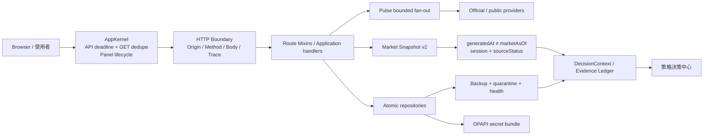
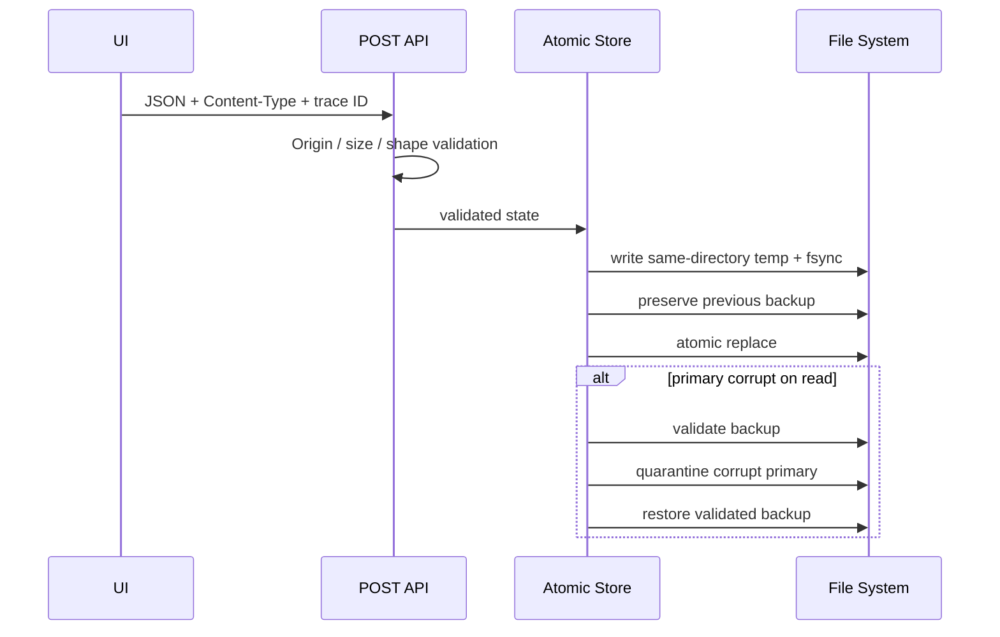

# Stock Terminal v5.0 架構修復與驗證報告

> 日期：2026-08-16  
> 對應審查：[ST_ARCHITECTURE_CODE_REVIEW_2026-08-16.md](ST_ARCHITECTURE_CODE_REVIEW_2026-08-16.md)  
> 範圍：ARC-001～ARC-012；不包含交易執行、公開部署或大型框架重寫。

## 結論

本輪把先前 code review 的六項 P1 與六項 P2 建議轉成可執行邊界、遷移與回歸測試。最重要的改變不是新增更多畫面，而是讓同一筆市場資料、同一個寫入動作與同一個面板生命週期只有一套可追蹤規則。

- HTTP：跨來源預設拒絕、寫入只接受 POST、JSON 有型別與大小上限。
- 資料：行情「來源時間」與「伺服器產生時間」分離；跨市場 K 線不再共享錯誤主鍵。
- 儲存：個人狀態採原子替換、備份、損毀隔離；秘密離開一般 JSON／文字檔。
- 韌性：Pulse fan-out 有 monotonic deadline、容量上限、飽和與逾時狀態。
- 前端：AppKernel 統一 API deadline、GET 去重、trace ID 與面板生命週期。
- 發佈：HTML 與 ZIP 可重現；分享包仍使用 allow-list 與雙重敏感資訊掃描。
- 可讀性：策略決策中心建立 10px 以上主要閱讀下限，Action Envelope 改為醒目的三格動作邊界。

## 修復後邏輯圖



## ARC 需求追蹤

| ID | 原問題 | 已完成變更 | 主要驗證 |
|---|---|---|---|
| ARC-001 | CORS 過寬、GET 有副作用 | WaveDeck bridge 精確 CORS；`/sync` 等寫入改 POST；same-origin 精確比對 | `test_server_http_security.py` |
| ARC-002 | timeout 只停止等待，背景工作仍堆積 | `Deadline`、`BoundedExecutor`、取消容量回收、來源 outcomes、pool health | `test_deadline.py` |
| ARC-003 | CI 漏收 module tests、單平台 | module `load_tests`、Windows/Linux matrix、Python/JS/PowerShell gates | CI workflow + full discovery |
| ARC-004 | JSON 直接覆寫、損毀靜默 | same-directory temp、fsync、atomic replace、backup、quarantine、health counter | `test_atomic_store.py` |
| ARC-005 | request body 無統一上限／型別 | `http_boundary.py`；413/415/422 一致錯誤 | `test_http_boundary.py` |
| ARC-006 | 啟動器可覆寫工作、入口分歧 | `START_TIP → go.ps1`；dirty fail-closed；ff-only；batch shim | `test_launcher_safety.py` |
| ARC-007 | 後端 god-file、前端 globals/lifecycle 分散 | 新增 HTTP／deadline／repository 模組與 AppKernel；既有 route 維持相容 adapter | JS self-tests + HTTP tests |
| ARC-008 | `updatedAt` 混合 receipt time 與 market time | snapshot contract v2：`generatedAt/marketAsOf/sessionDate/session/sourceStatus` | `test_market_contract.py` |
| ARC-009 | bars 主鍵缺 market | PK 改為 `(market,symbol,ts)`；首次遷移前建立 SQLite 備份 | `test_datastore_market_identity.py` |
| ARC-010 | build 使用 wall clock 並回寫 source | 資產內容雜湊；模板唯讀；ZIP 固定 timestamp/permission/order | `test_build_reproducibility.py` |
| ARC-011 | 失敗難關聯、健康狀態不足 | `X-ST-Trace-ID` request/response；deadline pool、atomic store、source outcomes | security/runtime tests |
| ARC-012 | AI／通知秘密為明文 | Windows DPAPI current-user；無 profile 時 machine-scope；config/backup 去密 | `test_secret_store.py`、`test_secret_migration.py` |

## 市場快照 v2 契約

```json
{
  "contractVersion": 2,
  "generatedAt": "2026-08-16T03:00:00Z",
  "marketAsOf": "2026-08-15T06:00:00Z",
  "sessionDate": "2026-08-15",
  "session": "mixed",
  "sourceStatus": {
    "taifex-mis": {
      "quoteCount": 1,
      "sessions": ["night"],
      "asOf": "2026-08-15T06:00:00Z",
      "ageSeconds": 75600.0,
      "freshness": "stale"
    }
  }
}
```

規則：

1. `generatedAt` 只表示 ST 何時生成 payload。
2. `marketAsOf` 只取可解析且具時區的上游市場時間；沒有就保持 `null`。
3. `updatedAt` 只保留為相容 alias，等於 `marketAsOf`，不得回退成瀏覽器現在時間。
4. `sourceStatus` 逐來源公布報價數、盤別、新鮮度與年齡，避免整包只給一個模糊時間。

## 個人狀態與秘密的寫入流程



秘密欄位不會進入 `alert_config.json` 或其備份。Windows 互動登入優先使用 current-user DPAPI；服務或受限執行環境若未載入 user profile，使用 machine-scope DPAPI，並維持私有限制檔案。分享包明確封鎖所有 secret bundle。

## 資料庫遷移與回復

首次 `init_db()` 發現舊主鍵時：

1. SQLite online backup 到 `market.db.pre-market-key-v2.bak`。
2. `BEGIN IMMEDIATE`。
3. 建立新表並複製舊資料；空 market 依舊資料契約填為 `TW`。
4. 新主鍵：`bars(market,symbol,ts)`、`meta(market,symbol)`。
5. 建索引、設定 `user_version=2`、commit。
6. 任一步驟失敗即 rollback；備份不刪除。

回復時先停止 ST，再把 `.pre-market-key-v2.bak` 複製為新的 `market.db`；不要直接覆蓋仍在使用的 WAL 資料庫。

## Pulse deadline 與降級語意

- 每個 pool 同時限制 worker 與 running+queued work。
- request 使用 monotonic budget；到期即回傳，不被 context-manager shutdown 再次拖住。
- queued future 若在啟動前取消，會確實釋放 capacity slot。
- 回應 `sourceOutcomes` 區分 `ok`、`timeout`、`saturated` 與 `error:<type>`。
- `/health` 公布各 pool 的 submitted/completed/rejected/timeouts/inFlight。
- 逾時來源可以用明示 cache 降級，但不得偽裝成同一時間的新資料。

## 前端邊界與相容策略

`window.AppKernel` 是新程式的唯一入口：

- `api.request/getJson/postJson`：同源 base、AbortController deadline、GET in-flight 去重、trace ID。
- `panels.register/activate/dispose`：集中 deactivate/activate，逐步接管既有 panel globals。
- `MarketData` 保留事件相容，但不再製造 market timestamp。
- 舊模組仍可直接呼叫原 API；後續碰到該模組時再遷入 kernel，避免一次重寫 80 支 classic script。

這是刻意的漸進遷移，不宣稱 `server.py` god-file 已完全拆除。新功能不得再把路由 body、儲存與 fan-out 邏輯直接塞回 handler。

## 策略決策中心可讀性

- 標題 24px、主要值 14–28px、一般說明約 10–11px。
- 情境卡、Evidence Ledger、Exposure Lab 使用不同密度，但不再以 6px 當主要閱讀字。
- `Action Envelope` 改為「✓ 允許／△ 限制／× 禁止」三格，使用藍、黃、橙風控色；不占用台股紅漲綠跌語意。
- 1280×720 實際瀏覽器驗證：雙欄未溢位、三格動作卡各約 187×64px、窄螢幕降為單欄。

## Canonical verification

```powershell
py -3 -m compileall -q server scripts tests
py -3 -m unittest discover -s tests -v
node tests\shell_v5_selftest.js
py -3 build_order.py
py -3 build_v2.py --out stock_terminal_v2.check.html
py -3 -m unittest tests.test_dist_scrub -v
```

CI 在 Windows 與 Ubuntu 各跑一次完整 Python discovery、所有 `*selftest.js`、build order、deterministic build、PowerShell parser（Windows）與分享包 scrub。

## 尚存但已降階的風險

1. `server.py` 與部分大型 UI 模組仍偏大；現在已有邊界可逐步搬移，但不是一次性框架重寫。
2. 公開市場來源仍可能限流、休市或延遲；系統能誠實降級，不能創造不存在的即時資料。
3. DPAPI machine scope 的隔離度低於 current-user scope；它只在使用者 profile 不可用時啟用，且仍受本機檔案權限保護。
4. 即時市場 session 的最終正確性仍依上游提供完整日期／時區；只提供 `HH:MM` 時會保持未知，不猜日期。

以上風險不再是本輪 scoped P1 阻擋，但應納入後續維護 backlog。
