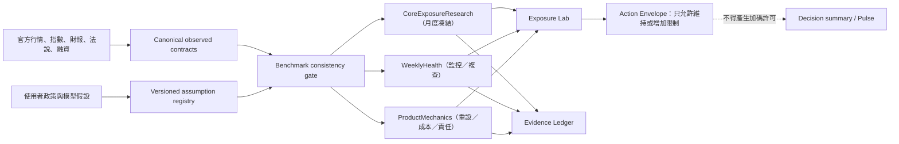

# Stock Terminal × 台股動態槓桿五篇重讀與指標設計

> 日期：2026-08-16
>
> 方法：Loop Engineering／primary-source-first／single-writer integration
> 狀態：研究與實作規格；不構成買賣、持倉比例或槓桿建議

## 1. 結論先行

FantasyMaya 的五篇「台股動態槓桿」不是五個可以相加的交易訊號，而是一條逐步修正、最後主動否定部分原始想法的研究鏈。

目前最合理的完整讀法是：

```text
Part 1  固定 P/E → 槓桿表（初始直覺，已被後文取代）
   ↓
Part 2  基本面、估值、股息、長期波動 → 月度核心研究
   ↓
Part 3  短期波動、融資、價格偏離 → 週度健康監控
   ↓
Part 4  純落後波動週度擇時 OOS 失敗 → 撤銷自動調曝險權限
   ↓
Part 5  從商品名稱轉向每日報酬、重設機制、成本與負債責任
```

對 ST 的判定：

| 用途 | 價值 | 判定 |
|---|---:|---|
| 研究框架與模型治理 | 9/10 | 高價值；尤其是公開負面結果與權限降級 |
| 中長期情境與正二複利效率 | 8/10 | 可納入 Exposure Lab，但必須有同基準資料與情境帶 |
| 產品機制與曝險穿透 | 9/10 | 可直接強化既有持倉風險研究 |
| 每週自動調整槓桿 | 1/10 | Part 4 的樣本外結果不支持 |
| 直接買賣或固定配置訊號 | 2/10 | 資料口徑、假設與驗證仍不足，不得授權交易 |

最重要的工程結論不是「再加一個 Kelly 分數」，而是建立兩個互不越權的契約：

1. `CoreExposureResearch`：月度凍結，只在官方季報／法說或明確資料事件後重估。
2. `WeeklyHealth`：每週更新，只能要求複查或增加限制，不能直接改寫核心曝險，也不能產生加碼許可。

## 2. 研究範圍與來源

Notes 分類目前另有其他文章；本文件只研究同一系列的五篇「台股動態槓桿」：

1. [Part 1：Kelly、P/E 與正二配置怎麼連起來](https://blog.fantasymaya.org/posts/taiwan-dynamic-leverage-notes/)（2026-06-14）
2. [Part 2：長期核心配置——EPS、估值與 Kelly](https://blog.fantasymaya.org/posts/taiwan-dynamic-leverage-part2/)（2026-07-09；2026-08-01 更新）
3. [Part 3：週度健康監控——短期波動要不要改變核心持倉？](https://blog.fantasymaya.org/posts/taiwan-dynamic-leverage-part3/)（2026-08-02；2026-08-14 更新）
4. [Part 4：Kelly 動態配置真的有效嗎？](https://blog.fantasymaya.org/posts/taiwan-dynamic-leverage-part4/)（2026-08-14）
5. [Part 5：產品名字不重要，日波動才重要](https://blog.fantasymaya.org/posts/taiwan-dynamic-leverage-part5/)（2026-08-16）

作者公開研究快照：

- [月度核心與週度健康快照](https://blog.fantasymaya.org/data/kelly-weekly.json)
- [Part 4 walk-forward 摘要](https://blog.fantasymaya.org/data/kelly-walkforward-summary.json)
- [Part 5 五產品研究摘要](https://blog.fantasymaya.org/data/five-product-leverage-summary.json)

外部驗證只採官方或原始研究：

- [TSMC 2026 Q2 官方法說](https://investor.tsmc.com/english/quarterly-results/2026/q2)
- [TSMC 投資人關係與長期展望](https://investor.tsmc.com/chinese)
- [TSMC 月營收](https://investor.tsmc.com/chinese/monthly-revenue/2026)
- [TWSE 臺灣 50 指數](https://www.twse.com.tw/zh/indices/ftse/tai50i.html)
- [TWSE 槓桿及反向型 ETF 說明](https://wwwc.twse.com.tw/zh/products/securities/etf/products/li.html)
- [TWSE 融資融券餘額](https://www.twse.com.tw/zh/trading/margin/mi-margn.html)
- [Moreira & Muir：Volatility-Managed Portfolios](https://onlinelibrary.wiley.com/doi/abs/10.1111/jofi.12513)
- [Cederburg et al.：On the Performance of Volatility-Managed Portfolios](https://experts.arizona.edu/en/publications/on-the-performance-of-volatility-managed-portfolios/)
- [Avellaneda & Zhang：Path-Dependence of Leveraged ETF Returns](https://epubs.siam.org/doi/10.1137/090760805)

作者 JSON 在 ST 中只能是 `external_research` 證據，不能取代官方行情、財報或 ST 自行計算的 canonical data。

## 3. 五篇修正鏈

### 3.1 Part 1：有用的是敏感度教育，不是固定配比表

原始 Kelly 公式：

\[
f^*=\frac{\mu-r_f}{\sigma^2}
\]

有用部分：

- 說明期望報酬、波動率與資金成本如何共同影響長期最適曝險。
- 說明原型 ETF、正二與現金之間的曝險換算。
- 可作「假設敏感度」教學工具。

不能進正式決策的部分：

- P/E 20～28 倍對應 160%～320% 是人工錨定，不是由 Kelly 推導。
- 原始模型未清楚區分算術報酬與幾何報酬。
- 指數 EPS、台積電 EPS、加權指數與臺灣 50 沒有維持同一基準。
- 200% 以上需要借款、期貨或其他融資工具，追繳與強制處分風險未建模。

ST 處置：保留教育性公式與敏感度；拒絕固定 P/E→固定槓桿表。

### 3.2 Part 2：月度核心比 Part 1 完整，但仍是模型，不是財測

Part 2 將報酬拆成成長、股息與估值回歸：

\[
g_{earn}=w g_{TSMC}+(1-w)g_{other}
\]

\[
y=w\frac{payout}{PE_f}+(1-w)y_{other}
\]

\[
v_{TSMC}=\left(\frac{PE_{fair}}{PE_f}\right)^{1/H}-1,\qquad
v_{index}=w v_{TSMC}
\]

\[
g_{proxy}\approx g_{earn}+y+v_{index}
\]

這比 Part 1 合理，因為每一個假設都可以獨立顯示與壓力測試；但它仍是「長期報酬代理」，不是公司財測或統計信賴區間。

主要風險：

- 台積電權重乘 EPS 成長只是指數報酬貢獻代理，不是精確指數 EPS 成長。
- `g_other`、`PE_fair`、其他成分股殖利率與估值回歸都是假設。
- 加法分解是一階近似；以目前公開快照重算，乘法分解約比加法高 `0.37pp/年`，足以影響 Kelly 臨界值。
- 52 週均值回歸波動的完整係數與樣本外校準未公開，ST 不能冒充已重現作者模型。

ST 處置：顯示 bear/base/bull 情境帶、近似誤差與假設指紋；不顯示「幾乎必然」的單一報酬值。

### 3.3 Part 3：最適合 ST 的是 `2x Carry Edge`，不是週度調倉

對每日 2x 產品的長期幾何報酬近似：

\[
G_2\approx2g-\sigma_H^2-c_2
\]

相對 1x 的複利效率差：

\[
M_2=G_2-G_1=g-(\sigma_H^2+c_2)
\]

這個公式適合 ST，因為它直接說明：正二是否比原型有較高的模型長期幾何報酬，主要取決於原型的長期幾何報酬、原型波動平方與額外成本。

但 `M₂ > 0` 只表示模型條件下的長期複利效率較高，並不表示：

- 明天會漲；
- 現在應買進；
- 應把曝險拉到 2 倍；
- 尾部回撤、流動性與個人現金流可承受。

Part 3 在 2026-08-14 更新後已明確把短期波動、融資與位置偏離降級為 monitor-only。這個修正必須反映在 ST 的資料權限，而不只是 UI 文案。

### 3.4 Part 4：負面結果是整個系列最重要的證據

作者的單次訓練結果：

| 樣本外策略 | 平均曝險 | CAGR | 最大回撤 |
|---|---:|---:|---:|
| 每週落後波動動態 Kelly | 約 1.60x | 30.44% | -49.32% |
| 同平均曝險固定組合 | 約 1.60x | 36.63% | -44.74% |

動態規則在這個研究中落後固定曝險約 `6.19pp/年`。作者的年度 walk-forward 與 2,000 次曝險排列測試也沒有支持純落後波動週度擇時。

合理結論：

- 被否定的是「1～2x 範圍內、純落後波動、每週調整」這個策略族，不是所有 Kelly 概念。
- 週度波動可作健康監控，不能取得自動調曝險權限。
- 不能宣稱 Part 2 的完整基本面模型已被 Part 4 驗證；Part 4 沒有回測歷史 EPS、估值與融資 point-in-time 資料。

回測仍有待補強之處：

- 784 組參數相對樣本數仍有多重選擇問題。
- 隨機打亂單週曝險會破壞 regime duration；需補 block permutation 或 circular shift。
- 全測試期平均曝險只適合作為歸因基準；可部署基準應由訓練期決定。
- 訓練使用合成 2x、測試使用實際 00631L，存在 domain shift。
- 尚需 nested walk-forward、multiple-testing adjustment 與 point-in-time 資料稽核。

ST 處置：把 `external_oos_failed` 寫進模型治理，禁止週度波動訊號提高曝險。

### 3.5 Part 5：正確修正是「同公式，不同責任」

一般化日重設槓桿近似：

\[
G_\lambda\approx\lambda g-
\frac12\lambda(\lambda-1)\sigma^2-c_\lambda
\]

只要自行質押策略每天維持 2x，就仍然承受與每日重設 2x ETF 同類的 variance drag。質押不會因為「不是 ETF」而自動消除波動耗損。

真正需要比較的是：

- 原型資產的日報酬分布與跳空；
- 目標槓桿與重設頻率；
- 顯性費用、隱含融資成本、追蹤誤差與成交摩擦；
- ETF 持有人責任與借款／質押者的追繳、額度及強制處分責任；
- 固定負債造成的漂移槓桿，不能混同每日重設。

Part 5 的 MU／MUU 共同樣本約 22 個月且處於特定市場階段，不能把產品排序泛化成長期結論，也不能因為波動接近便把單一公司視為臺灣 50 正二的替代品。

ST 處置：建立通用 `ProductMechanics`，不建立 MU/MUU 專屬訊號卡。

## 4. 與 ST 現況的差異

### 4.1 已做對的部分

- `Exposure Lab` 已標示 `shadowMode` 與 `research_ceiling_only`，沒有直接送單。
- 已有觀測值／假設值 metadata、持倉穿透、正二重疊與曝險溫度燈。
- 已有 `daily2xOutperformanceThresholdPct` 與 `baseEdgeVs2xThresholdPct`，數學方向與 Part 3 一致。
- `Action Envelope` 只會在效率不足時增加限制，不會因效率為正就產生加碼許可。
- Evidence Ledger 已有來源、時間、比較基準與品質欄位。
- 現有圖表已有本益比河流，不需另外建立第二套估值圖。

### 4.2 必須修正的衝突

| 現況 | 問題 | 目標 |
|---|---|---|
| 融資百分位乘上 `margin_factor` 後直接降低 research ceiling | 與 Part 2/3/4 最新權限分層衝突 | 只更新 weekly health／review flag |
| 短期／預測波動比 >1.2 直接設曝險 cap | 1.2 是 heuristic，不是通過 OOS 的配置門檻 | 顯示壓力與複查，不直接改月度核心 |
| TAIEX 的短中期波動同時評估 Taiwan 50 與 TAIEX 產品 | 成長、波動、產品 benchmark 不一致 | 每個輸出綁定單一 `benchmarkId` |
| 58.35%、42%、2.3% 等值硬編碼且缺 `asOf/source` | 可能過期，也無法回測當時可知資料 | 全部成為帶來源與日期的 observed/assumption |
| `2.3%` 同時代表多種產品成本 | 可能重複或漏算費用、融資與追蹤 | 成本分項，並區分 ex-ante 與 empirical gap |
| 狀態碼 `ELIGIBLE_SMALL_2X` | 語意接近授權 | 改成「效率差為正（研究）」 |
| 兩種 benchmark 的 ceiling 直接取最小 | 可能用不相關基準限制持有工具 | 先依產品映射到基準，再計算該基準研究結果 |

## 5. 目標架構



權限矩陣：

| 層 | 更新頻率 | 可以做 | 不可以做 |
|---|---|---|---|
| Observed facts | 依官方資料 | 更新實績、行情、權重、波動、融資 | 偷帶模型假設 |
| Core research | 每月／官方事件 | 更新情境報酬、M₂、研究上限 | 直接變成持倉目標或送單 |
| Weekly health | 每週 | 顯示壓力、要求複查、增加限制 | 提高或直接改寫核心曝險 |
| Product mechanics | 每日／月度 | 說明實際倍數、成本、漂移、追繳 | 由商品名稱推定報酬 |
| Decision/Action | 現有節奏 | fail-closed、禁止新增槓桿 | 因 M₂ 為正而允許加碼 |

## 6. 建議納入 ST 的指標

### 6.1 `tsmcEpsEvidence`

目的：將「台積電近季可預測性高」轉成可稽核的證據結構，而非虛假的信心百分比。

```json
{
  "benchmarkId": "FTSE_TAIWAN_50",
  "actualQuarters": 2,
  "guidanceDerivedQuarters": 1,
  "modelQuarters": 1,
  "epsLow": null,
  "epsBase": null,
  "epsHigh": null,
  "asOf": "2026-08-16",
  "assumptionFingerprint": "sha256:...",
  "actionAuthority": "research_only"
}
```

Q3 guidance-based EPS 應形成區間：

\[
EPS_{Q3}=\frac{
Revenue_{USD}\times FX\times OperatingMargin\times NetIncomeConversion
}{DilutedShares}
\]

其中營收、匯率與營益率使用官方區間；稅率、業外、淨利轉換與股數仍是模型假設。Q4 必須明示為 model，不得和 Q1/Q2 actual 合併成「幾乎確定」。

### 6.2 `fundamentalReturnProxy`

公式沿用 Part 2 的可解釋分解：

\[
g_{proxy}=w g_T+(1-w)g_O
+w\frac{payout}{PE_f}+(1-w)y_O
+w\left[\left(\frac{PE_{fair}}{PE_f}\right)^{1/H}-1\right]
\]

輸出要求：

- 單位：`%/year`
- `bear/base/bull` 三情境，不得只有單點。
- 明示 `model_proxy`，不是統計信賴區間或公司財測。
- 帶 `benchmarkId`、`weightAsOf`、`methodVersion`、`assumptionFingerprint`。
- 同時輸出 additive 與 multiplicative sensitivity 的差額，避免近似誤差被隱藏。
- `benchmarkId=FTSE_TAIWAN_50` 時，權重、價格、報酬、波動與回測都必須使用臺灣 50 口徑。

### 6.3 `leveragedCarryEdge2x`

\[
M_2=g_{proxy}-(\sigma_H^2+c_{inc})
\]

| 欄位 | 規格 |
|---|---|
| 單位 | percentage points/year |
| 唯一數學門檻 | 0 |
| `M₂ > 0` | 模型中 2x 幾何報酬高於 1x |
| `M₂ < 0` | 模型中 1x 較高 |
| 情境帶跨 0 | `INDETERMINATE` |
| 權限 | `research_only`；不得產生買進、加碼或提高 ceiling 的許可 |

顯示名稱建議：`正二效率差 M`。

Tooltip：`模型長期報酬 −（中長期波動率²＋正二額外成本）。大於 0 只代表模型中的複利效率較高，不是買進訊號。`

### 6.4 `costAdjustedKelly1to2`

對實際 1x～2x 研究範圍，應使用成本一致版本：

\[
\lambda^*=0.5+\frac{g_{proxy}-c_{inc}}{\sigma_H^2}
\]

\[
\lambda_{research}=\min(cap,\max(1,\lambda^*))
\]

若只用 1x 與 2x 產品：

\[
w_{2x}=\lambda-1,\qquad w_{1x}=2-\lambda
\]

規則：

- `cap` 是使用者政策，不是市場門檻。
- 理論 cash-to-index Kelly 可保留在研究細節，但不能和 1x～2x 的增量成本版本混成同一結果。
- `c_inc` 是每增加一單位曝險的年化額外成本，不能和 `rf` 重複計算。
- 若 `c_inc`、基準或波動口徑缺失，抑制結果，不以預設值靜默補齊。

### 6.5 `volatilityStressRatio`

\[
VSR=\frac{\sigma_{downside,20}}{\hat\sigma_H}
\]

用途：週度壓力燈與複查觸發。

- `1.2` 只保留為 heuristic badge。
- 增加歷史 percentile，避免固定比率忽略不同 regime。
- `VSR > 1.2` 只能設 `reviewRequired=true` 或增加限制，不能改寫月度核心。
- 目前 ST 的 `RV60 + 20% 長期錨` 必須標成 `ST 中長期波動代理`，不能稱為作者的 52 週模型。

### 6.6 `marginCrowding`

\[
P_{margin}=\widehat F_{252}(MarginBalance_t)
\]

\[
\Delta_{20}=\frac{Margin_t}{Margin_{t-20}}-1
\]

用途：尾部流動性與群聚風險提示。

- 60／80 百分位是健康分級，不是預期報酬扣分。
- 高檔且增加可要求複查；高檔但下降應和增加分開。
- 不再使用 `margin_factor` 乘進核心 Kelly 或 research ceiling。

### 6.7 `dailyLeverageEfficiency`

對實際槓桿產品計算：

Rolling beta：

\[
\beta_N=\frac{Cov(r_p,r_u)}{Var(r_u)}
\]

殘差波動：

\[
\sigma_\epsilon=Std(r_p-\lambda r_u)\sqrt{252}
\]

實證成本缺口：

\[
CostGap_{ann}=252\;Mean\left[\ln(1+\lambda r_u)-\ln(1+r_p)\right]
\]

注意：

- `CostGap` 已包含歷史期間內的費用、融資、追蹤與部分執行殘差，不得再和同期間的分項成本相加。
- 未來估算應使用 ex-ante 成本分項；歷史檢驗使用 empirical gap，兩者並列但不混算。
- 顯示 rolling beta、tracking residual、折溢價與樣本期間。
- 商品名稱不決定風險；每個產品必須連到正確 underlying 與 reset rule。

### 6.8 `productMechanicsRisk`

建議欄位：

```json
{
  "symbol": "00631L",
  "underlyingBenchmarkId": "FTSE_TAIWAN_50",
  "targetLeverage": 2.0,
  "resetFrequency": "daily",
  "liabilityType": "fund_level_derivatives",
  "holderMarginCallRisk": false,
  "forcedSaleRisk": "market_liquidity_and_fund_mechanics",
  "cost": {
    "managementFee": null,
    "financingImplied": null,
    "trackingGapEmpirical": null,
    "asOf": null
  },
  "actionAuthority": "research_only"
}
```

對自行借款／質押另加：

- 借款利率與變動規則；
- 維持率門檻；
- 可補繳現金；
- 額度與券商處分規則；
- 每日重平衡、定期重平衡或固定負債漂移。

3.88% 只能是使用者／券商假設，不可當 ST 全域預設。

## 7. 建議資料契約

```json
{
  "contractVersion": 3,
  "modelVersion": "st-exposure-lab/v3",
  "benchmarkId": "FTSE_TAIWAN_50",
  "observed": {
    "priceIndex": {},
    "totalReturnIndex": {},
    "tsmcActualEps": [],
    "tsmcGuidance": {},
    "tsmcWeight": {},
    "realizedVolatility": {},
    "margin": {}
  },
  "assumptions": {
    "tsmcGrowth": {},
    "otherGrowth": {},
    "fairPe": {},
    "convergenceYears": {},
    "payoutRatio": {},
    "otherDividendYield": {},
    "incrementalProductCost": {},
    "riskFraction": {},
    "policyCap": {}
  },
  "derived": {
    "fundamentalReturnProxy": {},
    "horizonVolatility": {},
    "leveragedCarryEdge2x": {},
    "costAdjustedKelly1to2": {},
    "dailyLeverageEfficiency": {}
  },
  "policy": {
    "coreAsOf": null,
    "frozenUntil": null,
    "reviewCadence": "monthly",
    "weeklyHealth": {},
    "reviewRequired": false,
    "actionAuthority": "research_only"
  }
}
```

每一個 leaf field 都必須帶：

| Metadata | 目的 |
|---|---|
| `source` | 原始來源或模型來源 |
| `asOf` | 該值代表的時間，而不是擷取時間 |
| `fetchedAt` | 系統取得時間 |
| `scope` | TAIEX、Taiwan 50、TSMC 或特定產品 |
| `benchmarkId` | 防止跨基準混算 |
| `actualOrAssumption` | actual／guidance-derived／model／policy |
| `methodVersion` | 可重現公式版本 |
| `pointInTimeAudited` | 是否確認為當時可取得版本 |
| `quality` | ready／partial／stale／hybrid_timestamp／insufficient |
| `uncertainty` | 情境帶或模型誤差，不偽裝成信心百分比 |

## 8. Evidence Ledger 與 UI 放置

不新增頂層面板、不增加 Pulse 分數、不新增第二條資料刷新路徑。

### Exposure Lab 主層

維持目前的溫度燈與一句話總結，避免閱讀負擔。

### 第一層展開：數據與判定依據

- 模型長期報酬 bear/base/bull。
- 正二效率差 M 與跨零狀態。
- 月度核心狀態：生效日、凍結至、是否需複查。
- 週度健康：波動壓力、融資擁擠、錨點偏離。

### 第二層展開：模型假設、商品機制與外部驗證

- 台積電 EPS actual／guidance-derived／model 分層。
- benchmark 權重、日期與來源。
- 成長、合理 P/E、殖利率、成本、波動預測方法。
- 每日重設、rolling beta、tracking residual、追繳責任。
- `每週波動擇時驗證：外部研究未通過`。

### Evidence Ledger

建議新增或整理為：

- `fundamental.tsmc_guidance`
- `fundamental.tsmc_weight`
- `research.core_assumptions`
- `research.long_horizon_volatility`
- `research.leverage_edge`
- `research.external_oos_validation`
- `product.daily_leverage_mechanics`

外部研究必須標示 URL、研究期間、資料口徑與 `external_research`；只有 ST 自行成功重現後才能改為 `st_reproduced`。

Decision summary 與 Pulse 5+5 維持原樣。`M₂ > 0` 不增加 posture、regime、allowed action 或 score。

## 9. 第一版實作映射（LOOP-006）

| 檔案／模組 | 已完成 | 邊界 |
|---|---|---|
| `server/exposure_lab.py` | 已升級 v3；月度 core、weekly health、product mechanics 分權；移除 margin/state 對 core ceiling 的機械乘數 | 不建立平行行情抓取；輸出只有 `research_only` 權限 |
| `server/key_levels.py` | 保留 TAIEX key levels；只供 TAIEX 與一般市場狀態 | Taiwan 50 缺資料時 fail-closed，不借用 TAIEX proxy |
| `server/benchmark_research.py` | 單一官方 provider；背景更新 TWSE Taiwan 50 price／total-return，請求路徑只讀快取 | 不使用作者 JSON；不阻塞 DecisionContext；公開快取可重建 |
| `server/decision_context.py` | 注入 canonical benchmark contract；新增七組研究／商品 evidence；只依選定 benchmark 限制動作 | M 正值不新增 posture、allowed action 或 score；週度健康只加限制／複查 |
| `src/ui/decision_v5.js` | 在既有 Exposure Lab 加兩層漸進揭露、證據層、同基準波動、M、商品追蹤與外部 OOS | 不新增頂層面板或刷新路徑；詳細內容預設收合 |
| `data/tai50_daily.csv` | 已由 TWSE 官方月報回補 1,468 筆，最新 2026-08-14；打包列入公開種子 | 不含持倉、憑證或私人假設 |
| tests | 已加入契約、公式、benchmark 隔離、authority、官方欄位解析、商品 total-return 邊界與 UI regression | 不以畫面存在取代數學驗證 |

## 10. 拒絕閘門

以下任一成立，ST 必須 suppress 研究上限或顯示 `INDETERMINATE`，不得輸出配置或買賣語意：

1. 成長權重使用 TAIEX，但價格、波動或產品使用 Taiwan 50。
2. EPS、權重、價格、波動或成本沒有 `asOf`／來源。
3. 官方 guidance 已失效或季報後未重新整理。
4. observed 與 assumptions 使用不一致日期且被標成同一快照。
5. 報酬情境帶或 M₂ 情境帶跨過零。
6. 增量成本缺失、和 `rf` 重複計算，或 ex-ante 與 empirical gap 混加。
7. 長期波動只有短樣本或未完成 forecast 校準。
8. 回測使用今日修訂資料卻聲稱 point-in-time。
9. 動態策略沒有 lag、成本、同曝險基準與樣本外測試。
10. 用 60／80 融資百分位或 1.2 VSR 直接調整持倉。
11. 用 MUU 約 22 個月共同樣本推論長期排名。
12. 新訊號沒有通過 block permutation、nested walk-forward 與 regime 測試。

## 11. 驗證矩陣

| Gate | 驗證 | 合格條件 |
|---|---|---|
| G1 公式重現 | 重算五篇公開數值與 JSON | 誤差在顯示精度內；差異有原因與版本 |
| G2 基準一致 | property tests | 每筆 derived result 的 benchmarkId 完全相同 |
| G3 時點一致 | PIT fixtures | 不使用當時不可得資料；hybrid timestamp fail-closed |
| G4 成本一致 | unit/property tests | `rf`、增量成本、empirical gap 不重複計算 |
| G5 情境不確定性 | bear/base/bull tests | 跨零輸出 `INDETERMINATE` |
| G6 權限隔離 | regression tests | weekly health 永不提高／直接改寫 core |
| G7 動態策略 OOS | nested walk-forward | lag、成本、matched exposure、block bootstrap 全部存在 |
| G8 regime coverage | 分段壓力測試 | 2008、2020、2022、AI 多頭分開報告 |
| G9 UI 邊界 | DOM snapshot | Exposure Lab 深層預設收合；Pulse／summary 不變 |
| G10 Evidence | contract/export tests | 來源、假設、版本、期間與 quality 可完整匯出 |
| G11 隱私與分享 | dist scan | 不含個人持倉、券商利率、密鑰與私人假設 |
| G12 前瞻觀察 | 一個完整月檢／法說循環 | shadow 結果可重播，沒有靜默資料降級 |

## 12. 實作優先順序

### P0：先修模型治理衝突

- 移除 `margin_factor` 與短期波動 cap 對月度核心研究的直接控制。
- core／weekly health 分成不同物件與 action authority。
- 所有輸出綁定單一 benchmark，禁止 TAIEX/Taiwan 50 混算。
- 58.35%、42%、2.3% 加上來源、日期與 actual/assumption 標籤。
- 狀態碼移除 `ELIGIBLE` 語意。

### P1：建立可用指標

- `tsmcEpsEvidence` 情境帶。
- `fundamentalReturnProxy` 與近似誤差。
- `leveragedCarryEdge2x`。
- `costAdjustedKelly1to2`。
- `dailyLeverageEfficiency` 與 `productMechanicsRisk`。
- Evidence Ledger 研究分組與外部 OOS 證據。

### P2：建立可驗證研究資料

- Taiwan 50 price／total-return canonical history。
- benchmark 成分權重 point-in-time snapshots。
- 波動 forecast rolling OOS calibration。
- 完整月度基本面核心的 nested walk-forward。
- 前瞻 shadow cycle 與可重播快照。

### LOOP-006 第一版完成狀態

- P0 已完成：core／weekly 權限分離、benchmark 隔離、來源／日期／假設標籤與中性狀態碼。
- P1 已完成第一版：EPS 證據層、報酬 proxy、近似差、M、cost-adjusted Kelly、daily leverage mechanics 與 Evidence Ledger。
- P2 已完成官方 Taiwan 50 price／total-return 歷史與本地 canonical cache；成分權重 point-in-time 歷史、作者 52 週波動模型重現、完整 nested walk-forward 與前瞻月檢仍明確標成待驗證，不以替代資料偽裝完成。
- 外部 Part 4 OOS 結果只以 `external_research` 呈現，`stReproduced=false`；它能否定受測策略族，不能冒充 ST 已完成獨立重現。

## 13. 最終建議

五篇內容值得納入 ST，但應以「研究框架、產品機制與模型治理」的形式納入，而不是包裝成一個新的買賣燈號。

最有價值的三項交付是：

1. `正二效率差 M`：把長期報酬、波動平方與增量成本放在同一個可解釋公式。
2. `月度核心／週度健康權限分離`：短期資料只能要求複查，不能自動改寫持倉。
3. `Product Mechanics`：用 underlying、日波動、重設、成本與負債責任比較產品，不再用名稱或短期績效排名判斷風險。

在 benchmark 一致、成本公式統一、point-in-time 資料與完整樣本外驗證完成前，Exposure Lab 必須維持 `shadowMode`、`research_only` 與「上限、非目標」語意。
