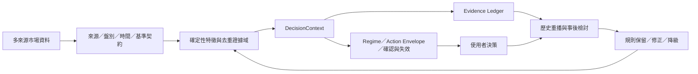
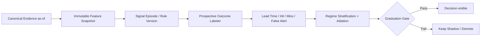
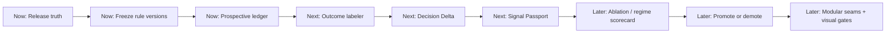

# Stock Terminal v5.0 — HIVE 全面演進審查

> 日期：2026-08-26  
> 基準版本：`beb38654e270fb0a98c3730e920dd8d197b3c0be`  
> 方法：Loop Engineering + Agent HIVE 多供應商獨立審查 + Host 本機實證  
> 變更邊界：本輪只建立審查、優先序與驗收契約，不修改產品行為  
> 重要定位：ST 是研究與決策支援工具，不是自動交易或報酬保證系統

> **後續實作狀態（LOOP-013）**：本文件保留原始審查基準與當時紅燈證據。其後已修復
> canonical package identity，完整 discovery 更新為 269 tests OK（1 skip），並落地只從啟用後
> 累積的 1／3／5 日 immutable outcome ledger、n=20 樣本閘門、唯讀 API、Decision UI 與
> Evidence Ledger。功能仍為 Shadow；尚未 commit 或 deploy。實作契約見
> [跨市場前兆雷達](MARKET_PRECURSOR_SIGNALS.md)，去敏化獨立審查包見
> [LOOP-013 review bundle](ST_LOOP013_REVIEW_BUNDLE_2026-08-26.md)。

---

## 1. 結論先行

Stock Terminal 已不是一般「把公開資料排進 Dashboard」的作品。真正有價值、也最難被複製的部分，是這條閉環：



ST 的護城河不是資料數量，而是：

1. **同一主題只有一套事實契約**，避免頂欄、總覽與圖表各說各話。
2. **結論能追溯到證據、時間、盤別與公式**，而不是只給一個漂亮分數。
3. **確定性決策層與 AI 解釋層分權**，AI 不得覆寫 Regime、Action Envelope 或警報狀態。
4. **研究假說有權限分層**：觀測、衍生、情境模型與 Shadow 研究不混為一談。
5. **本機優先與可分享版本並存**，能保留個人化價值，又能剝除秘密與私人狀態。

### 審查裁定

**產品價值：高；研究完整度：高；工程可持續性：中；前瞻訊號可信度：尚待前瞻驗證；發佈閘門可信度：目前不合格。**

下一階段不應以「新增更多指標」為中心，而應把 ST 升級成：

> **會記錄自己曾經怎麼判斷、之後發生什麼、哪些證據真正有增量價值的市場決策系統。**

最值得做的三件事是：

1. 修復 canonical test gate，讓「全綠」真的代表可發布。
2. 建立前兆訊號的前瞻觀測與校準實驗室，證明提前量與誤報成本。
3. 建立 `Decision Delta`：先顯示「和上次相比，什麼改變、為何改變、什麼會推翻」。

---

## 2. 審查證據與 HIVE 可信度

### 2.1 本機 Host 實證

| 證據 | 結果 |
|---|---|
| 審查基準 | Git `beb38654e270fb0a98c3730e920dd8d197b3c0be` |
| 後端規模 | `server/` 64 個 Python 檔 |
| 前端規模 | 90 個 tracked JS/CSS 資產 |
| 測試資產 | 59 個 Python／JavaScript 測試檔 |
| 最大後端熱點 | `server/server.py` 7,282 行 |
| 最大 UI 熱點 | `src/ui/pulse_v5.js` 3,870 行 |
| 全域相容面 | 約 249 個 `window.*` 指派、140 個前端 fetch/API 提及 |
| canonical unittest | 253 tests；7 import errors；1 skip；已載入測試無 assertion failure |
| 共同根因 | `server/server.py` 可被載成頂層 `server`，遮蔽 `server/` namespace package |
| 建置／分享掃描 | 測試過程完成 deterministic HTML、ZIP 與 privacy scan |

canonical test 的七個 error 不是七個不同產品錯誤，而是一個**套件身分不唯一**的架構缺陷：有些測試把 `server/` 放進 `sys.path` 後直接匯入模組，有些則使用 `from server...`；一旦 `server/server.py` 先以頂層 `server` 載入，後續的 `server.atomic_store`、`server.deadline`、`server.http_boundary`、`server.secret_store` 等就無法解析。

這件事的嚴重度不在於「目前邏輯全壞」，而在於：**ST 主張可稽核，但自己的 canonical release gate 仍不能穩定證明整體版本可發布。**

### 2.2 多供應商審查

外部 worker 只收到一份 14,108-byte 去敏化 Markdown 審查包；沒有傳送原始碼、持倉、成本、帳號、Token、私人網址、log、SQLite 或 runtime data。

| 審查線 | 上游供應商／模型 | Host 採用範圍 |
|---|---|---|
| 產品、決策 UX、手機與 AI 工作流 | Google / `gemini-3.5-flash` | 決策分層、功能降級、結構化 AI brief、前兆校準優先序 |
| 量化、架構、可靠性與驗證 | NVIDIA / `nvidia/nemotron-3-super-120b-a12b` | release gate、前瞻評估、session/freshness、Shadow 升級條件、模組邊界 |

HIVE 嚴格驗證結果：`VERIFIED_MULTI_PROVIDER`。Google 與 NVIDIA 使用不同上游供應商與不同 billing meter，兩份輸出均綁定同一審查包 SHA-256：

```text
078a98dadd383afc9877919d7c6a6a4a1140aa86884a186e48c709ee6c3ba9ef
```

### 2.3 Host 沒有照單全收的部分

| 外部建議 | Host 裁定 |
|---|---|
| 標準函式庫 HTTP server 可能是單執行緒瓶頸 | **排除。** 審查包沒有提供此證據，而且現況已有 threaded HTTP 路徑；應測 request budget 與 blocking provider，不應先換框架。 |
| 缺資料會退化成 neutral | **排除。** ST 現行契約是 fail closed／unavailable，不應把缺資料誤寫成中性市場。 |
| 前兆 precision 直接訂為 75% | **排除。** 任意精準率目標會被事件定義、base rate 與誤報成本操弄；應先建立基線與成本函數。 |
| 直接對 evidence strength 使用 Brier score／log-loss | **延後。** Strength 目前不是機率；除非先建立可驗證的 probability mapping，否則只評估命中、提前量、覆蓋率與誤報成本。 |
| 立即全面改成 ES Modules 或大規模 rewrite | **排除。** 先建立新程式不得擴大 global surface 的 seam，再逐頁抽離；不以框架遷移取代產品驗證。 |

---

## 3. 必須保護的資產

### 3.1 Canonical Market Contract

市場、來源、`asOf`、session、reference type／price 與 display change 是 ST 最重要的資料資產。任何新資料源都必須先進 canonical contract，不能直接寫 UI。

### 3.2 DecisionContext 權威邊界

Regime、Action Envelope、confirmation、invalidation、divergence 與 evidence 應持續由確定性規則產生。AI 可以解釋「為什麼」，不能決定「是什麼」。

### 3.3 Observed / Derived / Modeled / Shadow 分層

尤其選擇權與中長期曝險：公開 OI 不代表造市商淨方向；Signed GEX/VEX/Flip 應維持 Scenario。任何 Shadow 研究都要有清楚升級門檻，不能因畫面好看就變成主訊號。

### 3.4 台積電／0050 去重與記憶體跨市場籃子

這兩組不是一般 watchlist，而是 ST 的核心研究假說：

- 2330 與 0050 必須處理重疊，不能當兩票獨立證據。
- 台灣／美國記憶體籃子必須固定成分、同市場 benchmark、quorum 與 session 對齊。
- 成分或權重異動要有版本，不可用今天的權重回填歷史。

### 3.5 本機優先與分享版隔離

實際投組、個人風險上限、私人假說與登入管理只存在於 owner 邊界；分享版保留通用研究能力，不帶私人狀態。這個分離本身就是產品優勢。

---

## 4. 優先發現與建議

## P0-1 — canonical release gate 失真

**事實**：本機執行與 CI 相同的 `python -m unittest discover -s tests -v`，253 項中出現 7 個匯入 error。

**影響**：targeted tests 可以全過，但不能證明整體 import graph、測試順序與 Windows／Linux 發布路徑一致。之後每次「驗證 OK」都帶有不必要的信任折扣。

**建議**：不要一口氣改寫 64 個 server 模組，採 package seam：

1. 建立正式 `server/__init__.py` 與唯一 package identity。
2. 新增薄入口 `server/__main__.py` 或 `server/app.py`。
3. `server/server.py` 暫時保留為相容 shim，不再承接新 domain logic。
4. 測試移除各自的 `sys.path` 變體，統一使用 package-qualified import。
5. CI 將 discovery、targeted suites、JS contracts、build、dist、live-provider 分成可辨識的 gates。

**驗收**：

- Windows 與 Ubuntu canonical discovery 均 0 error。
- 測試隨機順序重跑不再出現 package collision。
- launcher、private gateway、share build 與既有 route contract 不變。
- canonical gate 失敗時禁止 commit/deploy 被宣告為 verified。

## P0-2 — 前兆訊號尚未證明「提前」與「有增量」

**事實**：目前 strength 是 bounded evidence score，不是概率；尚無足夠 prospective lead-time、precision、false-alert cost、coverage 與 drift 歷史。

**影響**：訊號可以看起來很合理，卻可能只是重新描述已發生的跌勢／漲勢，或在高度相關證據間重複計票。

**建議**：建立 `Signal Evaluation Ledger`，每次 observation 都先封存，之後才追加 outcome，禁止事後修改原始輸入。



必要規則：

- 先定義 downside／upside event，再開始觀察；不邊看結果邊改門檻。
- 用 alert episode 評估，不把連續五天同一警報算五筆命中。
- 對齊台美交易日、夜盤／日盤、假日、DST、換月與延遲資料。
- 保存 rule version、basket version、weight version 與 source revision。
- 對 overlap evidence 做 ablation：拿掉 2330、0050 residual、memory、breadth 等單域，確認是否有增量。
- 以簡單 baseline 比較：趨勢＋廣度、單純大盤動能、隨機／固定頻率警報。

**第一階段指標**（不假裝是概率）：

| 指標 | 意義 |
|---|---|
| `episode_count` | 獨立警報事件數，不是每日列數 |
| `coverage` | 有足夠證據可判斷的市場時段比例 |
| `abstention_rate` | 因資料不足而拒絕判斷的比例 |
| `lead_time_sessions` | 警報到事件間的交易時段分布 |
| `event_hit_rate` | 固定事件定義下的命中率 |
| `false_alerts_per_20_sessions` | 每 20 交易日誤報次數 |
| `miss_rate` | 發生事件但未先出現警報的比例 |
| `incremental_lift_vs_baseline` | 相較簡單 baseline 的增量 |
| `domain_ablation_delta` | 移除某域後的效能變化 |
| `regime_stability` | 不同波動／趨勢 regime 的穩定度 |

**驗收**：Shadow 訊號沒有足夠 prospective episodes 前，不升級為 Action Envelope 來源；任一升級都有版本化 scorecard、對照 baseline、失敗案例與 rollback 條件。

## P1-1 — 從 Dashboard 升級為 Decision Delta

ST 現在能回答「目前是什麼」，下一步要先回答「**為什麼和上次不同**」。這比再增加一組 score 更有決策價值。

建議建立三層閱讀：

### 3 秒

- Regime／主要方向。
- Action Envelope：允許／限制。
- 最高優先 alert 與 lifecycle。
- 資料品質總燈號。
- 最重要 invalidation level。

### 30 秒

- 自上次 DecisionContext 以來三個最大 evidence delta。
- 新增、解除、升級、降級的 alerts。
- 最主要 contradiction。
- 下一個 confirmation／invalidation 條件。

### 專業 drill-down

- Evidence ID、來源、時間、盤別、scope、公式、rule version。
- 過去相似 episode 與前瞻 outcome。
- raw observed、derived、scenario、shadow 的明確分區。

**驗收**：使用者不展開專業面板也能在十秒內說出「市場狀態、改變原因、限制行動、失效條件」；所有摘要可一鍵定位 evidence，而不是生成另一套數字。

## P1-2 — 將資料品質從註腳升成一級訊號

缺資料不是中性；資料源在極端行情時失效本身可能提高操作風險，但不能被解讀為市場方向。

建議分開呈現：

- `market_direction`：台／美價格色。
- `alert_urgency`：藍／黃／橙等風險語意。
- `evidence_strength`：數字或單色強度條。
- `data_quality`：fresh／delayed／stale／missing／proxy。
- `contradiction`：獨立圖示，不與漲跌色共用。

每個 DecisionContext 應帶 domain age vector，而不是只顯示整包 `generatedAt`。

**驗收**：任一核心域 stale／missing 時，Pulse、Decision 與 alert 都顯示相同狀態；不得維持舊 confidence 卻只在 Evidence Ledger 底部寫 stale。

## P1-3 — 以 seam 收斂後端，而非全面 rewrite

`server/server.py` 仍是最大相容面，但專案已有 `decision_routes`、`options_routes`、`market_routes`、`deadline`、`job_queue`、`atomic_store` 等正確方向。

建議新規則：

1. 新 route 必須進具名 route module，主 Handler 只做 registry／boundary。
2. 外部來源 I/O 只能由 adapter/service 持有；DecisionContext 不直接抓資料。
3. 所有 request 傳遞 monotonic deadline 與 typed outcome。
4. 所有狀態寫入走 atomic store／repository；不得新增直接 truncate write。
5. 建立 dependency-direction test，禁止 domain 反向 import HTTP Handler。
6. 每次抽離以 characterization tests 保護，不追求一次把行數降到漂亮數字。

**驗收**：連續三個功能不再增加 `server/server.py` 的 domain logic；新 route 有 schema、body limit、deadline、source outcome 與 contract test。

## P1-4 — 收斂前端請求權與 global surface

`MarketData`／`DecisionData` 已是正確起點，但 249 個 `window.*` 與 140 個 fetch/API 提及代表還有大量相容層。

建議：

- 新功能不得新增直接 `window.*` 寫入，必須註冊於 AppKernel/service registry。
- 新頁面不得自行抓與 Pulse 同主題資料，應訂閱 canonical store。
- 先抽 `pulse_v5` 的 Decision Delta、Data Quality、Precursor、Panel Registry；不要先做全站 ES-module 改寫。
- 建立 listener／timer／inflight request 計數，路由切換後必須歸零或維持固定上限。

**驗收**：route 重複切換 100 次後，listener、timer、fetch 數量不線性增加；同一主題全站只有一個 inflight producer。

## P1-5 — 手機直式是 Decision Confirmation，不是縮小桌面

手機橫式可以保留完整 5+5；直式應優先：

1. Decision Delta。
2. alert lifecycle 與 data quality。
3. key invalidation／confirmation。
4. 左右翻頁的完整工作區與明確 page index。

不要用瀏覽器偶然下拉才能看到的內容，也不要讓固定 footer 壓住最後一張卡。

**自動化 viewport gate**：

- 375×812 小型手機直式。
- 430×932 大型手機直式。
- 844×390 手機橫式。
- 1366×768 一般桌面。
- 1920×1080 專業桌面。

檢查：水平 overflow、fixed footer safe-area、最末內容可達、touch target、最小字級、tab/page index、方向切換後 state 保留。

## P1-6 — AI 應產品化成四個結構化任務

比 open-ended chatbot 更有價值的本機 AI 工作流：

1. **Morning Brief**：目前狀態、夜間變化、今日確認／失效。
2. **What Changed**：只解釋 DecisionContext delta。
3. **Contradiction Explainer**：為何 index、breadth、futures、flow 不同向。
4. **Post-close Review**：早上警報後實際發生什麼，哪些證據有效／無效。

輸出必須引用 Evidence IDs，明示 missing／conflict，不得：

- 修改 regime／strength／Action Envelope。
- 補造缺失數據。
- 把 scenario 當 observed。
- 產生未經 risk profile 授權的倉位百分比。
- 以自然語言掩蓋 LLM unavailable。

效能計時必須包含模型 load time；AI 失效時用 deterministic template 降級。

## P2-1 — Signal Passport 與 Shadow 升級制度

每一個研究訊號應有一張 passport：

```text
signal id / version
authority: observed | derived | scenario | shadow | decision-visible
inputs and de-duplication
session and freshness contract
prospective start date
episode count and coverage
lead-time / hit / miss / false-alert metrics
known failure regimes
promotion / demotion / rollback criteria
```

升級不是一次性「批准」，而是可逆狀態。資料源異動、效能漂移或 false-alert cost 上升時，訊號應自動回 Shadow。

## P2-2 — 功能價值帳本與面板降級

新增 `Feature Value Ledger`，每月回答：

- 此面板是否改變過使用者決策？
- 是否提供 canonical store 沒有的增量？
- 是否只是把 Evidence 重新排版？
- 是否有使用、展開、深連結或匯出？
- 是否造成 mobile overflow、額外 fetch 或維運成本？

無增量的 panel 不一定刪除，可降到專業 drill-down；主畫面只保留會改變決策的資訊。

## P2-3 — 遠端營運韌性

Private Web 已有 owner/admin 邊界，下一步應強化現有 admin，而不是移往公有雲：

- active release identity。
- gateway／backend／AI runtime／data freshness 狀態。
- 上次成功 refresh、backup、restore drill。
- 可下載的去敏診斷包。
- host reboot 後的明確啟動／失敗指示。

**驗收**：任一遠端黑屏或 502 能在 admin 內辨識是 gateway、backend、asset、auth、AI 或 source 問題，不必先猜。

---

## 5. 三個最高價值投資

## Bet A — Prospective Signal Lab

這是把 ST 從「分析得很完整」升級成「知道自己是否真的提早看見」的關鍵。

交付物：

- immutable feature snapshots。
- signal episode ledger。
- delayed outcome labeler。
- baseline comparison。
- domain ablation。
- regime-stratified scorecard。
- Shadow graduation／rollback gate。

## Bet B — Decision Delta & Timeline

將 Decision history 轉成使用者真正需要的時間序列：

```text
上次：NARROW_RALLY / 限制新增槓桿
現在：DEFENSIVE_RISK_OFF / 新增 downside precursor ACTIVE
原因：breadth velocity ↓、AI anchors conflict、memory sync 轉弱
資料：4/5 domains fresh；options scenario stale
確認：...
失效：...
```

這會成為 ST 最能被感受到的產品差異。

## Bet C — Trustworthy Release & Modular Seams

先讓 canonical gate 可信，再以小型 seams 逐步降低 change radius。這不是單純技術清潔；它直接保護使用者最有價值的資產，讓未來每一次功能落地不再放大回歸風險。

---

## 6. 不建議做或應降級的項目

- 不做自動下單、一鍵槓桿或 AI 自主交易。
- 不把 evidence strength 包裝成勝率或概率。
- 不把 Signed GEX/VEX/Flip 放成主畫面唯一真相。
- 不新增另一套 Pulse／Chart／Header 行情計算。
- 不以換 React、FastAPI 或雲端化本身當作產品升級。
- 不新增更多通知管道，直到誤報、漏報與 alert fatigue 可量測。
- 不讓 open-ended AI chat 取代 Evidence-cited structured workflows。
- 不保留只是複製公開資訊、未進入決策閉環的主畫面面板。
- 不用今天的 ETF 權重或籃子成分回填歷史。
- 不因單一回測漂亮就將 Shadow 升級為 Action Envelope 權威。

---

## 7. 90 日路線圖



### Now — 0 到 14 天

1. 修復 package identity 與 canonical test discovery。
2. 將 canonical gate 定義為 deploy 必要條件。
3. 凍結所有 precursor rule／threshold／basket／weight version。
4. 建立 append-only signal observation schema。
5. 定義兩到三種前瞻事件與 alert episode 邊界；尚不調門檻。

### Next — 15 到 45 天

1. 建立 delayed outcome labeler 與 baseline。
2. 建立 Decision Delta API／store，不新增第二套市場計算。
3. 在 Decision 手機首屏加入「改變原因／資料品質／確認／失效」。
4. 建立 Signal Passport 與 Shadow graduation template。
5. 從 `server.py` 抽第一個 route registry seam，保留相容 shim。
6. 建立 viewport／orientation／overflow 自動 gate。

### Later — 46 到 90 天

1. 執行 domain ablation 與 regime-stratified evaluation。
2. 根據真實觀測決定升級、維持 Shadow 或降級。
3. 上線 Morning Brief、What Changed、Contradiction、Post-close 四個 AI 任務。
4. 建立 Feature Value Ledger，降級一批未提供增量的主畫面資訊。
5. 建立 remote admin 診斷與 restore drill。
6. 依實際 change radius 再抽第二批 backend／frontend seams。

---

## 8. 可量測的完成定義

### Release Trust

- canonical Python discovery：0 error。
- JS contracts、build、dist、security、private-Web gates 分項可見。
- Windows／Ubuntu 均通過。
- 版本、artifact hash 與 deploy release identity 可追溯。

### Signal Value

- 每次訊號有 immutable as-of snapshot、rule version、episode ID。
- 顯示 coverage、abstention、lead time、hit、miss、false-alert cost。
- 與簡單 baseline 比較，而不是只看自己的曲線。
- 對 2330／0050、memory、breadth、flow 做 ablation。
- 樣本不足時明示 `INSUFFICIENT_PROSPECTIVE_HISTORY`。

### Decision UX

- 十秒內回答狀態、改變、限制與失效。
- alert urgency、strength、direction、quality 使用不同視覺通道。
- 所有摘要可深連結 Evidence。
- 直式與橫式沒有不可達內容或 footer 遮蔽。

### Architecture

- 新 route 不增加 monolith domain logic。
- 新市場主題只有一個 producer／inflight owner。
- 路由切換不累積 listeners、timers 或 fetches。
- 寫入皆有 atomic／repository contract。
- AI unavailable 不影響 deterministic decision loop。

---

## 9. 建議的下一個落地 Loop

下一輪應命名為：

> **LOOP-013 — Release Truth + Prospective Signal Ledger**

範圍只包含：

1. package/import identity 修復。
2. canonical CI 全綠。
3. precursor rule/basket/version freeze。
4. append-only observation ledger。
5. outcome label contract 與測試 fixture。
6. 不改變現有訊號權限、不新增交易建議、不調整門檻。

這一輪完成後，才進 `Decision Delta`。原因很簡單：如果歷史資料沒有用固定版本、固定事件與固定 as-of 契約記錄，之後再漂亮的「改變原因」也無法證明有沒有提前價值。

---

## 10. 最終判斷

ST 現在最缺的不是聰明指標，而是兩種「記憶」：

1. **工程記憶**：這個版本是否真的被完整驗證、由哪個 artifact 部署。
2. **決策記憶**：當時看到什麼、做出什麼判斷、後來發生什麼、哪個證據真正有效。

補齊這兩種記憶後，ST 的價值會從「很完整、很好看、很多資料」轉成：

> **一套能持續證明自己何時有用、何時應該閉嘴、何時必須降級的市場決策資產。**
