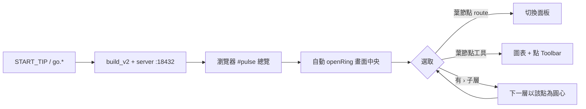
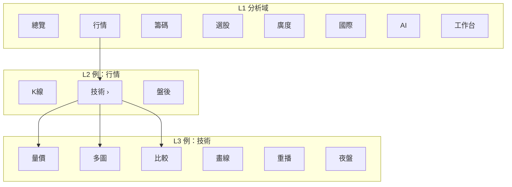
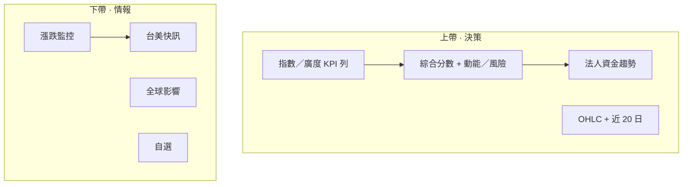
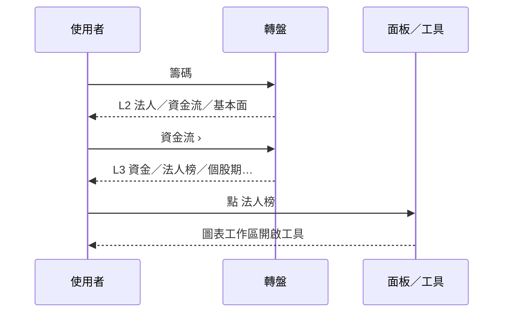

# Stock Terminal 5.0 · tip UX 導覽

> Bloomberg 風格本機終端。**無側欄**——導航改為 **分析轉盤**。  
> 開啟一律進 **總覽 `#pulse`**，並自動彈出轉盤。


---

## 30 秒上手

| 步驟 | 動作 |
|------|------|
| 1 | Windows 雙擊根目錄 **`START_TIP.cmd`**（或 `scripts\go.bat`）；Linux／macOS 跑 `./scripts/go.sh` |
| 2 | 瀏覽器開到總覽；**轉盤自動出現**（中心為 Stock Terminal 5.0 logo） |
| 3 | **滾輪**循環選取 → **Enter** 或滑鼠點選；有 `›` 的項目會從該點開下一層 |
| 4 | **Esc**／中心徽記：有子層先返回，否則關閉轉盤 |

> 開頁後建議 **Ctrl+F5**，避免舊 JS 快取。

---

## 啟動流程（示意）



---

## 分析轉盤：三層投資邏輯

最多 **三層**。上一層維持顯示但**半透明鎖定**；下一層以**被點選功能**為圓心展開（不重回畫面正中）。




### L1 → 對應原側欄能力

| L1 | 涵蓋頁面／工具（原 sidebar） |
|----|------------------------------|
| **總覽** | 儀表板 `#pulse`、快訊、風險 |
| **行情** | 圖表 K 線、技術工具（量價／多圖／畫線…）、盤後 |
| **籌碼** | 法人頁、資金流工具、基本面工具 |
| **選股** | 選股室、策略庫工具、訊號 |
| **廣度** | 漲跌家數、熱力、排行（盤後） |
| **國際** | 國際頁、行事曆 |
| **AI** | AI 中樞、報告／副駕／焦點 |
| **工作台** | 自選、投組、系統（指令盤＝原「工具」）、設定 |

> 契約：`ShellV5.ringCoversRoute(id)`／selftest「covers all sidebar routes」。

---

## 操作對照（圖示＋快捷）

```text
                 +-- tip / breadcrumb --+
                         L2 · 行情
        (鎖定 L1)  o o o o o o o o
                      \
         o--o--o       o 技術›        o--o
        /    活躍層以「行情」為圓心
              +----------+
              |  ST 5.0  |  <- logo 中心
              |    ‹     |  <- 子層返回徽記
              +----------+
        滾輪：循環高亮    Enter：確認
```

| 輸入 | 行為 |
|------|------|
| **中鍵** | 在游標處開／關轉盤 |
| `\` / `[` / `Ctrl+B` / `⌘B` | 畫面中央開關轉盤 |
| 右下角 **◎ FAB** | 開轉盤 |
| **滾輪** | 循環選取作用層 |
| **↑↓←→** | 同上 |
| **Enter** | 確認／下鑽 |
| **Esc** / **Backspace** / 中心徽記 | 返回上層或關閉 |
| `Alt+Shift+1…0` | 直達常用路由（總覽／圖表／廣度…） |

---

## 總覽儀表板（#pulse）一眼架構

開啟後背景即為一屏高密度總覽（5 欄 × 2 帶）。轉盤關閉後可直接閱讀：



| 區塊 | 你會看到 |
|------|----------|
| 市場脈搏 | 綜合分、動能／風險權重、可靠度 |
| 盤勢 | 加權／櫃買／台指期 + OHLC 折線 |
| 法人 | 外資／投信／自營 + 合計趨勢 |
| 廣度 | 漲跌結構；極端時才強調漲跌停 |
| 全球 | 美股／費半／日韓／VIX／美元台幣／金銅角色 |
| 快訊 | 台／美重大訊息（可搜尋） |

鐵律：缺資料進「尚未納入」，不捏造 Fear&Greed 或未掃描的「全市場 250 日新高家數」。

---

## 推薦路徑範例

### 例 A — 早盤決策（60 秒）

1. 開機看轉盤 → **總覽 › 儀表板**（或直接 Esc 看已載入的總覽）
2. 掃綜合分與法人趨勢
3. 轉盤 **廣度 › 漲跌家數** 確認市場溫度
4. **行情 › K線** 載入關注股

### 例 B — 籌碼追蹤



### 例 C — 策略選股

**選股 › 策略庫 ›** 三合一／篩選／型態／回測；或 **選股 › 選股室** 進頁面。

---

## 與舊版差異（給升級者）

| 舊 tip／側欄時代 | 現在 |
|------------------|------|
| 左側 navrail 點路由 | **轉盤**三層分析分類 |
| `[`／Ctrl+B 開側欄 | 開／關**轉盤** |
| 開機可能還原 `#chart` | **一律 `#pulse` + 自動彈轉盤** |
| 品牌在側欄頂 | 品牌在**轉盤中心 logo** |

殘留側欄 DOM 會被 `stripLegacyNav()` 移除。

---

## 本機啟動（tip 專用）

**Windows（建議）**

```powershell
cd C:\Users\Sam\AI_Stock
.\START_TIP.cmd
```

**同步此 tip 分支後再開**

```powershell
git fetch origin cursor/st51-docs-ux-on-tip-3497
git reset --hard origin/cursor/st51-docs-ux-on-tip-3497
.\START_TIP.cmd
```

**Linux／macOS**

```bash
./scripts/go.sh
# → http://127.0.0.1:18432/stock_terminal_v2.html#pulse
```

Server **只聽** `127.0.0.1:18432`。

---

## 分享包收件者檢查清單

- [ ] 解壓後跑 `START_TIP.cmd` 或 `scripts\go.bat`／`go.sh`
- [ ] 見總覽 + 轉盤 + 中心 **ST 5.0** logo
- [ ] 滾輪可循環；點「行情 › 技術」從該點開第三層
- [ ] 自行設定 API Key／通知（**不會**出現在分享包內）
- [ ] 大庫（融資週期／集中度等）首次使用會背景回補，或按頂列「同步資料」

完整功能表與資料來源見 [README.md](./README.md)。  
打包指令見根目錄 [README.md](../README.md)「打包可分享版」。
