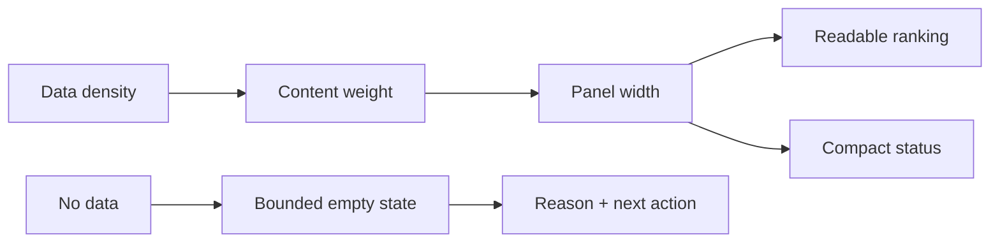
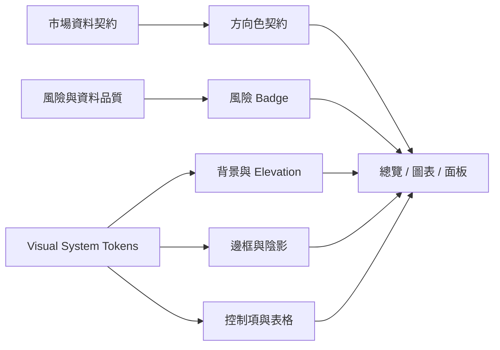
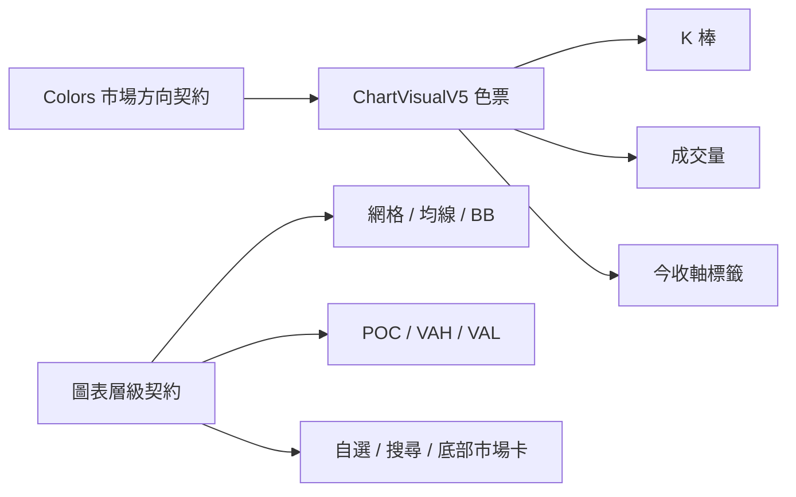

# Stock Terminal v5.0 視覺系統

## Content-weighted layout contract

The terminal keeps its dense one-screen structure, but columns are not required
to be equal. Width follows reading cost and interaction density:

- Overview keeps five equal-width panels per row so the second and third rows
  retain a stable visual rhythm.
- Breadth prioritizes the two-column strong/weak ranking. The compact market
  structure signal no longer consumes the widest column.
- Empty datasets render a bounded explanation and next action instead of an
  unstructured blank surface.
- Shared page headers, KPI cells and section accents are owned by
  `visual_system_v5.js`; market-direction colors remain owned by the market color
  contract.



本規範將 Stock Terminal 的高資訊密度介面收斂成一致的「專業金融終端」視覺語言。核心目標不是增加裝飾，而是讓使用者先辨認層級、再閱讀數據，並在長時間使用下維持舒適度。

## 設計原則

1. **資料優先**：陰影、光暈和透明度只負責分層，不與價格漲跌搶色。
2. **一套層級**：頁面底圖、頂層容器、資訊卡、互動狀態分成四層。
3. **高密度不膨脹**：不全面增加 padding；主要透過色差、細邊框和陰影建立空間感。
4. **語意不可混用**：台股／日股紅漲綠跌；美股綠漲紅跌；風險使用藍、黃、橙。
5. **效能可控**：玻璃模糊只用於頂欄、Modal、Badge 等有限區域，不套在每一張卡片。

## Surface 與 Token

| 層級 | Token | 用途 | 視覺特徵 |
| --- | --- | --- | --- |
| Base | `--vs-surface-0` | 全頁底圖 | 極深冷藍、低亮度環境光 |
| Surface 1 | `--vs-surface-1` | 面板底層 | 接近不透明，確保文字對比 |
| Surface 2 | `--vs-surface-2` | 外層卡片 | 微漸層、細玻璃邊框 |
| Surface 3 | `--vs-surface-3` | Hover／選取 | 只比卡片亮一階 |
| Border | `--vs-border` | 一般邊界 | 白色 14% 透明度 |
| Border High | `--vs-border-hi` | Hover／Focus | 淡青色，不代表漲跌 |
| Shadow 1 | `--vs-shadow-1` | 一般卡片 | 短距離柔和陰影 |
| Shadow 2 | `--vs-shadow-2` | Hero／主面板 | 較深陰影與內高光 |

## 總覽 Markdown 範例

以下範例是總覽資訊層級的文字版契約，可用於 README、分享說明或 AI 摘要輸出：

```markdown
## 市場總覽

> ◐ **指數偏強・結構分化**
>
> 今日建議：可以續抱觀察，但先別追高或增加槓桿。

| 一眼訊號 | 目前狀態 | 白話說明 |
| --- | ---: | --- |
| ⚖️ 市場熱度 | 45／100 | 每 10 家約 4 家上漲，漲勢集中少數股票 |
| 💰 大戶動向 | +220 億 | 三大法人合計買超，資金面偏多 |
| 🔋 動能氣氛 | 71／100 | 成交活躍，但仍需確認廣度是否跟上 |

### 三市場雷達

- 🇹🇼 台股：**指數偏強、個股分化**｜風險中等
- 🇺🇸 美股：**科技與大盤偏強**｜風險中等
- ◈ 期貨：**多方偏強**｜注意期現價差與夜盤波動

### 歷史關卡

- 壓力參考：`48,182`
- 支撐參考：`46,990`
- 資料過期時只供回顧，不作當日停損依據。
```

## 元件規範

### Hero

- 使用雙環境光：左側冷青、右側極淡金色。
- 僅有一條 1px 頂部高光，不使用大面積霓虹框。
- 主要結論字重最高；資料品質與來源降階顯示。

### 卡片

- 外層圓角 11px，內層 8px，控制項 6px。
- Hover 僅上移 1px，並提高邊框亮度；不做大幅縮放。
- 總覽三張訊號卡以青／金／紫細線區分功能，不代表漲跌。

### Badge 與風險色

- 方向色由市場契約決定，視覺系統不可覆寫。
- 風險低／中／高使用藍／黃／橙。
- Badge 採透明底、細邊框與膠囊圓角，避免大色塊搶焦點。

### 表格

- 表頭使用深色垂直漸層並保留 sticky。
- 偶數列只增加約 2% 白色透明度。
- Hover 使用淡青底色；排序欄位仍以金色表示。

## Logic Map



## 圖表工作站

圖表頁在全站 Surface Token 之上再加一層 `ChartVisualV5` 契約，僅負責圖表視覺，不另建漲跌邏輯：

- K 棒、成交量、今收軸標籤共用同一個市場感知色票。
- 台股／日股維持紅漲綠跌；美股維持綠漲紅跌。
- 20MA 使用較粗金線；60MA 使用較細青線；Bollinger Bands 降低透明度。
- 圖表網格退到背景，POC／VAH／VAL 以紫／藍／青建立圖表與右欄的視覺對應。
- 自選列、搜尋、雙分數卡與底部市場列只提升層次，不增加工作站高度。
- 今／昨收沿用既有正確價位標籤，不同時開啟 Lightweight Charts 原生價框，避免重疊。



## 驗收清單

- 總覽在 1280×720 仍維持一頁，沒有新增遮蔽或水平捲軸。
- 卡片邊界清楚，但亮度不高於主要數據。
- 台股、日股、美股方向色不受視覺層覆寫。
- Decision、Heat、Scan、News 等面板使用相同 border、radius、shadow 層級。
- 鍵盤 Focus 可見，`prefers-reduced-motion` 下停用位移動畫。
- 列印模式移除深色背景、陰影與模糊效果。
- 圖表頁切換 `2330` 與 `NVDA` 時，K 棒、成交量與今收標籤同步切換市場色彩。
- 右側雙分數卡、量價關卡與底部市場卡在 1280×720 不產生新增水平捲軸或遮蔽。
