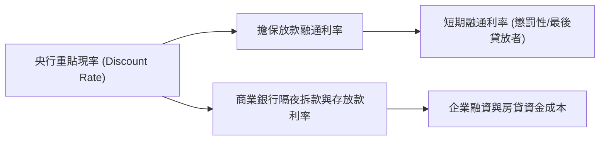
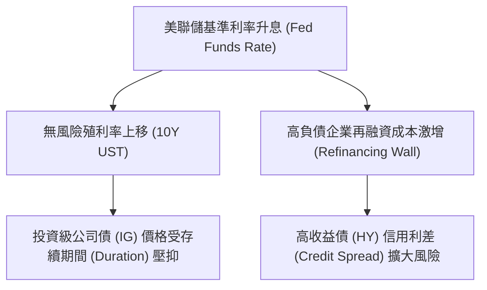

# 📊 全球與台灣宏觀總經與市場風險觀測研析報告 (Macro & Market Risk Observations)

## 📌 執行摘要 (Executive Summary)

本報告針對 4 組極具價值的宏觀總經與市場風險觀察圖表進行深度剖析。這 4 組指標涵蓋了**台灣央行貨幣政策姿態**、**台灣散戶與中小型股籌碼過熱風險**、**美聯儲利率週期與信用債市場總報酬傳導**，以及**通膨與基準利率對美國金融類股淨利差 (NIM) 與資產負債表的影響**。

---

## 1. 台灣 - 指標利率 (Taiwan Benchmark Interest Rates)

### 📈 圖表指標構成
* **藍線**：重貼現率 (Discount Rate, FRED: `INTDSRTWM193N`)
* **紅線**：擔保放款融通利率 (Secured Loan Accommodative Rate)
* **綠線**：短期融通利率 (Short-term Accommodative Loan Rate)



### 💡 宏觀經濟與貨幣政策邏輯
1. **政策利率走廊 (Interest Rate Corridor)**：
   * 台灣中央銀行（CBC）透過調整「重貼現率」、「擔保放款融通利率」與「短期融通利率」建立貨幣市場的利率走廊。
   * **重貼現率**為基準底線（銀行向央行貼現合格票據的成本）；擔保放款與短期融通利率則作為流動性調節與最後貸放者（Lender of Last Resort）融通資金成本。
2. **貨幣寬鬆與緊縮週期**：
   * **2008 金融海嘯 / 2020 全球疫情**：央行迅速降息至歷史低點（重貼現率降至 1.125%），大幅降低市場資金成本，維持金融體系流動性。
   * **2022-2024 升息防禦**：因應全球供應鏈瓶頸與台幣通膨壓力，央行啟動溫和升息與調升存款準備率（雙重緊縮），推升整體貨幣市場利率走廊。

### ⚠️ 風險觀測與交易策略應用
* **流動性溢價 (Liquidity Premium)**：當短期融通利率與重貼現率利差擴大時，反映銀行間隔夜拆款市場流動性趨緊。
* **資產評價與房貸/企業融資成本**：台灣指標利率上升直接傳導至指數型房貸與企業聯貸利率，壓抑高槓桿企業淨利率與房市交易量。

---

## 2. 台灣 - 上櫃融資張數除以上市融資張數 (OTC / Listed Margin Balance Ratio YoY vs. TAIEX)

### 📈 圖表指標構成
* **藍線**：上櫃融資張數 / 上市融資張數 (年增率 %, L - 左軸)
* **紅線**：加權指數 (TAIEX Index, R - 右軸)

### 💡 散戶情緒與中小型股風險邏輯
1. **散戶槓桿結構與市場籌碼分佈**：
   * **上市（TWSE）** 包含大盤權值股（如台積電、聯發科），多由外資、法人與機構主導；
   * **上櫃（TPEx）** 集中了中小型成長股與題材股，散戶與內資主力參與度極高，融資使用率（Margin Usage）顯著高於上市股票。
2. **OTC 融資相對熱度 (OTC Speculative Intensity)**：
   * 當「上櫃融資張數 / 上市融資張數」的年增率（YoY）大幅飆升，代表散戶正大量借貸槓桿湧入高波動的中小型股，市場投機氣氛達到極致過熱（Retail Overcrowding）。

### ⚠️ 風險觀測與歷史見頂訊號
* **頭部警戒線 (Market Top & Retail Overheating Signal)**：
  * 歷史經驗（如 2007-2008、2011、2015、2018、2021 高點）：每當上櫃融資年增率飆升至高檔區（>+20% ~ +40%）並開始急劇反轉時，往往標誌著散戶籌碼過度集中且缺乏法人生意買盤支撐。
  * 一旦大盤出現突發性拉回，高槓桿的中小型股將率先引發**多殺多（Margin Call Cascades）與斷頭賣壓**，導致櫃買指數（OTC Index）出現無差別流動性崩潰。

---

## 3. 美國 - 市場利率 vs. 公司債總報酬指數 (US Rates vs. Corporate Bond Total Return Index)

### 📈 圖表指標構成
* **黑線**：美國 - 基準利率 (Fed Funds Effective Rate, FRED: `FEDFUNDS`, L)
* **黃線**：美國 - 10年期公債殖利率 (10Y UST Yield, FRED: `DGS10`, L)
* **藍線**：美國 - 美林投資級公司債總報酬指數 (ICE BofA US Corporate Index TR, FRED: `BAMLCC0A0CMTRIV`, R)
* **紅線**：美國 - 美林高收益債總報酬指數 (ICE BofA US High Yield Index TR, FRED: `BAMLHY0A0HYMTRIV`, R)



### 💡 殖利率曲線與信用債市場傳導
1. **利率週期對債券總報酬的影響**：
   * 債券價格與殖利率呈反向關係（$P \approx \frac{C}{1+r}$）。美聯儲在 2022-2023 啟動歷史性快速升息（0% $\rightarrow$ 5.25%-5.50%），導致無風險殖利率曲線大幅上移。
   * 長天期投資級公司債（藍線）具有較高存續期間（Duration），在升息過程中承受顯著的資本損失（Drawdown）；而高收益債（紅線）存續期間較短且票息較高（High Coupon Buffer），在經濟強勁時展現出較佳的抗跌性。
2. **信用利差與企業再融資風險 (Credit Spread & Refinancing Wall)**：
   * 當 Fed 利率長時間維持高檔（High-for-Longer），高負債/垃圾級企業面臨「再融資壁壘」（Refinancing Wall），利息支出大幅激增，信用違約風險（Default Risk）上升。

### ⚠️ 風險觀測與資產配置
* **殖利率曲線倒掛與解倒掛 (Yield Curve Un-inversion)**：
  * 當 10Y-2Y / 基準利率倒掛結束並走向熊市陡峭（Bear Steepening）或牛市陡峭（Bull Steepening）時，通常預示經濟陷入衰退或信用緊縮期。
  * **配置策略**：在降息週期啟動前夕，鎖定高殖利率投資級公司債（IG Corporate Bonds），可獲得票息收益與資本利得的雙重回報。

---

## 4. 美國 - 基準利率 & 通脹 vs. 金融類股 (US Policy Rate & Inflation vs. Financials Sector)

### 📈 圖表指標構成
* **藍色柱狀**：美國 - 消費者物價指數 (CPI YoY %, FRED: `CPALTT01USM659N`, L)
* **綠色柱狀**：美國 - 基準利率 (Fed Funds Rate, FRED: `FEDFUNDS`, L)
* **黃線**：美國 - S&P 500 金融類股總報酬指數 (S&P 500 Financials Sector TR Index, R)

### 💡 通膨、利率環境對金融業盈利能力與資產負債表影響
1. **淨利息收益率 (Net Interest Margin, NIM)**：
   * 升息初期：銀行資產端（貸款/債券）收益率重定價速度快於負債端（存款成本），帶動淨利差擴大（NIM Expansion），金融類股盈餘大幅成長。
   * 升息尾聲/高利率後期：存款轉向高收益定存/貨幣市場基金（Deposit Beta 上升），資金成本大幅攀升，壓抑淨利差。
2. **通膨衝擊與資產品質 (Inflation Shock & Asset Quality)**：
   * 高通膨迫使央行升息。若通膨居高不下引發滯脹（Stagflation），企業與消費者違約率上升，銀行備抵呆帳（Provisioning）增加；同時持有的低利率長天期美債出現未實現虧損（Unrealized Losses, 如 2023 年矽谷銀行 SVB 事件）。

### ⚠️ 類股輪動與系統性風險觀測
* **金融股對利率與殖利率曲線陡峭度的敏感度**：
  * 金融類股總報酬（黃線）在大週期中與經濟擴張及陡峭的殖利率曲線呈正相關。
  * 當 CPI 居高不下但美聯儲被迫降息以救經濟（滯脹降息）時，金融股估值將面臨壓力；反之，若經濟軟著陸（Soft Landing）且利率維持於溫和水準，金融股將持續發揮高股息與穩定現金流優勢。

---

## 📋 總結與四圖聯動綜合觀測矩陣 (Integrated Macro Risk Matrix)

| 觀測層面 | 觀察指標 / 圖表 | 警戒/臨界門檻 (Risk Thresholds) | 觀測含義與資產配置指引 |
| :--- | :--- | :--- | :--- |
| **台灣央行政策** | 台灣指標利率走廊 | 重貼現率向上調升 / 短融利差拉大 | 貨幣緊縮，壓抑高槓桿房市與中小型股估值 |
| **台股籌碼風險** | 上櫃/上市融資張數比 YoY | 年增率飆高（>+20%~40%）後反轉 | 散戶籌碼過熱、中小型股多殺多/斷頭風險極高 |
| **美債與信用市場** | 美國基準利率 vs. 公司債總報酬 | 信用利差急劇擴大 / 殖利率曲線解倒掛 | 信用違約風險升高，優先選擇投資級債 (IG) |
| **美國金融類股** | CPI & 基準利率 vs. 金融股總報酬 | 存款 Beta 上升 / 長債未實現虧損 / 倒掛壓抑 NIM | 銀行淨利差受壓，觀察殖利率曲線陡峭度變化 |

---

## 🛠️ 程式碼與系統整合說明

我們已同步將上述 4 組觀察圖表所涵蓋的總經數據資料集，寫入後端 `server/server.py` 與前端 `src/screener/macro_v3.js` 的 `MACRO_SERIES` 配置中，支援在看盤介面中進行任意總經指標與個股 K 線的疊圖與 Pearson 相關係數分析！

```python
# MACRO_SERIES 新增項目 (server/server.py)
MACRO_SERIES = {
    # ... 原有美債與 CPI 項目 ...
    'tw_discount_rate': {'p': 'fred', 'id': 'INTDSRTWM193N', 'label': '台灣央行重貼現率', 'unit': '%'},
    'baml_ig':           {'p': 'fred', 'id': 'BAMLCC0A0CMTRIV', 'label': '美林投資級公司債總報酬', 'unit': 'Index'},
    'baml_hy':           {'p': 'fred', 'id': 'BAMLHY0A0HYMTRIV', 'label': '美林高收益公司債總報酬', 'unit': 'Index'},
    'us_cpi_yoy':        {'p': 'fred', 'id': 'CPALTT01USM659N', 'label': '美國CPI年增率(YoY)', 'unit': '%'},
}
```
