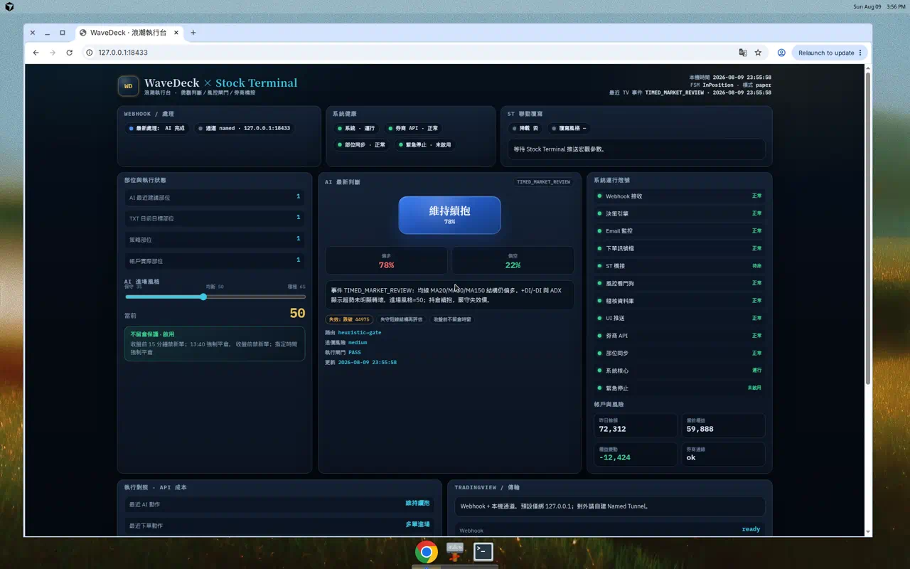

# WaveDeck · 浪潮執行台

**Stock Terminal 的微觀執行艦橋**——接收 TradingView／ST 訊號、AI 判斷、風控閘門、部位校準與下單橋接。

> 宏觀看盤 → [Stock Terminal](../README.md)  
> 微觀執行 → **WaveDeck**

資訊架構對齊附圖艦橋：部位四欄／AI 判斷／燈號牆／不留倉／Kill Switch／系統控制列。



---

## 為什麼叫 WaveDeck？

- **Wave**：延續 Wave AI 訊號／浪潮語意  
- **Deck**：艦橋／操作台——一眼掌握判斷、風控與執行  
- 中文名：**浪潮執行台**

---

## 30 秒啟動

需求：Python 3.10+（**純標準庫，不用 pip**）、現代瀏覽器。

```bash
cd wavedeck
python3 run.py
# Windows: 雙擊 START_WAVEDECK.cmd  或  py -3 run.py
# （勿用 python server\server.py，Windows 易 import 撞名導致起不來）
```

開啟：

```
http://127.0.0.1:18433/
```

若 Windows 出現 `WinError 10013`（埠被系統保留），伺服器會自動改試
`18434 / 18765 / 28765 / …`，實際埠寫入 `data/wavedeck.port`。
亦可手動：`set WAVEDECK_PORT=28765` 再 `py -3 run.py`。

Windows 亦可雙擊 `START_WAVEDECK.cmd`。

### 艦橋上先按這顆

**「模擬 TV 事件」** → 跑一輪 `TIMED_MARKET_REVIEW` → 看 AI 判斷卡、閘門、稽核更新。

---

## 你會看到什麼

| 區塊 | 說明 |
|------|------|
| 頂列健康 | 系統／券商／同步／緊急停止 |
| 部位四欄 | AI 建議 · TXT 目標 · 策略 · 帳戶實倉 |
| 進場風格 | 35／50／65 滑桿（可被 ST 覆寫） |
| AI 判斷 | 主動作＋信心、偏多偏空、失效價、閘門 |
| 燈號牆 | Webhook／決策引擎／ST 橋接／風控… |
| 控制列 | 啟停、模擬事件、Kill Switch |

架構細節 → [`docs/ARCHITECTURE.md`](docs/ARCHITECTURE.md)

---

## 與 Stock Terminal 銜接

版面美感對齊「Wave AI × 下單大師」參考艦橋（三欄＋頂列健康膠囊＋底部分組控制）。
**「帳戶與風險」面板數值為 Wave AI 參考樣本，僅供攻能驗證，非本機實盤持倉／權益。**
功能層讀 ST 既有端點（`:18432`）：`/health`、`/twindex`、`/breadth`、`/fundamental/^TWII`。

| 方向 | 端點 |
|------|------|
| ST → WaveDeck | `POST http://127.0.0.1:18433/bridge/st`（風格／降載／輪動／外溢） |
| WaveDeck → ST | `POST http://127.0.0.1:18432/bridge/wavedeck`（FSM／部位／成本回報） |
| 共享成本 | `GET http://127.0.0.1:18432/bridge/wavedeck` 或 `/api/cost-meter`；`/health.wavedeck` 含 freshness |
| LLM 費用 | OpenAI 依 usage 累計 USD；Ollama 計本機次；啟發式 $0 |
| Console「套用 ST 建議風格」 | 讀 ST 上表 → 寫 `/bridge/st` + `/api/style` |
| TV／訊號 | `POST http://127.0.0.1:18433/webhook` |
| 狀態 | `GET  http://127.0.0.1:18433/api/state` |

ST 覆寫範例：

```bash
curl -s -X POST http://127.0.0.1:18433/bridge/st \
  -H 'Content-Type: application/json' \
  -d '{"style":65,"delever":false,"note":"宏觀偏多，風格轉積極"}'
```

預設 **paper** 模式；實盤需在艦橋明確切「實盤 live／TXT」。

### v0.1.5 決策源與券商

| 項目 | 說明 |
|------|------|
| 決策源 | Console 選 Heuristic／Ollama／OpenAI；失敗自動回退啟發式 |
| Ollama | 本機 `http://127.0.0.1:11434`，模型見 `data/wavedeck_config.json` |
| OpenAI | `OPENAI_API_KEY` 或 `data/wavedeck_secrets.json`（勿提交） |
| 紙上 | `PaperBroker` 只改記憶體部位 |
| 實盤 TXT | `TxtMasterBroker` 寫 `data/master/target_position.txt` 並讀策略／帳戶 TXT |
| ST 入口 | Stock Terminal 側欄 **執行** → 開啟 WaveDeck |

```bash
# 切決策源
curl -s -X POST http://127.0.0.1:18433/api/provider \
  -H 'Content-Type: application/json' -d '{"provider":"ollama"}'

# 切 live（下單大師 TXT）並同步部位
curl -s -X POST http://127.0.0.1:18433/api/mode \
  -H 'Content-Type: application/json' -d '{"mode":"live"}'
curl -s -X POST http://127.0.0.1:18433/api/sync_txt -d '{}'
```

---

## 對 Gemini 初版的關鍵修正

1. **Local-first，而非雲端絕對禁止**（可選 Ollama／OpenAI）  
2. **v1 = stdlib + SQLite**，不強迫 Redis／Docker  
3. **AI 建議必須過執行閘門**  
4. **正式狀態機 + ST JSON 協定**  
5. UI 對齊附圖資訊架構，品牌獨立（金／青、艦橋密度）

---

## 目錄

```
wavedeck/
  server/     # API、狀態機、風控、決策、稽核
  web/        # 艦橋 Console
  docs/       # 架構設計書
  data/       # 本機狀態／稽核（密鑰勿提交）
```

## 授權

與 Stock Terminal 相同（MIT 精神）；本目錄為連動子專案，可獨立啟動。
