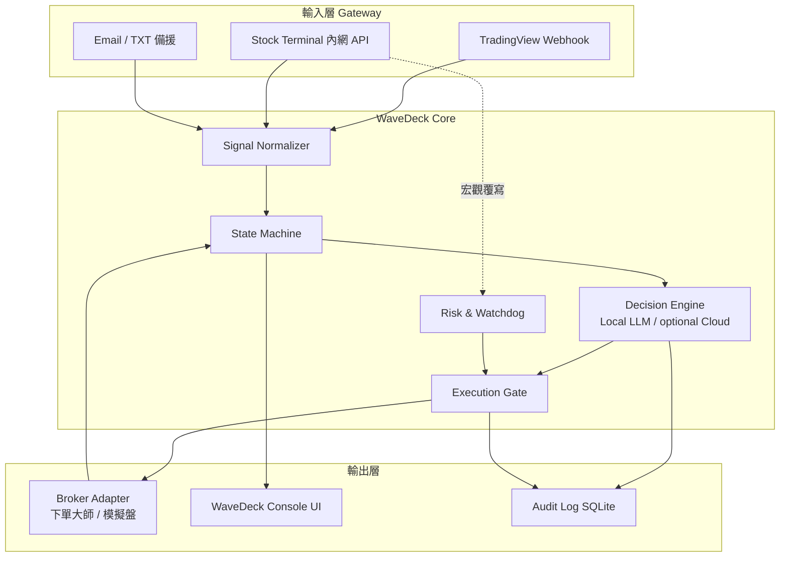
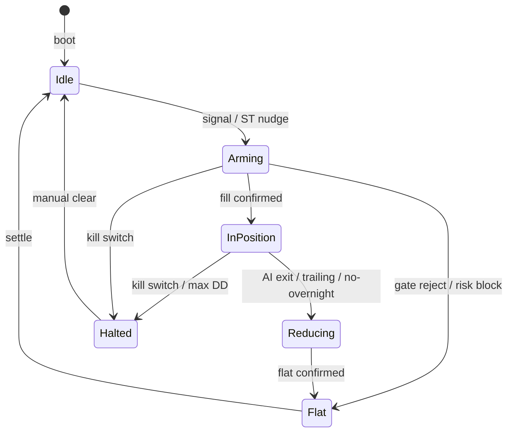

# WaveDeck（浪潮執行台）架構設計書

> 產品名：**WaveDeck**  
> 定位：Stock Terminal 的**微觀執行艦橋**——接收訊號、AI 判斷、風控覆寫、券商下單與部位校準。  
> 對照：Stock Terminal = 戰略指揮；WaveDeck = 戰術執行。  
> 修訂自 Gemini 初版；吸收附圖「Wave AI × 下單大師」儀表板資訊架構。

---

## 0. 對初版的專業調整（為何改）

| Gemini 初版 | 調整後 | 理由 |
|-------------|--------|------|
| 全面棄用雲端、僅 Ollama | **Local-first + 可選雲端**（預設本機；雲端需明確 opt-in 且不落盤金鑰到分享包） | 附圖現況含 OpenAI；商用需彈性，但預設隱私優先 |
| Redis + PostgreSQL + Docker 微服務 | **v1：stdlib HTTP + SQLite**；狀態記憶體＋WAL 日誌；日後再升 Redis／容器 | 與 Stock Terminal「零 pip、本機即跑」一致；降低運維摩擦 |
| Email 當備援主通道 | Email／TXT 為 **旁路備援**；主路徑 Webhook + ST 內網 API | 降低延遲與誤觸風險 |
| 網路設備品牌點名排除 | 改為 **安全原則**（最小暴露面、本機 loopback、簽章／共享密鑰） | 避免供應商綁定敘事；聚焦可控威脅模型 |
| 缺正式協定 | 新增 **ST ↔ WaveDeck JSON 協定**、狀態機、紙上／實盤模式 | 可測試、可回歸、可接 ST tip UX |
| AI 直接下單 | **AI 建議 ≠ 成交**；必須通過執行閘門（風控／不留倉／部位校準） | 附圖已有「執行閘門」概念；商用必備 |

---

## 1. 產品定位與設計原則

1. **職責分離**  
   WaveDeck 不做全市場掃描；專注標的微觀（分 K、五檔、部位、訂單）。宏觀脈絡由 Stock Terminal 推送覆寫參數。

2. **安全優先於獲利**  
   風控模組可覆寫 AI。Kill Switch、單日虧損上限、不留倉時窗擁有最高權限。

3. **狀態機為真理來源**  
   任何重啟／斷線後，必須能從持久化狀態還原「系統認為的目標部位」並與券商對帳。

4. **可觀測、可稽核**  
   每次 AI 判斷、閘門放行／拒絕、下單／成交，寫入不可變 append-only 日誌（SQLite）。

5. **本機預設、低延遲**  
   Server 預設只綁 `127.0.0.1`。對外 Webhook 僅經使用者自建隧道（如附圖 Named Tunnel），不預設公網暴露。

---

## 2. 邏輯架構



---

## 3. 狀態機（正式）



| 狀態 | 意義 |
|------|------|
| `Idle` | 空手等待；可收訊號 |
| `Arming` | 有進場意圖；等待閘門與成交 |
| `InPosition` | 持倉監控；AI 可續抱／加減 |
| `Reducing` | 減倉／平倉進行中 |
| `Halted` | 緊急停止；拒一切新單 |
| `Flat` | 已空手；結算後回 Idle |

---

## 4. 模組設計

### 4.1 Gateway & Signal Receiver
- **Webhook**：TradingView／自訂；驗證 `X-WaveDeck-Secret`
- **ST Bus**：`POST /bridge/st` 接收宏觀覆寫（風格、降載、禁止新單）
- **備援**：輪詢指定 TXT／可選 Email 旗標（非熱路徑）

標準事件 envelope：

```json
{
  "v": 1,
  "source": "tradingview|stock_terminal|manual",
  "event": "TIMED_MARKET_REVIEW",
  "symbol": "TXF",
  "ts": "2026-04-13T13:45:00+08:00",
  "payload": {}
}
```

### 4.2 Decision Engine
- 輸入：正規化行情摘要 + 持倉 + ST 宏觀標籤 + 進場風格（35/50/65/自訂）
- 輸出：

```json
{
  "action": "HOLD|ENTER_LONG|ENTER_SHORT|EXIT|REDUCE",
  "confidence": 0.62,
  "bias_long": 0.60,
  "bias_short": 0.40,
  "summary": "既有多單仍受 MA20 與 +DI 支撐…",
  "invalidation": { "price": 45015, "side": "below" },
  "next_watch": ["失守短線結構再評估"]
}
```

- **提供者介面**：`LocalOllamaProvider`｜`CloudOpenAIProvider`｜`HeuristicProvider`（無模型時可跑 demo）
- 每次推論必落盤；UI「AI 最新判斷」直接讀此結構

### 4.3 Risk & Watchdog（可覆寫 AI）
- 單日最大虧損 → Kill Switch
- 不留倉：收盤前禁新單 + 強制平倉時點
- 追價風險評估、部位上限、ST 降載（口數 ×0.5、停利緊縮）
- 權益／昨餘／變動即時面板

### 4.4 Execution Gate & Broker Adapter
- 閘門檢查清單：狀態允許？風控放行？部位校準一致？紙上／實盤？
- Adapter 介面：`PaperBroker`｜`TxtMasterBroker`（下單大師 TXT／策略檔）｜未來券商 API
- **雙向部位校準**：AI 建議部位 ≠ TXT 目標 ≠ 策略部位 ≠ 帳戶實倉 → 四欄並列（對齊附圖）

### 4.5 Console UI（商用級艦橋）
對齊附圖資訊架構，視覺獨立品牌（非套紫漸層模板）：
1. 頂列：時間、最近 TV 事件、Webhook 處理態、系統燈號  
2. 左：部位四欄、進場風格滑桿、不留倉保護  
3. 中：AI 主判斷（續抱／進出）、邏輯摘要、失效條件、程序結果  
4. 右：組件燈號牆、帳戶風險  
5. 底：執行對照、API 成本、傳輸通道、系統控制列  

---

## 5. 與 Stock Terminal 聯動

| ST 信號 | WaveDeck 行為 |
|---------|----------------|
| 宏觀偏多 + 輪動健康 | 進場風格 → 積極（如 65） |
| 跌停家數異常／VIX 急升 | 風控降載：新單口數減半、移動停利收緊 |
| 側欄「執行」／橋接 | `WaveDeckBridge.open()` → `http://127.0.0.1:18433/` |
| Pulse／大盤體質 → WD | `WaveDeckBridge.syncFromMarket({score, advRatio})` → `POST /bridge/st`（風格／降載；節流 60s） |
| Pulse AI 摘要 | 本機 `POST /ai/local`（LM Studio）；失敗則規則後援 |
| Watch／Book ← WD | `WaveDeckBridge.fetchState` → chip／執行狀態條（失效價、部位、信心） |
| ST 心跳失敗 | WaveDeck 亮黃燈；不自動加倉 |

協定路徑（本機）：
- ST → WD：`http://127.0.0.1:18433/bridge/st`
- WD → ST（可選回報）：`http://127.0.0.1:18432/bridge/wavedeck`（後續在 tip 掛接）

---

## 6. 技術棧（分階段）

### v1（本倉庫交付）
- Python **stdlib** `http.server` + 背景執行緒（與 ST 一致、免 pip）
- SQLite 稽核庫 `data/wavedeck_audit.db`
- 前端 Vanilla JS + CSS（高密度艦橋 UI）
- `HeuristicProvider` 可離線演示

### v1.5（已交付）
- **決策 adapter**：`heuristic`｜`ollama`｜`openai`（失敗自動 fallback 啟發式）
- **Broker**：`PaperBroker`｜`TxtMasterBroker`（`data/master/*.txt` 四欄對帳）
- **模式**：預設 `paper`；`live` 明確切換後才寫下單大師 TXT
- **ST 入口**：側欄「執行」→ `http://127.0.0.1:18433/`（`shell_v5` + `wavedeck_bridge_v5`）
- API：`/api/provider`、`/api/mode`、`/api/broker`、`/api/sync_txt`、`/api/config`

### v2
- 可選 Redis 熱狀態、Docker Compose、雲端模型 opt-in、正式簽章 Webhook

---

## 7. 威脅模型（精簡）

| 威脅 | 緩解 |
|------|------|
| 惡意 Webhook | 共享密鑰、來源 IP 允許清單、本機綁定 |
| AI 幻覺下單 | 執行閘門 + 失效價硬砍 + 紙上模式預設 |
| 部位不一致 | 四欄對帳 + 告警，不盲目補單 |
| 金鑰外洩 | 不進 git／分享包；僅本機設定檔 |
| 進程僵死 | Watchdog 心跳；Halted 保底 |

---

## 8. 非目標（v1 不做）

- 全市場選股／廣度掃描（屬 ST）
- 高頻做市／交易所 colo
- 自動實盤對不明券商下單（需使用者明確切換 Live）

---

## 9. 目錄約定

```
wavedeck/
  README.md
  VERSION
  START_WAVEDECK.cmd
  docs/ARCHITECTURE.md
  server/          # stdlib API + 狀態機 + 風控 + adapter
  web/             # 艦橋 Console
  data/            # 本機狀態／稽核（gitignore 大庫與密鑰）
  tests/
```

---

## 10. 成功樣貌（驗收）

1. 雙擊啟動 → 瀏覽器見艦橋 UI，燈號與部位四欄可讀  
2. 模擬 Webhook → AI 判斷卡更新，稽核庫有一筆  
3. 拉高「進場風格」或觸發降載 → 風控標籤可見  
4. Kill Switch → 狀態 `Halted`，拒新單  
5. 文件與 UI 達到「可給同伴展示」的商用密度與質感
